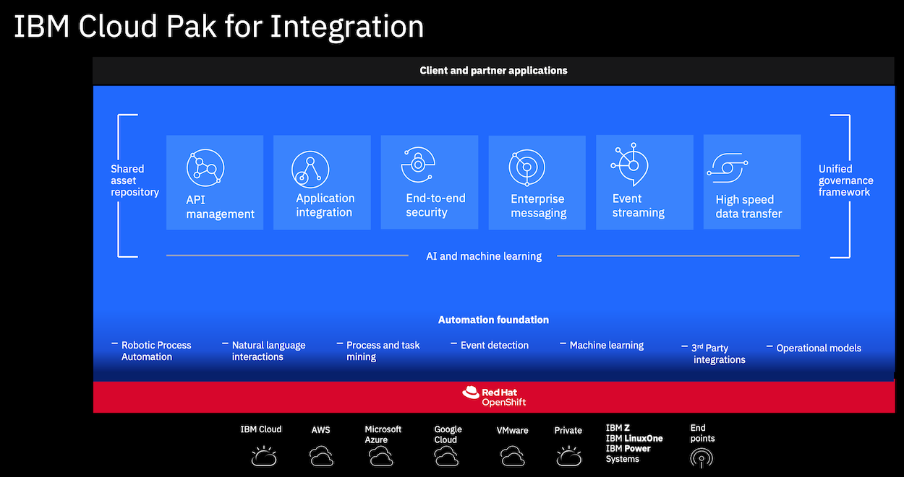

# Enterprise-grade integration with Cloud Pak for Integration

Welcome to our workshop! In this workshop we'll be looking at various parts of the Cloud Pak for Integration platform. The goals of this workshop are:

* Create, deploy and test a new API using the **API Connect Developer Toolkit**
* Using **App Connect**  to bidirectionally sync  Salesforce data with an application
* Using **Apache Kafka** for near realtime data replication

## About this workshop

The introductory page of the workshop is broken down into the following sections:

* [About Cloud Pak for Integration](#about-cloud-pak-for-integration)
* [Credits](#credits)

## About Cloud Pak for Integration

IBM Cloud Pak for Integration is an enterprise-ready, containerized software solution that contains all the tools you need to integrate and connect application components and data both within and between clouds. Running on Red Hat OpenShift, the IBM Cloud Pak for Integration gives businesses complete choice and agility to deploy workloads on premises and on private and public cloud.

Cloud Pak for Integration includes components to enable you to manage:

|   |   |
| - | - |
| **API lifecycle** | Create, secure, manage, share and monetize APIs across clouds while you maintain continuous availability. Take control of your API ecosystem and drive digital business with a robust API strategy that can meet the changing needs of your users |
| **Application and data integration** | Integrate all of your business data and applications more quickly and easily across any cloud, from the simplest SaaS application to the most complex systems - without worrying about mismatched sources, formats or standards |
| **Enterprise messaging** | Simplify, accelerate and facilitate the reliable exchange of data with a flexible and security-rich messaging solution that’s trusted by some of the world’s most successful enterprises. Ensure you receive the information you need, when you need it - and receive it only once |
| **Event streaming** | Use Apache Kafka to deliver messages more easily and reliably and to react to events in real time. Provide more personalized customer experiences by responding to events before the moment passes |
| **High-speed data transfer** | Send large files and data sets virtually anywhere, reliably and at maximum speed. Accelerate collaboration and meet the demands of complex global teams, without compromising performance or security |
| **Datapower Gateway** | Provides secure and reliable gateway services for API Connect |
| **Asset Repository** | Stores, manages, retrieves and enables search for integration assets |
| **Operations Dashboard** | Traces transactions across Cloud Pak for Integration |

### Lectures

In addition to the labs, this workshop uses the following lectures:

* [Agenda and Lab Descriptions](https://ibm.box.com/s/k470n4ofiw4m2i704jdgxlndz4jx9iz4)
* [Cloud Pak for Integration Overview](https://ibm.box.com/s/9ahekzd9x70z7f3f6ke0f11h9mudyydi)
* [Introduction to App Connect](https://ibm.box.com/s/bsnetb2owhyxlh746g2bibrc58v4ar5v)
* [Introduction to API Connect](https://ibm.box.com/s/67foj5ed7csky8hm897jz8jjnk1somv3)
* [Application Messaging with MQ and Apache Kafka](https://ibm.box.com/s/c82dw42e3x4ose3ci8udx60olihv2e6m)
* [Tracing Overview and Demo (optional)](https://ibm.box.com/s/22u19i5axm0yp5u7jh7lgl3nvft0m577)

## Credits

This workshop was primarily written by [David Carew](https://github.com/djccarew), [Henry Nash](https://github.com/henrynash) and [Steve Martinelli](https://github.com/stevemar).
