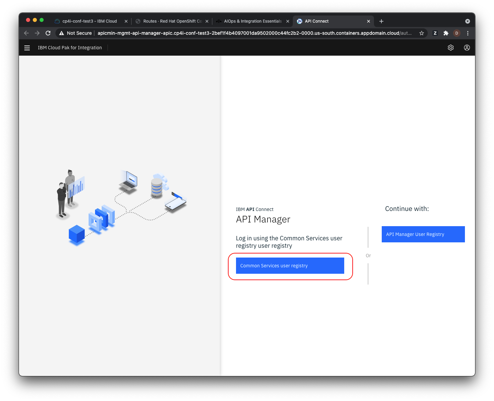
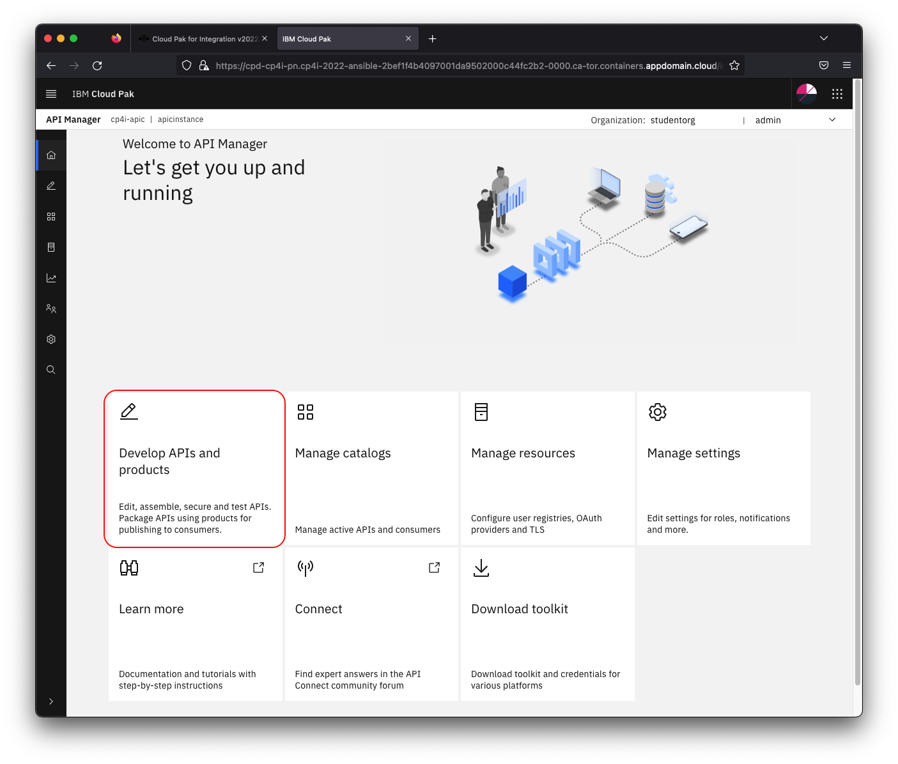
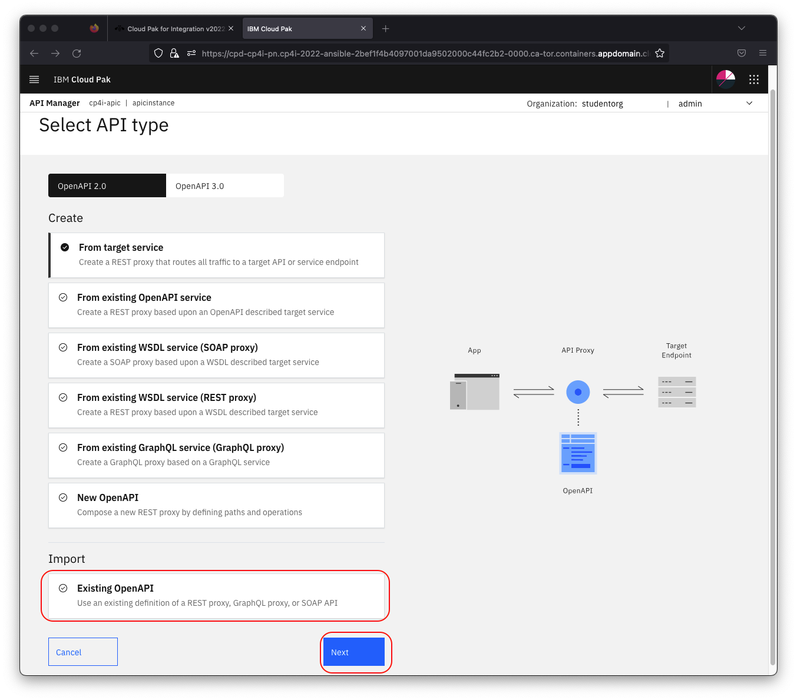
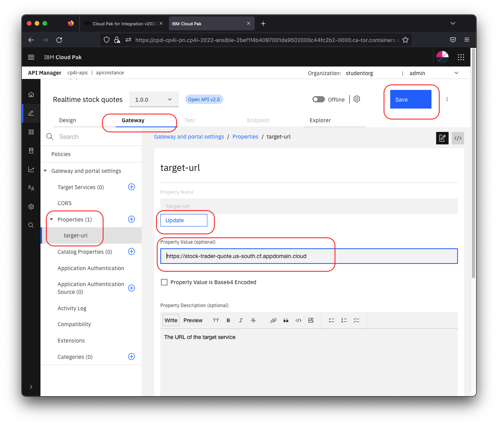
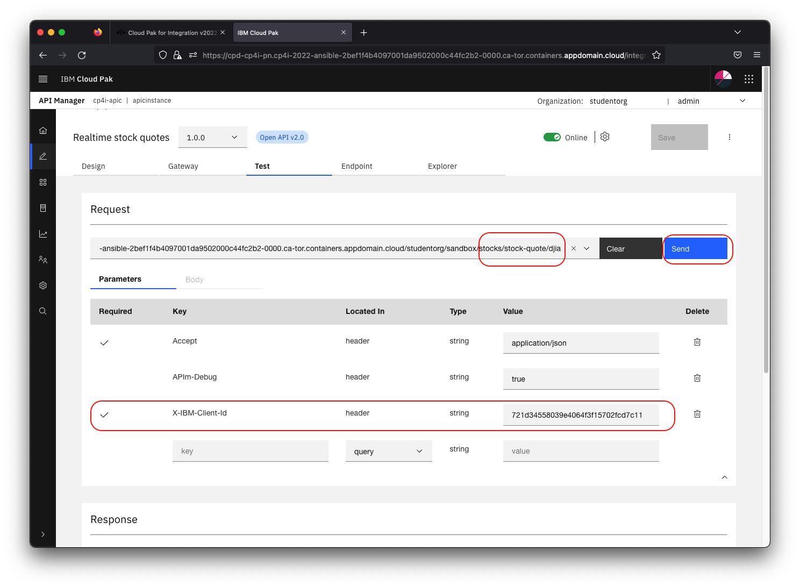
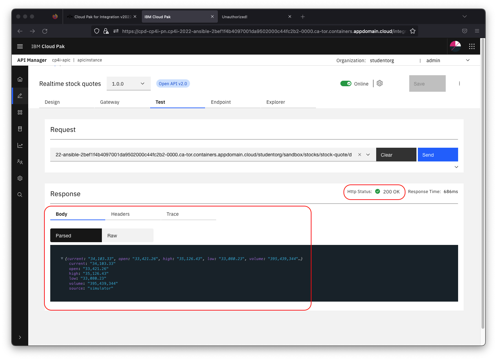
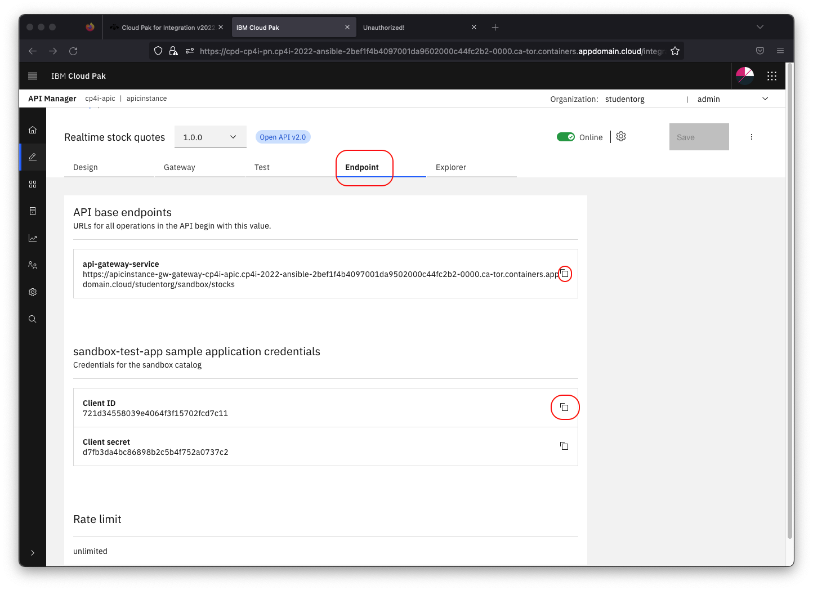
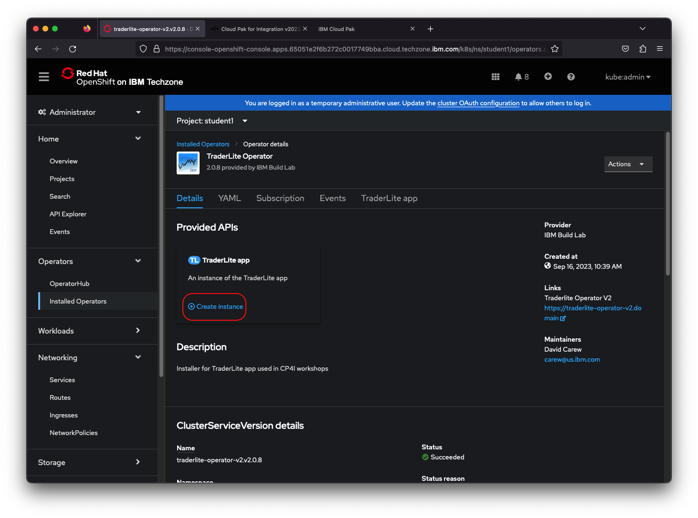

# Exercise - Create, deploy and test a new API using the API Connect Developer Toolkit

In this lab you will create a new API using the OpenAPI definition of an existing RESTful web-service that  gets realtime stock quotes. You will then test the deployed API by deploying the *IBM Trader Lite* application which is a simple stock trading sample, written as a set of microservices. The app uses the API definition that you will create to get realtime stock quotes.

The architecture of the app is shown below:

* **Tradr** is a Node.js UI for the portfolio service

* The **portfolio** microservice sits at the center of the application. This microservice:
   * persists trade data  using JDBC to a MariaDB database
   * invokes the **stock-quote** service that invokes an API defined in API Connect in CP4I to get stock quotes
   * calls the **trade-history** service to store trade data in a PostgreSQL database that can be queried for reporting purposes.
   * calls the **trade-history** service to get aggregated historical trade data.

This lab is broken up into the following steps:

1. [Prerequisites](#prerequisites)

1. [Download the OpenAPI definition file for the external Stock Quote service](#step-1-download-the-openapi-definition-file-for-the-external-stock-quote-service)

1. [Import the OpenAPI definition file into API Manager](#step-2-import-the-openapi-definition-file-into-api-manager)

1. [Configure the API](#step-3-configure-the-api)

1. [Test the API](#step-4-test-the-api)

1. [Install the Trader Lite app](#step-5-install-the-trader-lite-app)

1. [Verify that the Trader Lite app is calling your API successfully](#step-6-verify-that-the-trader-lite-app-is-calling-your-api-successfully)

1. [Summary](#summary)

## Prerequisites
API Connect requires the [Firefox](https://www.mozilla.org/en-US/firefox/new/) browser (version > 78.9.0) in order to use the testing capabilities during API development (Step #4 of this lab) so it is recommended that you complete this entire lab using Firefox.

## Step 1: Download the OpenAPI definition file for the external Stock Quote service

>**Note:** You can click on any image in the instructions below to zoom in and see more details. When you do that just click on your  browser's back button to return to the previous state.

1.1 In your browser right click on  the following link, right click and select **Save Link As ...** from the context menu. Save the file *stock-quote-api.yaml* to  your local system.

   [stock-quote-api.yaml](https://raw.githubusercontent.com/IBMStockTraderLite/traderlite-cp4i/master/apic/stock-quote-api.yaml)

## Step 2: Import the OpenAPI definition file into API Manager

2.1 Go to your Workshop Information page and click on the API Connect component link. (**Note:** if you no longer have the Workshop Information page available see [these instructions](../pre-work/README.md)).

  

  **Note:** This API Connect installation use self-signed certificates so you will have to click through any browser warning and continue to the URL.

2.2 Click on **Common Services user registry**. Then click **Default authentication**.

  

2.3 Login with the credentials for API Connect on the Workshop Information Page.

**Note:** API Connect takes times to load the first time. Please be patient on the first screen while it initializes.

2.4 Click on the **Develop APIs and Products tile**

   

2.5 Click **Add API**

  

2.6 On the next screen select **Existing OpenAPI** under **Import** and then click **Next**.

  

2.7 Now choose **stock-quote-api.yaml** from your local file system and click **Next**.

  

2.8 **Do not** select **Activate API**. Click **Next**

  

2.9 The API should be imported successfully as shown below. Click **Edit API**.

  

## Step 3: Configure the API

After importing the existing API, the first step is to configure basic security before exposing it to other developers. By creating a client key  you are able to identify the app using the services. Next, we will define the backend endpoints where the API is actually running. API Connect supports pointing to multiple backend endpoints to match your multiple build stage environments.

3.1 Scroll down in  the  Edit API screen and replace the **Host** address with `$(catalog.host)` to indicate that you want calls to the external API to go through API Connect.

     

3.2 Click **Save**

3.3 In the Edit API screen click **Security Definitions** in the left navigation

3.4 In the **Security Definition** section, click the **Add** button on the right. This will open a new view titled **API Security Definition**.

3.5 In the **Name** field, type `client-id`.

3.6 Under **Type**, choose **API Key**. This will reveal additional settings.

3.7 For **Located In** choose **Header**. For **Key Type** choose **Client ID**

3.8 Enter `X-IBM-Client-Id` as the **Parameter Name**.  Your screen should now look like the image below.

     

3.9 Click the **Save** button to return to the **Security Definitions** section.

3.10 Click **Security** in the left menu. Click **Add**. Select the **client-id** as shown below and then click **Save**.

  

3.11 Next you'll define the endpoint for the external API. Click on **Properties** in the left menu.

3.12 Click on the **target-url** property. Click **Add**.

3.13 Choose the **sandbox** catalog and for the URL copy and paste the following URL:

    https://stock-trader-quote.us-south.cf.appdomain.cloud

  

3.14 Click **Save** to complete the configuration.

## Step 4: Test the API

In the API designer, you have the ability to test the API immediately after creation in the **Assemble** view.

4.1 On the top Navigation, click **Assemble**.

  

4.2 Click **invoke** in the flow designer. Note the window on the right with the configuration. The **invoke** node calls the **target-url** (ie the external service).

  

4.3 Modify the **URL** field to include the request path passed in by the caller as well by appending `$(request.path)` to the **URL**.

     

4.3 Click **Save**

4.4 Click the play icon as indicated in the image below.

  

4.5 Click **Activate API** to publish the API to the gateway for testing.

  

4.6 After the API is published, click on the **Test** tab  

  

4.7 The **Request** should be prefilled with the GET request to  **/stock-quote/djia**.

4.8 Note that your **client-id** is prefilled for you.

4.9 Click **Send**.

  

4.10 If this is the first test of the API, you may  see a certificate exception. Simply click on the link provided. This will open a new tab and allow you to click through to accept the self signed certificate. **Note**: Stop when you get a `401` error code in the new tab.

  

4.11 Go back to the previous tab and click **Send** again.

4.12 Now you should see a **Response** section with Status code `200 OK` and the **Body** displaying the details of the *Dow Jones Industrial Average*.

  

4.13 Next you'll get the *Client Id* and *Gateway endpoint* so you can test your API from the TraderLite app. Click on the **Endpoints** tab.

4.14  Copy the value of the  **api-gateway-service** URL and the **Client-Id**  to a local text file so it can be used in the Stock Trader application later (**Note:** this is a shortcut to the regular process of publishing the API and then subscribing to it as a consumer).

  

## Step 5: Install TraderLite app

5.1 In a separate browser tab go to the OpenShift console URL  for the cluster assigned to you by for the workshop.

> **Note**: There is a link to your assigned cluster's console on your Workshop Information page. If you have closed it,  you can access it following the instructions in the [FAQ](https://ibm.github.io/cloudpakforintegration-workshop/faq/).

5.2 Click on **Projects** in the left navigation and then click on the **student001**  project in the list

  

5.3 Click on **Installed Operators** in the left navigation and then click on the **TraderLite Operator** in the list.

  

5.4 Click the **Create Instance** to start the installation of the TraderLite app.

  

5.5 Name the instance *traderlite*  and replace the **API Connect URL**  and **API Connect ClientId** with the **api-gateway-service** URL and the **Client-Id** you saved in the previous section. Click **Create**

  

5.6 In the left navigation select **Pods** and then wait for all the TraderLite pods to have a status of **Running** and be in the **Ready** state.

> *Note: You will know the traderlite-xxxxx pods are  in a ready state when the `Ready` column shows `1/1`.*

  

## Step 6: Verify that the Trader Lite app is calling your API successfully

6.1 In your OpenShift console  click on **Routes** in the left navigation and then click on the icon next to the url for the **tradr** app (the UI for TraderLite)

  

6.2 Log in using the username `stock` and the password `trader`

  

6.3 If the DJIA summary has data then congratulations ! It means that the API you created in API Connect is working !

  

## Summary

Congratulations ! You successfully completed the following key steps in this lab:

* Created an API by importing an OpenAPI definition for an existing REST service.
* Configured a ClientID/API Key for security set up a proxy to the existing API.
* Tested the API in the API Connect developer toolkit.
* Deployed the Trader Lite app and configured it to use the API you created.
* Tested the Trader Lite app to make sure it successfully uses your API.
