# Exercise - Sync Salesforce data using IBM App Connect Enterprise

In this lab you will create App Connect flows to sync  client data in the  **IBM Trader Lite** app to Salesforce. This will occur whenever a user of the  **IBM Trader Lite** app creates a  portfolio for a new client or accesses the data of an existing client.

In order to accomplishment this at a minimum  2 flows are needed:

1. A URL driven flow to push a new client to a Salesforce contact when the **IBM Trader Lite** app creates a portfolio for a new client

2. An Event driven flow to push changes to the  **IBM Trader Lite** app whenever a contact's data is updated in Salesforce

The architecture of the app is shown below:

The **portfolio** microservice invokes the REST endpoint of the new flow whenever a new client is created or read by the app and this results in a new contact being created in, or read from  Salesforce.

This lab is broken up into the following sections:

1. [Sign up for Salesforce Developer Edition](#section-1-sign-up-for-salesforce-developer-edition)

1. [Create a Salesforce Connected App](#section-2-create-a-salesforce-connected-app)

1. [Setup connectivity to Salesforce in App Connect Designer](#section-3-setup-connectivity-to-salesforce-in-app-connect-designer)

1. [Create the flows in App Connect Designer](#section-4-create-the-flows-in-app-connect-designer)

1. [Create an Integration Server instance and deploy your flows](#section-5-create-an-integration-server-instance-and-deploy-your-flows)

1. [Get the REST endpoint of your App Connect Flow](#section-6-get-the-rest-endpoint-of-your-app-connect-flow)

1. [Test your App Connect Flow with Trader Lite](#section-7-test-your-app-connect-flows-with-trader-lite)

1. [Summary](#summary)

## Section 1: Sign up for Salesforce Developer Edition

1.1 In your browser go to the following URL to sign up for Salesforce Developer Edition - a full featured version of the Salesforce Lightning Platform.

> **Note:** If you already have access to  the Salesforce Developer Edition or a paid version of Salesforce, skip to **Step 1.2**.

   [Salesforce Developer Edition signup](https://developer.salesforce.com/signup)

1.2 Enter the required information and follow the prompts to complete the signup process.

> **Note**: You can click on any image in the instructions below to zoom in and see more details. When you do that just click on your browser's back button to return to the previous state.

## Section 2: Create a Salesforce Connected App

In this section you'll create a *Connected App* in Salesforce so that the App Connect flows that you create later will be able to access your Salesforce data.

2.1 Login to [Salesforce](https://www.salesforce.com)  

2.2 Click on your avatar (top right) and select **Switch to Salesforce Classic** from the context menu.

  

2.3 Click on **Setup**.

  

2.4 In the left navigation area, scroll down to the **Build** section, expand **Create** and click on **Apps**

  

2.5 Scroll down to the **Connected Apps** section and click on **New**

  

2.6 Fill in the required values for a new Connected App

   a. Set the **Connected App Name** property to `IBM App Connect`

   b. Set the **API Name** to `IBM_App_Connect`

   c. Enter your email address as the **Contact Email**

  

2.7 Configure the OAuth settings

   + Select the **Enable OAuth Setting** check box.

   + Set the **Callback URL** to `https://www.ibm.com`

   + Under **Selected OAuth Scopes** select  **Access and manage your data (api)** and click the arrow under the **Add** label

  

2.8 Scroll down to the bottom of the web page and click **Save**

2.9 Copy the **Consumer Key** and **Consumer Secret** to a text file.  You will need them later to connect to Salesforce.

2.10 Click on your user name and select **My Settings**. On the left under the **Personal** section click on **Reset My Security Token**

 

2.11 Check your email for the email address that you use as your Salesforce username. You should receive an email from  Salesforce with the subject **Your new Salesforce security token**. Copy the **Security Token** to the same text file that you used for the  **Consumer Key** and **Consumer Secret**

  

## Section 3: Setup connectivity to Salesforce in App Connect Designer

App Connect Designer is a component of Cloud Pak for Integration that provides an authoring environment in which you can create, test, and share flows for an API. You can share your flows by using the export and import functions, or by adding them to an Asset Repository for reuse.

3.1 Go to your Workshop Information page and click on the App Connect Designer component link. (**Note:** if you no longer have the Workshop Information page available see:  TODO - put link to instructions here).

  [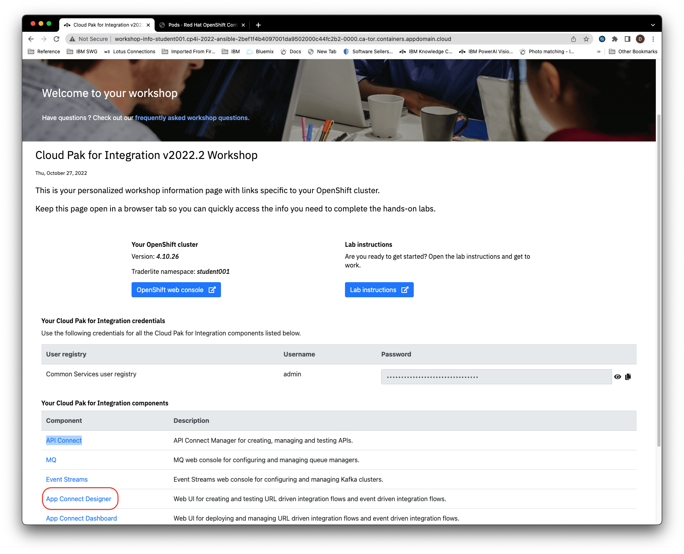](images/nav-to-des.png)

3.2 If prompted to login, select **Default authentication** and enter the credentials on the Workshop Information page

3.5 Click the **Catalog** icon

   

3.6 Expand **Salesforce**  and click **Connect**

   

3.7 Enter the following values referring to the text file from  the previous section where you saved your Salesforce credentials.

   + For the **Login URL** enter `https://login.salesforce.com`

   + For the **Username** enter the email you use to login to Salesforce

   + For the **Password** enter the password you use to login to Salesforce. Then append the value of the  **Security Token**  (that you saved in the previous section) to the password. For example if your password is `foo` and your security token is `bar` you would enter `foobar` into the password field.

   + For the **Client Id** copy and past the value of the  **Consumer Key** (that you saved in the previous section).

   + For the **Client Secret** copy and past the value of the  **Consumer Secret** (that you saved in the previous section).

   

> **NOTE**: If you receieve an error that the connection to Salesforce failed, then it is recommended to re-check the credentials and try again. You can re-enter the credentials for this account by clicking on the three dots next to the account name (typically this is **Account 1**), and clicking **Update Account** from the subsequent menu. The previous details are cleared, so you will need to enter them all again.   

3.8 Click on **Connect**. The connection will be given a default name of the form *Account n*.

## Section 4: Create the flows in App Connect Designer

4.1 In App Connect Designer, click the **Dashboard** icon.

  

4.2 Click  **New** and select **Flows for an API**

  

4.3 Name the flow `sfpush`   Name the model `Client`

  [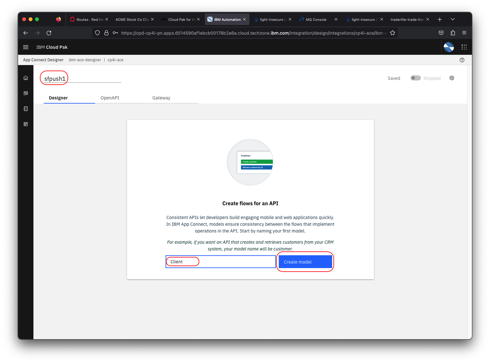](images/flowname.png)

4.4 Click **Create Model**

4.5 Next you will add the properties of the input data for your flow.

> **Note**: Name them exactly as instructed (including matching case) so that your flow will work with the *Stock Trader Lite* app.

   + Enter `ClientId` as the first property and then click **Add property +**

   + Enter `FirstName` as the next property and then click **Add property +**

   + Enter `LastName` as the next property and then click **Add property +**

   + Enter `Email` as the next property and then click **Add property +**

   + Enter `MobilePhone` as the next property

   When you're done the screen should look like the following:

   

4.6 Click  **Operations** and then select **Create Client**

   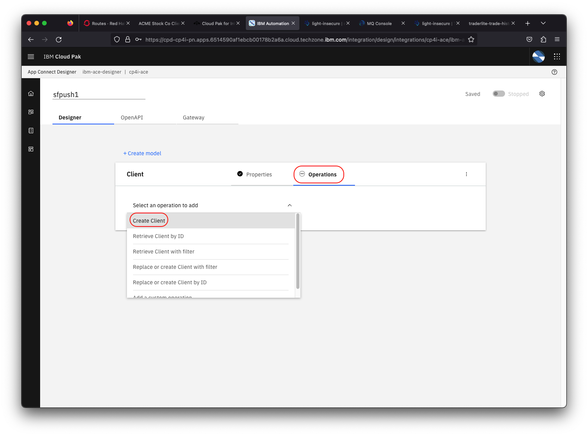](images/operation.png)

4.7 Click **Implement flow**

4.8 Click on the **+** icon.

   + Scroll down to Salesforce

   + Select your account from the dropdown

   + Expand **Contacts**

   + Click **Create Contact**

   [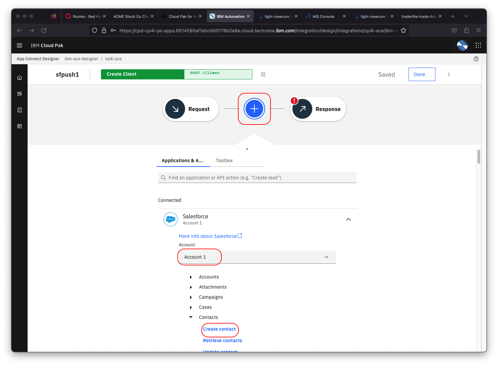](images/implementflow1.png)

4.9 Next you'll map the properties from  your model to the Salesforce Contact properties. The properties have the same names as their Salesforce equivalents so click on **Auto match fields** to complete the mapping

  

4.10 Click on **Response** to configure what will be returned by the flow. Click in the text box for the **Client Id** property and then click on the icon just to the right of the field. Select the **Contact Id** property of the Salesforce contact.

  [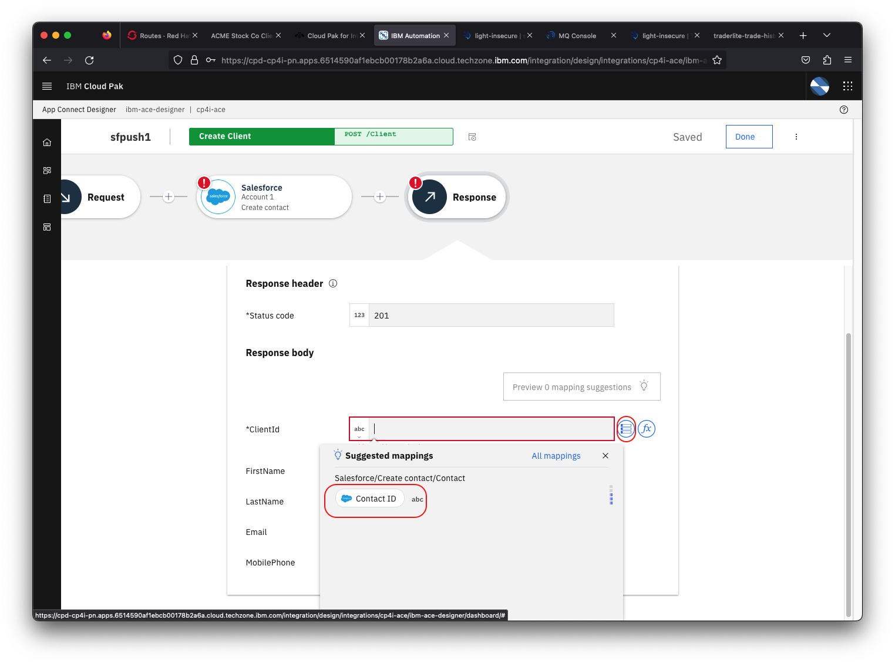](images/responsedata.png)

4.11 Next you'll test the flow to make sure it works. Click on the middle part of the flow and then click on the edit icon.

  [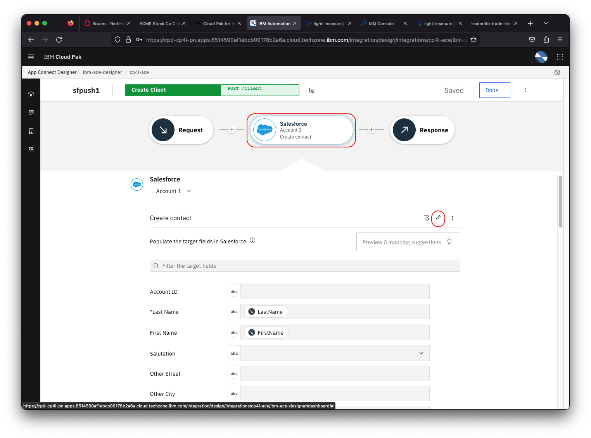](images/testparams.png)

4.12 Click on **Request body parameters** and then edit the input parameters that will be used in the test.

> **Note**: Salesforce does enforce formatting for telephone numbers and email addresses so use valid formatting for those

  + Set the **Client Id** to blank. This value will be generated by Salesforce and returned.

  + Enter a **FirstName** value.

  + Enter a **LastName** value.

  + Enter an **Email** in a valid email format

  + Enter a **MobileNumber** in a valid format

  

4.13 Click the test icon. Verify that the operation returns a 200 HTTP status code.

  [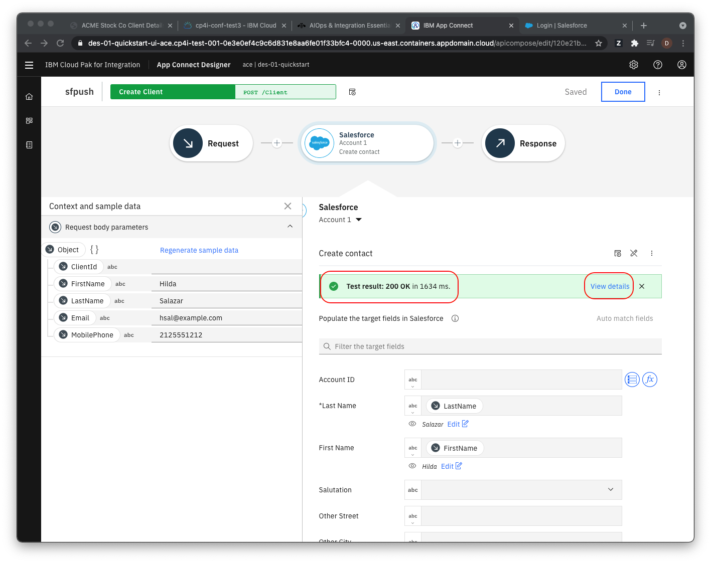](images/teststatus.png)

4.15 Click **View details** to see the raw data returned from  the call to Salesforce (note this is not the same as the data returned by the flow which you defined in the **Response** stage of the flow).

4.16 Click **Done**

4.17 Next you'll build a reverse flow. One that will call an API in the TraderLite app whenever a Salesforce contact is updated Click on the **Catalog** icon and select the **APIs**

  

4.18 In your browser right click on the following link, right click and select **Save Link As ...** from the context menu. Save the file *sfsync.json* to  your local system. This is an OpenAPI definition of the API in TraderLite that will update client data.

   [sfsync.json](https://raw.githubusercontent.com/IBMStockTraderLite/traderlite-cp4i/master/appconnect/sfsync.json)

4.19  Back in App Connect click on **Add your API now**

4.20  Import the file *sfsync.json*, and name the API *Salesforce sync*

  [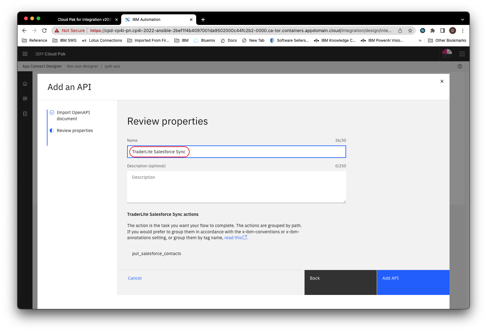](images/addapi.png)

4.21 Click **Add API**

4.22 Click on the down arrow and then on **Connect**

  

4.23 Accept the default values and click again **Connect** again

4.24 Click on the **Dashboard** icon

  

4.25 Click **New** and select **Event-driven flow**

4.26 Name the flow `sfevents`,  expand the Salesforce section and select **Updated contact** under **Contacts**

  

4.27 Click the **+** icon and then on the **APIs** tab. Expand your **Salesforce sync** API and click on **PUT /salesforce/contacts**

  

4.28 Click in the icon right next to the **ClientId** field.

   + Map the **ClientId** field to the Salesforce **ContactId** field

   + Map the **FirstName** field to the Salesforce **FirstName** field

   + Map the **LastName** field to the Salesforce **LastName** field

   + Map the **Email** field to the Salesforce **Email** field

   + Map the **MobilePhone** field to the Salesforce **MobilePhone** field

  

4.29 Click on the **Dashboard** icon at the left

4.30 Export your `sfevents` flow by clicking on the 3 period icon and selecting **Export..** from the context menu.

  [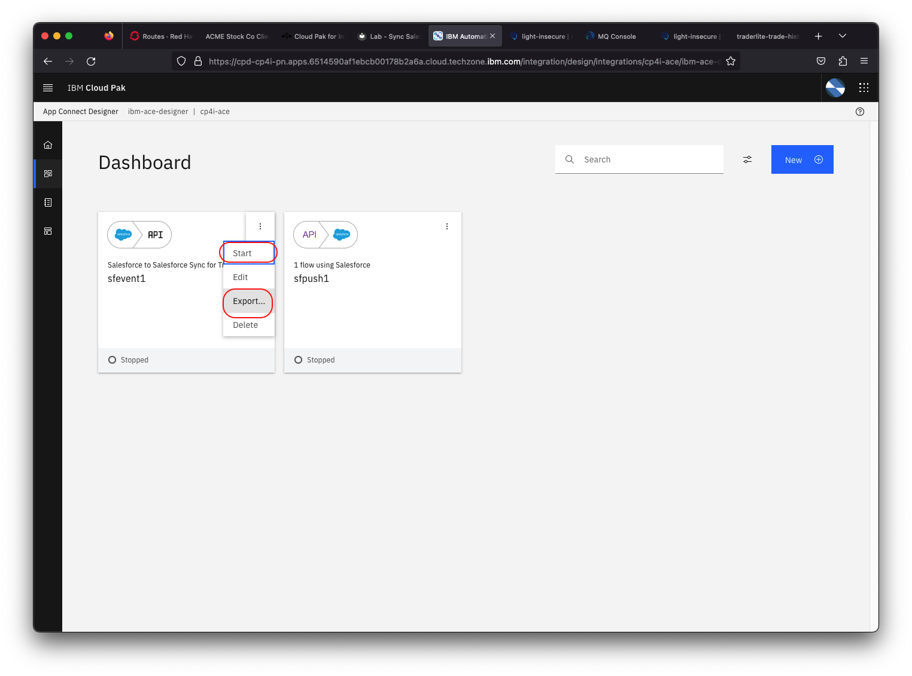](images/exportevt.png)

4.31 Select **Runtime flow asset (BAR)** and click **Export**

4.32 Adjust the target folder if you wish and then click **Save**

4.33 Repeat for the `sfpush` flow also selecting **Runtime flow asset (BAR)** and saving to your local system.

## Section 5: Create an Integration Server instance and deploy your flows

In this step you'll create an Integration Server instance and deploy your flows to it.

5.1 Go to your Workshop Information page and click on the **App Connect Dashboard** component link. (**Note:** if you no longer have the Workshop Information page available see:  TODO - put link to instructions here).

5.2 Select **Default Authentication** and login with your credentials if prompted

5.3 Click **Create server**

  [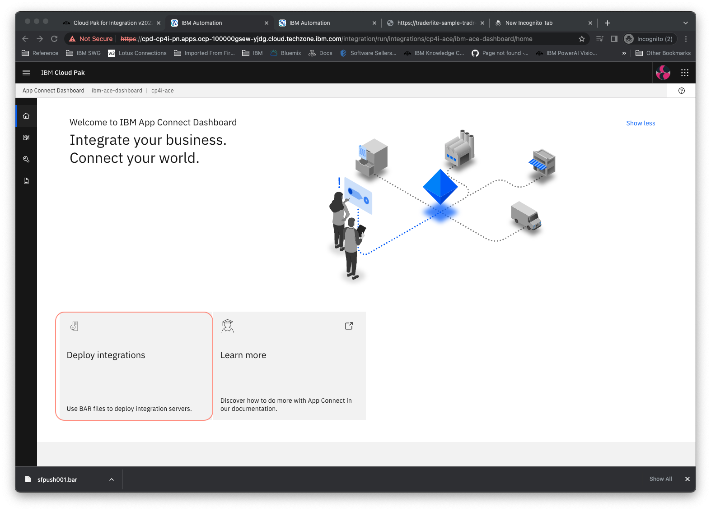](images/dashboardui.png)

5.4 Select the **Quick start designer integration** tile and click **Next**

5.5 Upload the `sfevents.bar` file and click **Next**

  [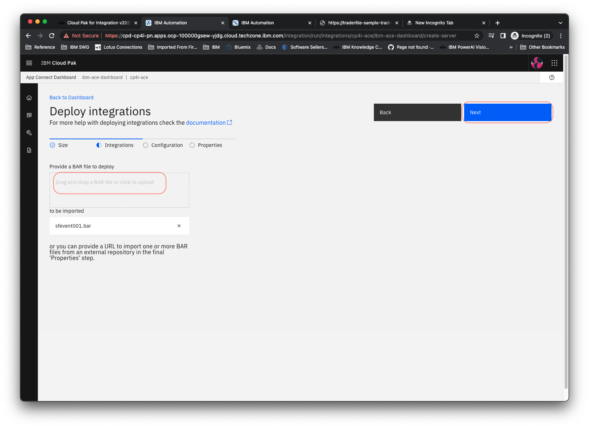](images/sfeventsbar.png)

5.6 Select the **Accounts** file and leave the others unchecked. Click **Next**

  

> **Note**: Without *Accounts* checked, your flow will  not work when deployed . This allows the secret with your Salesforce credentials to be accessible to the deployed flow.

5.7 Name the server `sfevents` and click  **Create** . It will take a while for the server to provision so you can continue deploying the other flow. Click **Create server**

5.8 Select the **Quick start designer integration** tile and click **Next**

5.9 Upload the `sfpush.bar` file and click **Next**

5.10 Select the **Accounts** file and leave the others unchecked. Click **Next**

> **Note**: Without *Accounts* checked, your flow will  not work when deployed . This allows the secret with your Salesforce credentials to be accessible to the deployed flow.

5.11 Name the server `sfpush` and click and click **Create** .

5.12 Wait for both servers be in the **Started** state. They will take about 2 or 3 minutes.

> Note: You may have to refresh the page to get the latest server status

  

## Section 6: Get the REST endpoint of your App Connect Flow

6.1 In the App Connect Dashboard click on the tile for the `sfpush` server

6.2 Click on the API tile to see the details of the flow's API

  

6.3 You should see the details of your flow's API

  [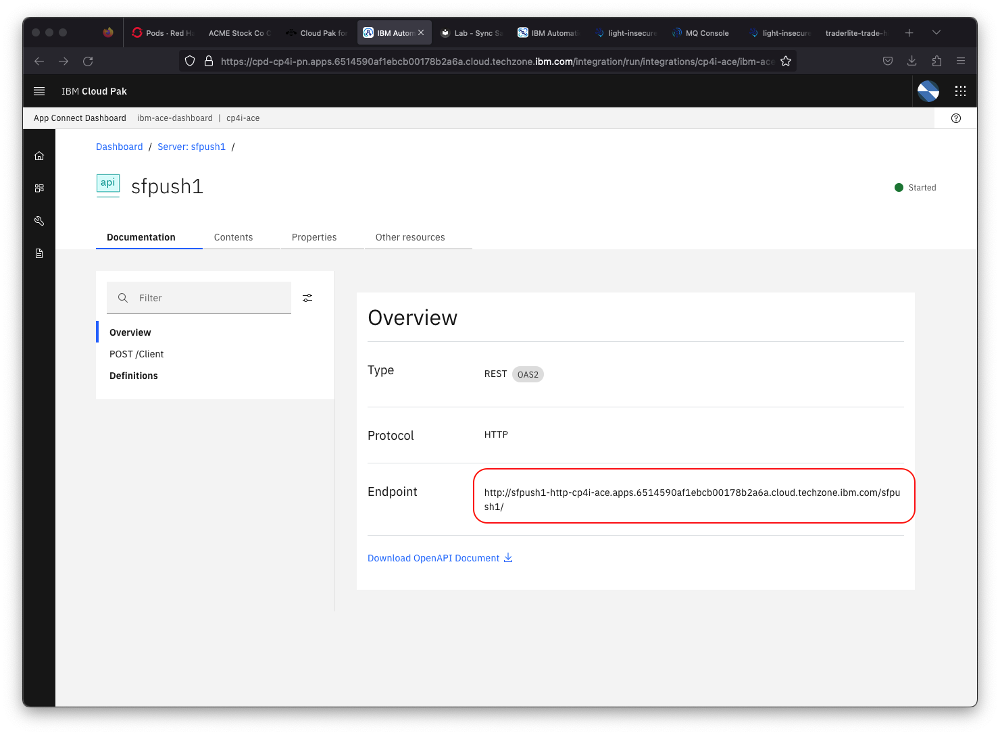](images/apidetails.png)

6.4 Copy the **Endpoint** and save it in a text file.

## Section 7: Test your App Connect Flows with Trader Lite

7.1 Go to the OpenShift console of your assigned cluster. Select the **student001** project. In the navigation on the left select **Installed Operators** and select the **TraderLite Operator**

  

7.2 Click on the **TraderLite app** tab

  

7.3 Click on the 3 periods to the right of the existing TraderLite CRD and select **Edit TraderLite** from the context menu.

  

7.4 Scroll down to line 62 and change the **enabled**" field value to *true*  and paste the endpoint of your API flow that you saved earlier as the **url** value on line 66.

  

7.5 Click **Save**.

7.6 In the navigation area on the left select **Pods** in the **Workloads** section. You should see that a new instance of the Portfolio pod has been started.

  

7.7 Wait until the new pod is in the  **Ready** state and the  previous pod has terminated before continuing.

> **Note**: You will know the traderlite-portfolio-xxxxx pod is in a ready state when the `Ready` column shows `1/1`. You will also see that the created column will have a recent timestamp value.*

7.8 In  the left navigation  click on **Routes** (in the **Networking** category) and then click on the icon next to the url for the **tradr** app (the UI for TraderLite)

  [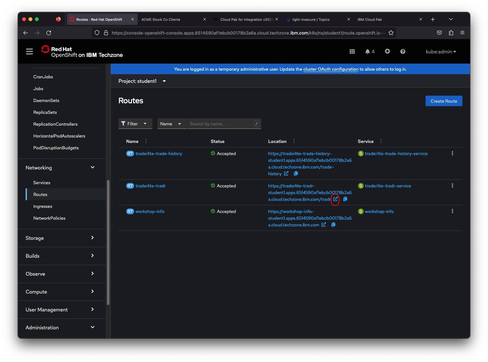](images/traderlite-run-tradr.png)

7.9 Log in using the username `stock` and the password `trader`

  

7.10 Click **Add Client** and fill in the form. You must use valid email and phone number formats to avoid  errors.

  

7.11 Click **Save**

7.12 Click on the **Portfolio ID** of the new client to see the details of the portfolio

  [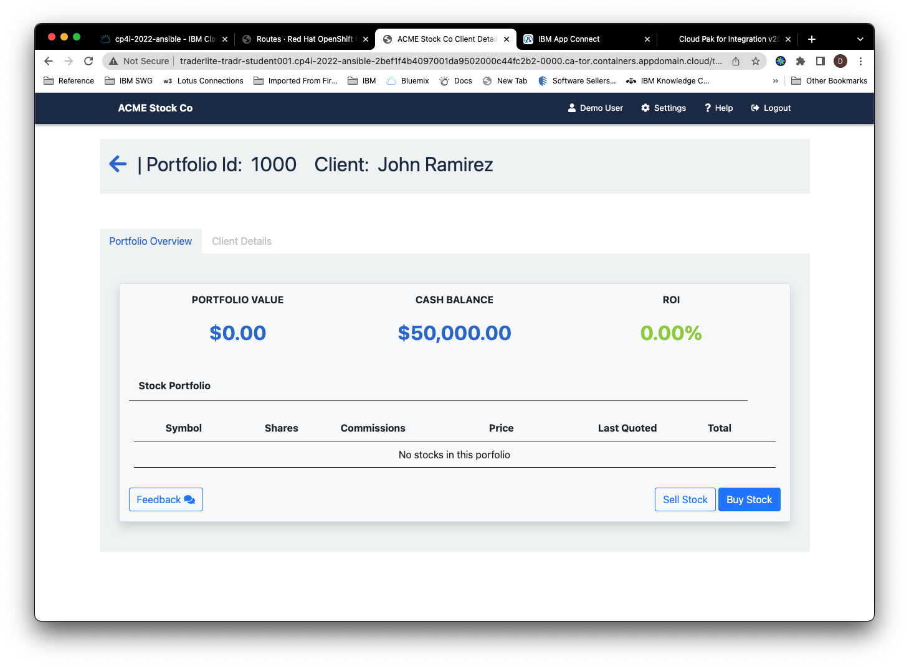](images/new-portfolio.png)

7.13 Click on the **Client Details** tab. Because the TraderLite app is now calling your *sfpush* flow whenever a new client is created, you should see a Salesforce Contact Id in the form of a link.

  

7.14 Click on the Contact Id link to see the contact in Salesforce (you may be prompted for your Salesforce credentials)

> **Note**: If the link does not work because of geo specific URLs for Salesforce, login in to Salesforce by yourself and look at the new contact. The easiest way to find the new contact is to enter the first and last name in the search bar in Salesforce.

7.15 Now test your reverse flow (i.e. when a contact is modified in Salesforce). Click on the **Edit** button for the contact and change  the mobile number. Click **Save**.

  

7.16 Go back to the tab with the TraderLite app and refresh the page with the Client Details. Click on the **Client Details** tab and verify that the phone number has been updated with the new value you added in Salesforce.

  

## Summary

Congratulations ! You successfully completed the following key tasks in this lab:

* Connected to Salesforce
* Created an App Connect designer flow to push client data to Salesforce contacts.
* Created an Event Driven flow to push Salesforce contact updates to the TraderLite App via an API call
* Deployed the flows as Integration Servers in App Connect Dashboard
* Tested the flow with the Trader Lite app.
