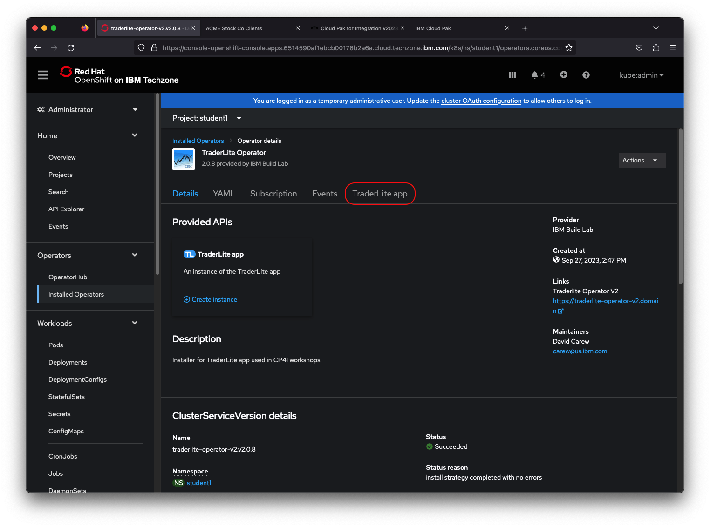
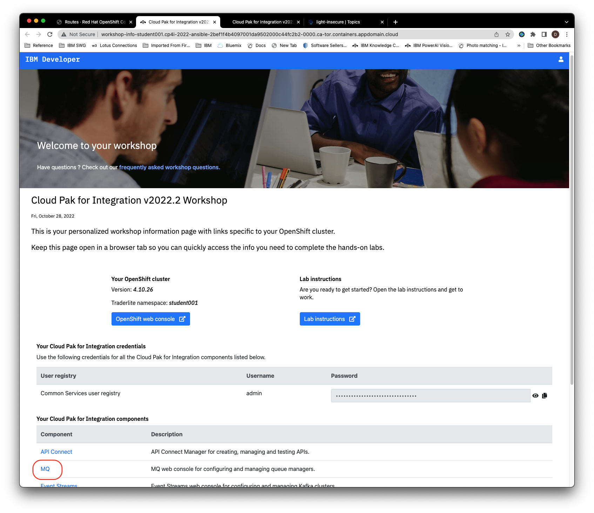
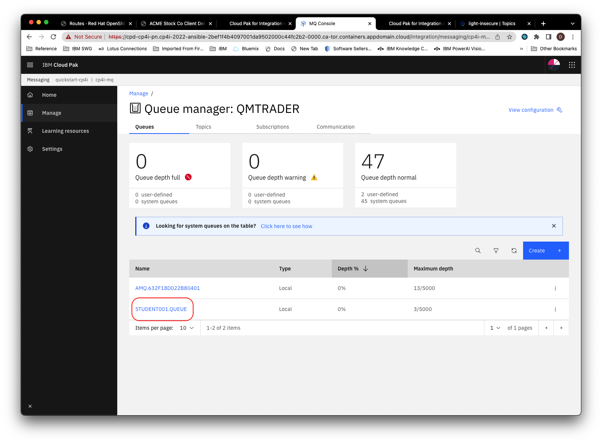
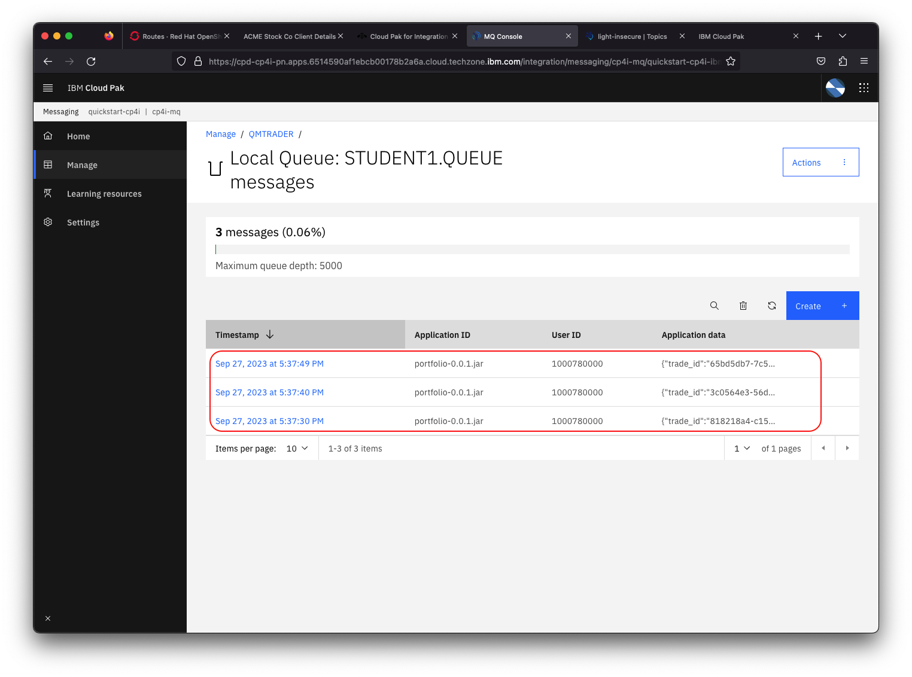
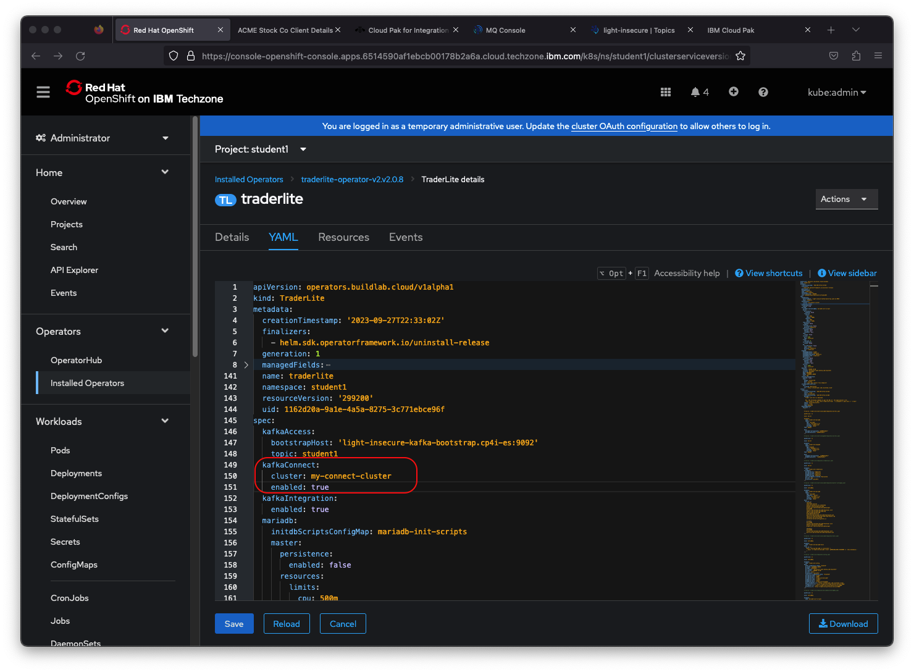
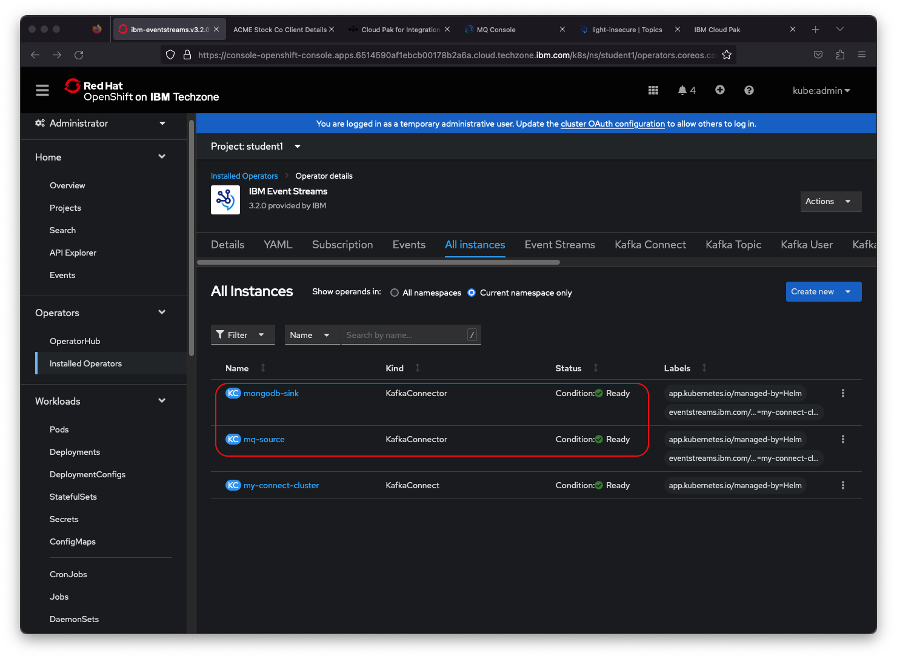
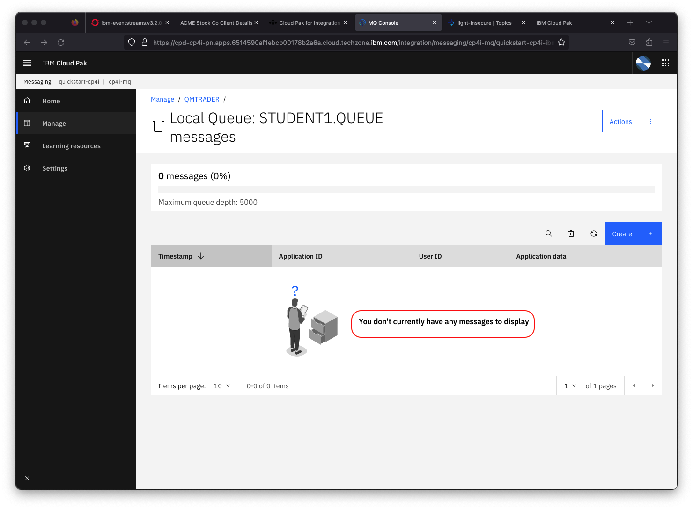

# Exercise - Using IBM MQ and Kafka for near realtime data replication

In this lab you will use IBM MQ and Kafka to replicate data from a transactional database to a reporting database. The pattern used allows for seamless horizontal scaling to minimize the latency between the time the transaction is committed to the transactional database and when it is available to be queried in the reporting database.

The architecture of the solution you will build is shown below:

* The **portfolio** microservice sits at the center of the application. This microservice:

    * sends completed transactions to an IBM MQ queue.
    * calls the **trade-history** service to get aggregated historical trade data.

* The **Kafka Connect** source uses the Kafka Connect framework and an IBM MQ source to consume the transaction data from IBM MQ and sends it to a topic in Kafka. By scaling this service horizontally you can decrease the latency between the time the transaction is committed to the transactional database and when it is available to be queried in the reporting database,

* The **Kafka Connect** sink uses the Kafka Connect framework and a Mongodb sink to receive the transaction data from Kafka and publishes it to the reporting database. By scaling this service horizontally you can decrease the latency between the time the transaction is committed to the transactional database and when it is available to be queried in the reporting database.

This lab is broken up into the following steps:

1. [Prerequisites](#prerequisites)

1. [Add messaging components to the Trader Lite app](#step-1-add-messaging-components-to-the-trader-lite-app)

1. [Generate some test data with the Trader Lite app](#step-2-generate-some-test-data-with-the-trader-lite-app)

1. [Verify your trades have been sent as messages to IBM MQ](#step-3-view-messages-in-ibm-mq)

1. [Start Kafka Replication](#step-4-start-kafka-replication)

1. [Verify transaction data was replicated to the Trade History database](#step-5-verify-transaction-data-was-replicated-to-the-trade-history-database)

1. [Summary](#summary)

## Prerequisites

The *TraderLite* application needs to be up and running on your cluster. If you've completed the API Connect and/or the Salesforce integration labs then you will have the app running already. If you have not completed either of those labs, follow the installation instructions in this [FAQ](../faq/README.md#traderlite-application-installation) before continuing to step 1 below.

## Step 1: Add messaging components to the Trader Lite app

In this section you will modify the TraderLite app to start storing transactions as MQ messages, without setting up the KafkaConnect part that will move the transactions out of MQ, into Kafka and then into MongoDB. This demonstrates how MQ can serve as a reliable store and forward buffer especially during temporary network disruption.

>**Note:** You can click on any image in the instructions below to zoom in and see more details. When you do that just click on your browser's back button to return to the previous state.

1.1 Go to the OpenShift console of your assigned cluster. Select the **student001** project. In the navigation on the left select **Installed Operators** in the **Operators** section and select the **TraderLite Operator**

  

1.2 Click on the **TraderLite app** tab

  

1.3 Click on the 3 periods to the right of the existing TraderLite CRD and select **Edit TraderLite** from the context menu.

  

1.4 Click on the **Details** tab

  

1.5 Scroll down and toggle **Kafka Integration** to **True** and click on **Confirm change**

  

1.6 In the navigation area on the left select **Pods** in the **Workloads** section. You should see that a new instance of the Portfolio pod has been started.

  > *Note: You can enter `traderlite` in the search by name input field to filter the pods.*

  

1.7 Wait until the new pod is in the **Ready** state and the previous pod has terminated before continuing.

> *Note: You will know the traderlite-portfolio-xxxxx pod is in a ready state when the `Ready` column shows `1/1`. You will also see that the created column will have a recent timestamp value.*

## Step 2: Generate some test data with the Trader Lite app

2.1 In your OpenShift console click on **Routes** in the left navigation under the **Networking** section and then click on the icon next to the url for the **tradr** app (the UI for TraderLite)

  

2.2 Log in using the username `stock` and the password `trader`

  

2.3 Click **Add Client** fill in the form. You must use valid email and phone number formats to avoid validation errors.

  

2.4 Click **Save**

2.5 Click on the **Portfolio ID** of the new client to see the details of the portfolio

  

2.6 Buy some shares of 2 or 3 different companies and then sell a portion of one of the shares you just bought. To buy shares, click the `Buy Stock` button, then select a company and enter a share amount. To sell shares, click the `Sell stock` button, then select the company symbol and enter the number of shares to sell.

  

>**Note:** Your ROI will be off because we are not yet replicating the historical trade data that goes in to the calculation of the ROI.

## Step 3: View messages in IBM MQ

3.1 Go to your Workshop Information page and click on the MQ component link. The webpage will launch in a separate browser tab, you may be prompted to that the connection is not private. In which case, click the `Advanced` button and click the link to proceed to the page.

   > *Note: If you no longer have the Workshop Information page available, follow the instructions in the [FAQ](../faq/README.md#workshop-information-page)*

  

3.2 If prompted to login, select **Default authentication** and enter the credentials on the Workshop Information page

3.3 Click on the **Manage QMTRADER** tile

  

3.4 Click on the queue **TRADER.QUEUE**

  

3.5 You should see messages for the trades you just executed. The number of messages in the queue will vary based on the number of buy/sell transactions you performed in the previous steps.

  

3.6 Keep the browser tab with the MQ web interface open as you'll need it later in the lab.

## Step 4: Start Kafka Replication

In this section you will configure the TraderLite app to start moving the transaction data out of MQ, into Kafka and then into the MongoDB reporting database.

4.1 Go to the OpenShift console of your assigned cluster.  In the navigation on the left select **Installed Operators** and select the **TraderLite Operator**

4.2 Click on the **TraderLite app** tab

  

4.3 Click on the 3 periods to the right of the existing TraderLite CRD and select **Edit TraderLite** from the context menu.

4.4 Click on the **Details** tab

  

4.5 Scroll down and toggle **Kafka Connect enabled** to **True** and click on **Confirm change**

  

4.6 In the navigation on the left select **Installed Operators** and select the **Strimzi** operator.

  

4.7 Click on the **All instances** tab and wait for the *mq-source* and *mongodb-sink* connectors to be in the *Ready* state before continuing.

  

4.8 Go back to the browser tab with the MQ Console and verify that all the messages have been consumed by the *mq-source* connector. *(Note: You may need to reload this browser tab to see that the messages have been consumed.)*

  

## Step 5: Verify transaction data was replicated to the Trade History database

5.1 Go to the OpenShift console of your assigned cluster.  In the navigation on the left select **Routes** in the **Networking** section.

5.2 Copy the link for the *trade-history* microservice and paste it into a new browser tab.

> **Note:** You will get a 404 (Not Found) message if you try to access this URL as is. This is because the *trade-history* microservice requires extra path information.

  

5.3 Append the string `/trades/1000` to the address you pasted - you should get back some JSON with the test transactions that you ran earlier.

  

## Summary

Congratulations ! You successfully completed the following key steps in this lab:

* Configured the Trader Lite app to use MQ
* Deploy Kafka Connect
* Generated transactions in the Trader Lite app and verified that the data is being replicated via MQ and Kafka.
