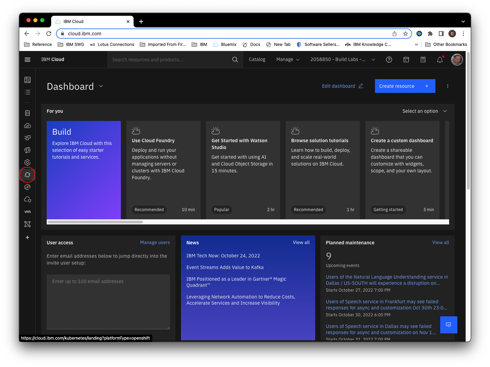
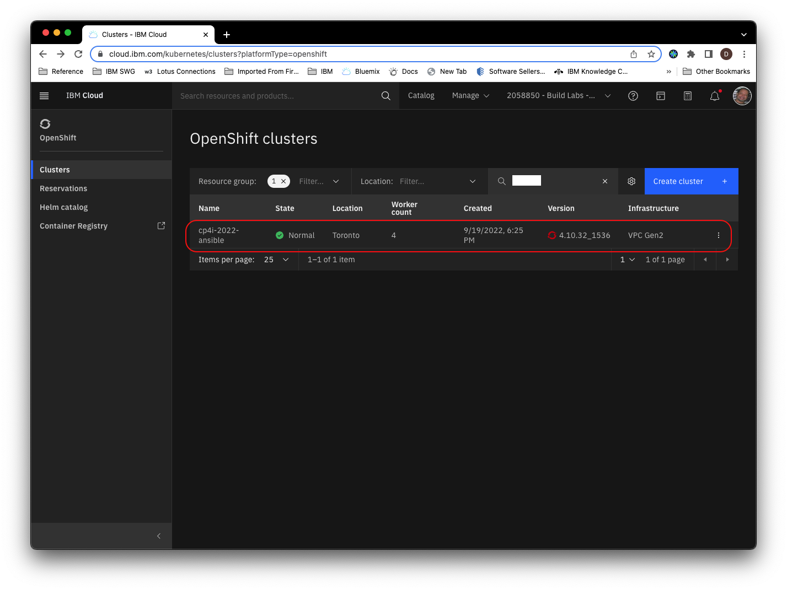
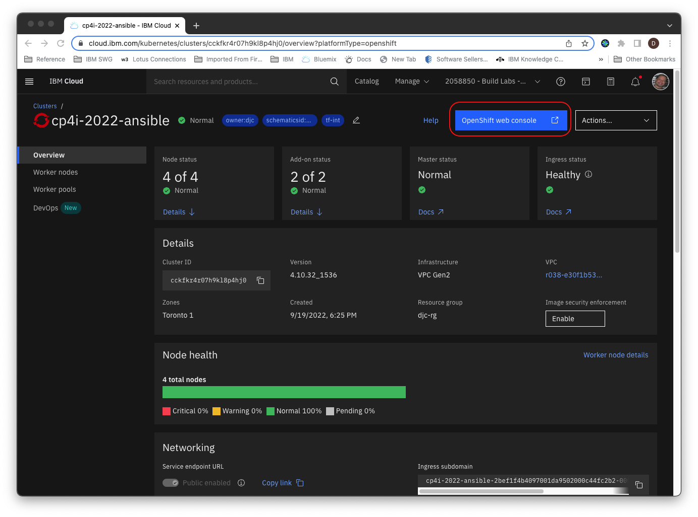
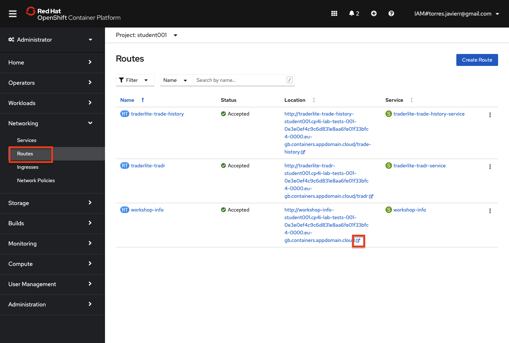
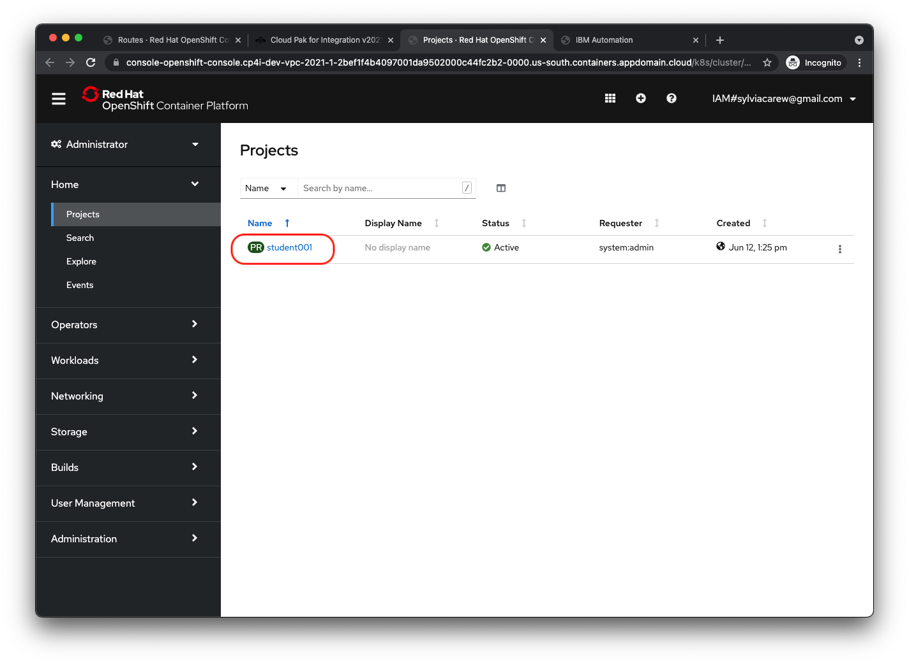
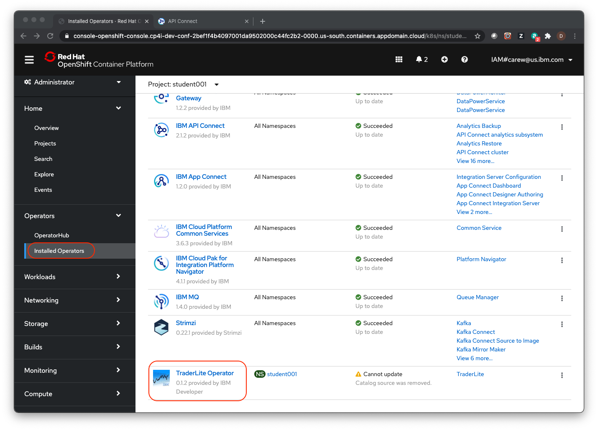
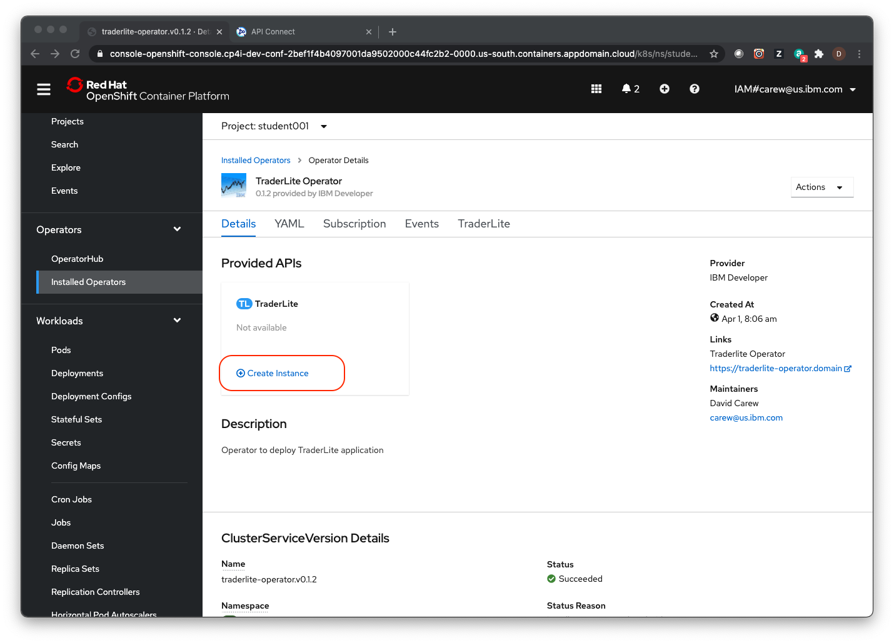
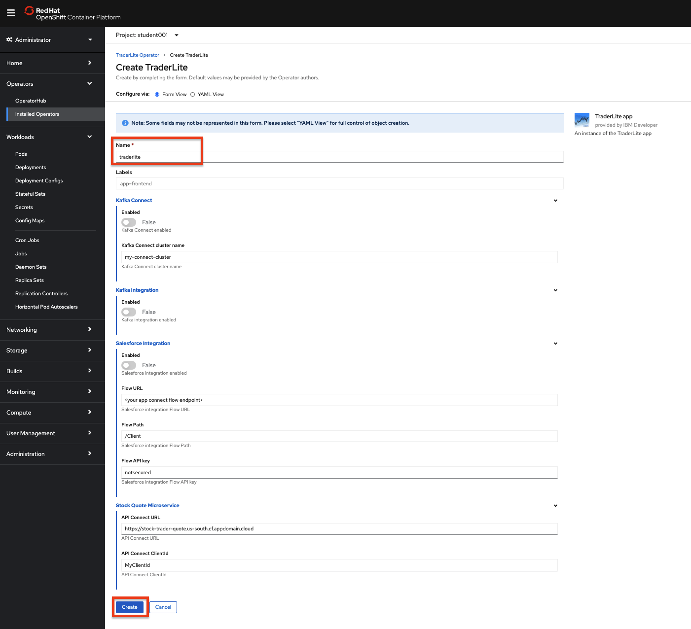
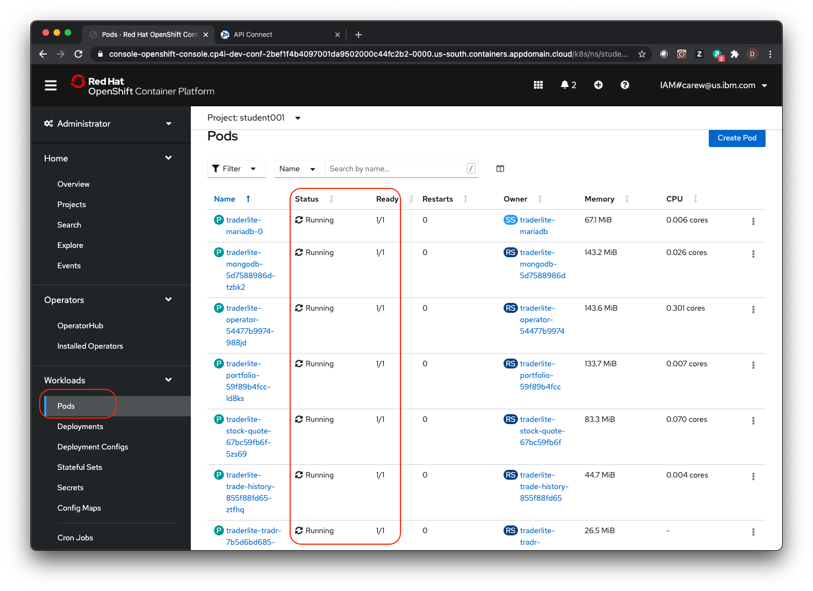

# Frequently Asked Questions & Helpful Tips / Tricks

1. [How do I get to the workshop OpenShift console?](#your-workshop-openshift-cluster-console)
1. [How do I get to the workshop information page?](#workshop-information-page)
1. [I don't have the trader lite application, how can I install it?](#traderlite-application-installation)

>**Note:** You can click on any image in the instructions below to zoom in and see more details. When you do that just click on your browser's back button to return to the previous state.

***

## Your workshop OpenShift cluster console 

Open the OpenShift console on your workshop cluster:

 > **Note:** You can click on any image in the instructions below to zoom in and see more details. When you do that just click on your  browser's back button to return to the previous state.

1. Got to the [IBM Cloud](https://cloud.ibm.com) landing page. Click on the OpenShift cluster icon in the left navigation.

    

1. Select your workshop cluster.

    

1. Details for your cluster will load.

1. Click on *OpenShift web console* to launch the console.

    

## Workshop Information Page

If you no longer have your workshop cluster OpenShift console open, follow the instructions in the  previous section and then return here. 

1. Go to the OpenShift console of your assigned cluster. Select your  ***studentnnn*** project. In the navigation on the left, select **Routes** in the **Operators** section.

1. Click on the icon next to the url for the **workshop-info** route. This will open the webpage in a new tab.

    

## Traderlite Application Installation

The traderlite application used in this workshop is installed as part of the API Connect and/or the Salesforce integration labs. If you have not completed that lab, follow these steps to install an instance of the application.

1. In a separate browser tab, go to the OpenShift console of your workshop  cluster.

1. Click on **Projects** in the left navigation and then click on your ***student001*** project in the list.

    

1. Click on **Installed Operators** in the left navigation and then click on the **TraderLite Operator** in the list.

    

1. Click the **Create Instance** to start the installation of the TraderLite app.

    

1. Name the instance *traderlite* and leave everything else with their default values. Click **Create**

    

1. In the left navigation select **Pods** in the **Workloads** section and then wait for all the TraderLite pods to have a status of **Running** and be in the **Ready** state.

    > *Note: You can enter `traderlite` in the search by name input field to filter the pods.*

    

