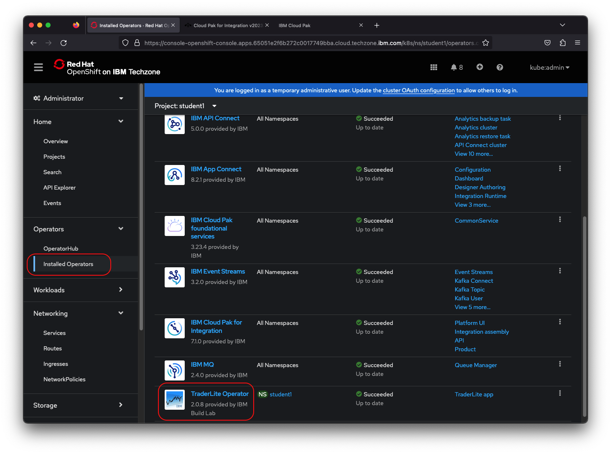

# Frequently Asked Questions & Helpful Tips / Tricks

1. [How do I get to the workshop information page?](#workshop-information-page)
1. [I don't have the trader lite application, how can I install it?](#traderlite-application-installation)
1. [I am receiving a `Your connection is not private` message, what should I do?](#accept-private-connection)

>**Note:** You can click on any image in the instructions below to zoom in and see more details. When you do that just click on your browser's back button to return to the previous state.

***

## Workshop Information Page

The workshop information page contains the links, resources and credentials necessary to complete the labs in this workshop. To get to this webpage:

1. Go to the OpenShift console of your assigned cluster. Select the **student001** project. In the navigation on the left, select **Routes** in the **Operators** section.

1. Click on the icon next to the url for the **workshop-info** route. This will open the webpage in a new tab.

    

## Traderlite Application Installation

The traderlite application used in this workshop is installed as part of the API Connect and/or the Salesforce integration labs. If you have not completed that lab, follow these steps to install an instance of the application.

1. In a separate browser tab, go to the OpenShift console of your assigned cluster.

1. Click on **Projects** in the left navigation and then click on the **student001** project in the list.

    

1. Click on **Installed Operators** in the left navigation and then click on the **TraderLite Operator** in the list.

    

1. Click the **Create Instance** to start the installation of the TraderLite app.

    

1. Name the instance *traderlite* and leave everything else with their default values. Click **Create**

    

1. In the left navigation select **Pods** in the **Workloads** section and then wait for all the TraderLite pods to have a status of **Running** and be in the **Ready** state.

    > *Note: You can enter `traderlite` in the search by name input field to filter the pods.*

    

## Accept Private Connection

There are various components used in this workshop. When loading the UIs for these components you may receive a message in your browser that the connection is not private. To complete loading the UI:

* Click the `Advanced` button below the warning message and then click the `Proceed to ....` link.

    

* You may receive this message more than once, follow the same steps to proceed to the UI.
