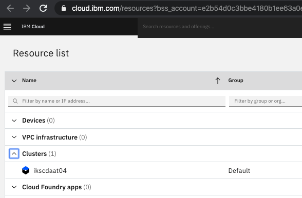

# Grant Cluster

## IBM Kubernetes Service (IKS) and RedHat OpenShift Kubernetes Service (ROKS)

The `grant cluster` method will assign access permissions to a cluster or namespace in a cluster that was created prior to the workshop. Creating a cluster and provisioning the VMs and other resources and deploying the tools may take up to 15 minutes and longer if queued. Permissioning access to an existing cluster in contrast happens in 1 or 2 minutes depending on the number of concurrent requests.

You need an IBM Cloud account to access your cluster,

1. If you do not have an IBM Cloud account yet, register at [https://cloud.ibm.com/registration](https://cloud.ibm.com/registration),
2. Or find instructions to create a new IBM Cloud account [here](https://github.com/IBM/workshop-setup/raw/master/docs/pdf/NEWACCOUNT.pdf),

To grant a cluster,

1. You need to be given a URL to submit your grant cluster request,
1. Open the URL to grant a cluster, e.g. `https://<workshop>.mybluemix.net`,
1. The grant cluster URL should open the following page,

    

1. Log in to this IBM Cloud account using the `lab key` given to you by the instructor and your IBM Id to access your IBM Cloud account,
1. Instructions will ask to `Log in to this IBM Cloud account`

    

1. When you click the link to log in to the IBM Cloud account, the IBM Cloud overview page will load with an overview of all resources on the account. In the top right, you will see an active account listed. The active account should be the account on which the cluster is created, which is not your personal account. Click the account dropdown if you need to change the active account.
1. Navigate to the `Clusters` section and select the cluster assigned to you.

    

    > *Note: The type of cluster and its name will vary from the screenshot.*

1. Details for your cluster will load.
