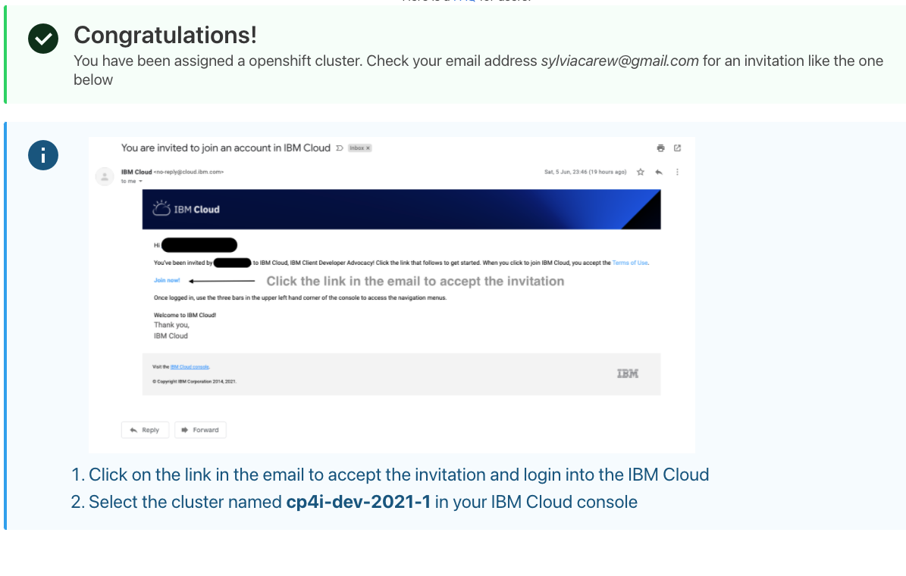
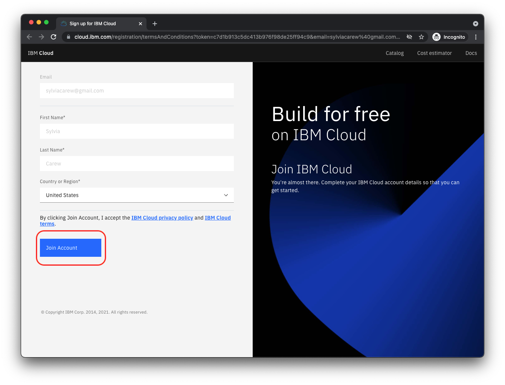
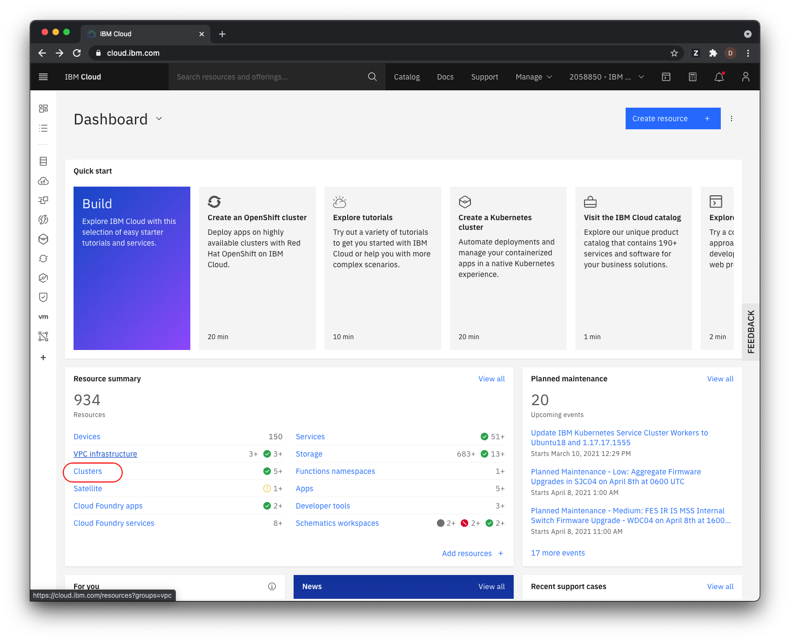
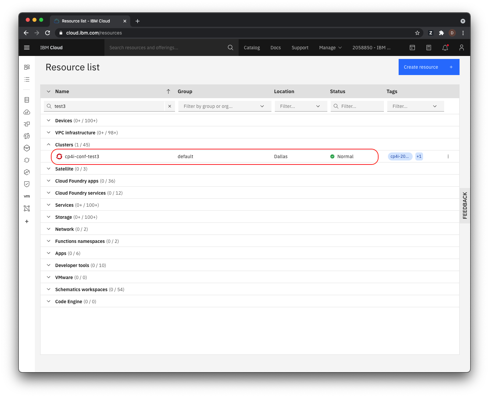
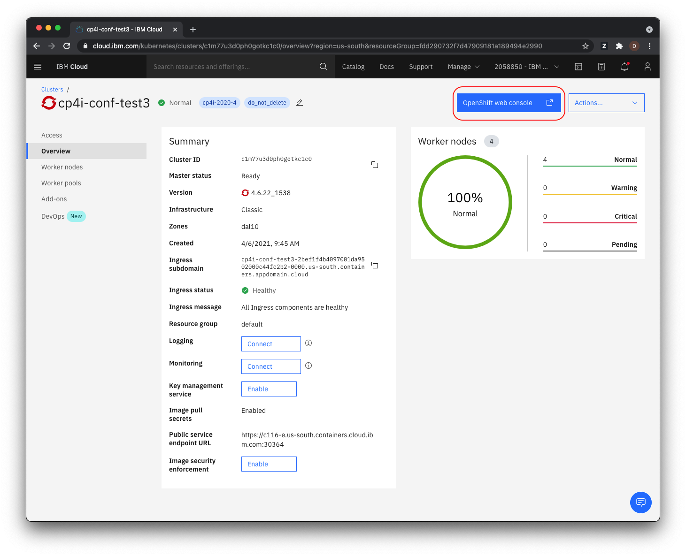
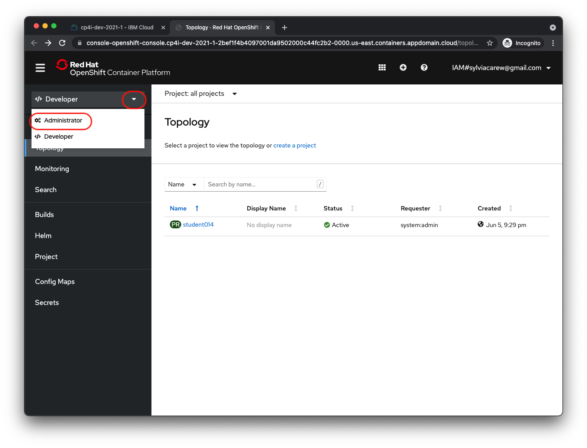
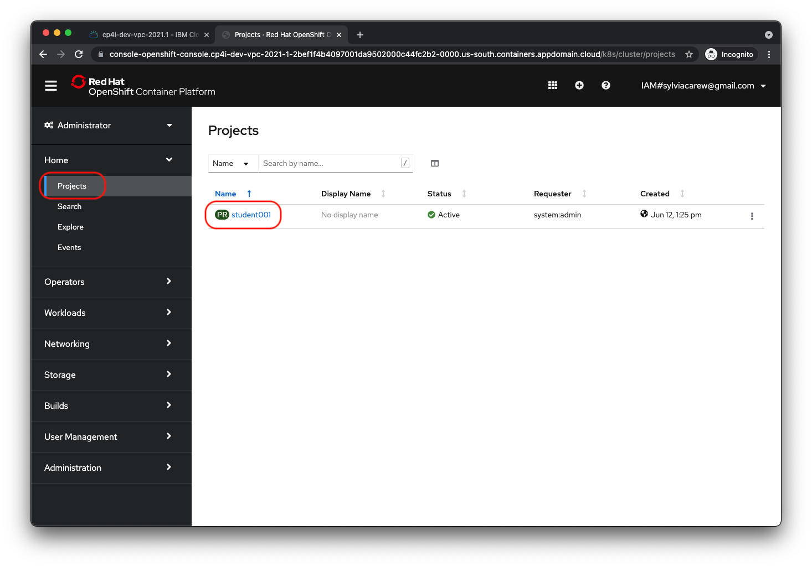
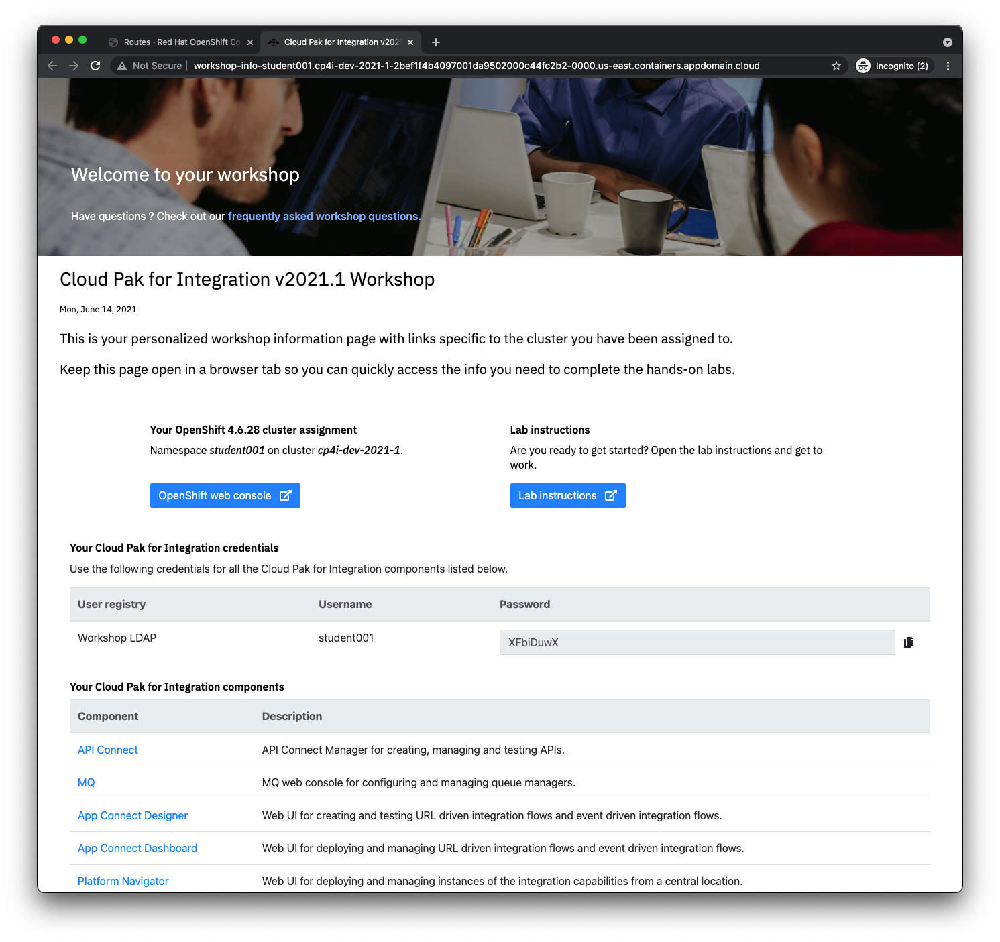

# Pre-work

## Cloud Pak for Integration and RedHat OpenShift Kubernetes Service (ROKS) Access

The `grant cluster` method will assign access permissions to a cluster or namespace in a cluster that was created prior to the workshop. Creating a cluster and provisioning the VMs and other resources and deploying the tools may take up to an hour and longer if queued. Permissioning access to an existing cluster in contrast happens in 1 or 2 minutes depending on the number of concurrent requests.

You need an IBM Cloud account to be given access to a cluster.

1. If you do not have an IBM Cloud account yet, register at [https://cloud.ibm.com/registration](https://cloud.ibm.com/registration),
2. Or find instructions to create a new IBM Cloud account [here](https://github.com/IBM/workshop-setup/raw/master/docs/pdf/NEWACCOUNT.pdf),

To gain access to a cluster,

1. Open the URL for the *Grant Cluster* application given to you for this workshop.

    > **Note:** You can click on any image in the instructions below to zoom in and see more details. When you do that just click on your  browser's back button to return to the previous state.

1. The grant cluster URL should open the following page,

    

1. Log in to this IBM Cloud account using the `lab key` given to you for this workshop and your IBM Id to access your IBM Cloud account,

    > *Note: The lab key can be found on the session information page or by asking your instructor.*

1. The instructions will ask to check the email associated with your IBM Cloud account and click on the link in the invitation email.

    

1. This brings up a page like the following.  Click the **Join Account** button.

    

1. If prompted to login, click the **Log in** button, after logging in the IBM Cloud overview page will load with an overview of all resources on the account. In the top right, you will see an active account listed.

   > The active account should be the account on which the cluster is created, which is not your personal account. Click the account dropdown if you need to change the active account.

1. From the [IBM Cloud](https://cloud.ibm.com) overview page. Select *Clusters*.

    

1. Select the cluster that was assigned to you by the grant cluster application for this workshop.

    

1. Details for your cluster will load.

## Workshop Information Page

The links, credentials and other resources you will need to complete the labs in this workshop have all been consolidated on one `Workshop Information` application. This application is pre-deployed on your cluster and can be accessed using the following steps:

1. From your cluster details page.

1. Click on *OpenShift web console* to launch the console.

    

1. In the left navigation switch from the **Developer** view to the **Administrator** view

    

1.  Select *Projects* (in the *Home* section) and then select your  ***studentnnn*** project.

   > *Note*: Each student will be assigned to a different namespace on their assigned cluster with a name in the format studentnnn (e.g. student012)

    

1. In the left navigation select *Routes* (in the *Networking* section) and then click on the *Location* link for the *workshop-info* route.

    

1. The will launch your Workshop Info page. Keep this tab open for the rest of the workshop as it has all the information and links needed for you to complete the lab exercises.

    
