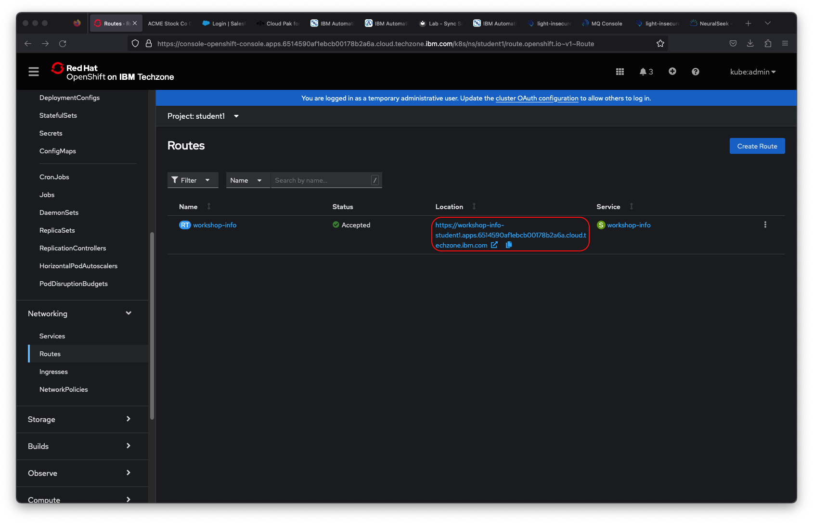
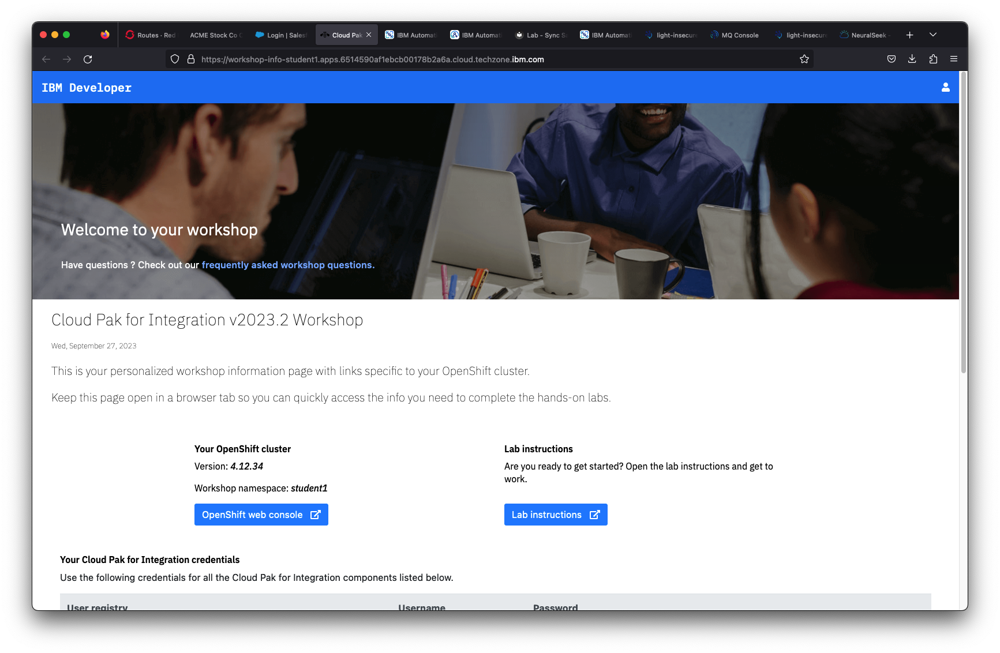

# Pre-work

## Cloud Pak for Integration and RedHat OpenShift Kubernetes Service (ROKS) Access

The workshop requires a workshop specific  instance of Cloud Pak for Integration 2022.2.1  on RedHat OpenShift 4.10 running on the IBM Cloud. This will have all required CP4I components as well the TraderLite application used in the lab exercises.

Open the OpenShift console on your workshop cluster:

   > **Note:** You can click on any image in the instructions below to zoom in and see more details. When you do that just click on your browser's back button to return to the previous state.

1. Got to the [IBM Cloud](https://cloud.ibm.com) landing page. Click on the OpenShift cluster icon in the left navigation.

    

1. Select your workshop cluster.

    

1. Details for your cluster will load.

1. Click on *OpenShift web console* to launch the console.

    

## Workshop Information Page

The links, credentials and other resources you will need to complete the labs in this workshop have all been consolidated on one `Workshop Information` application. This application is pre-deployed on your cluster and can be accessed using the following steps:

1.  From the OpenShift console  select *Projects* (in the *Home* section) and then select the ***student001*** project.

    

1. In the left navigation select *Routes* (in the *Networking* section) and then click on the *Location* link for the *workshop-info* route.

    

1. The will launch your Workshop Info page. Keep this tab open for the rest of the workshop as it has all the information and links needed for you to complete the lab exercises.

    
