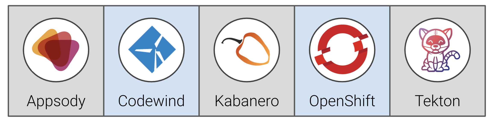

## Integrating Cloud Native Applications on OpenShift with Cloud Pak for Integration 

Welcome to our workshop! In this workshop we'll be using the Cloud Pak for Integration platform to wire together a set of micro-service applications into a running solution on OpenShift. The goals of this workshop are:

* Deploy an API Gateway using `API Connect`, to provide an API management point across the micro-services
* Simplify data access from external data sources, such as Salesforce, using `App Connect`
* Integrate payment flow into an existing `MQ` payment service
* Simplify flow of status udpates to the end user with a kafka event stream, using `Event Streams`
* Find performace bottlenecks in the overall flow, using `Tracing`

[Rewrite everything below this line]

### About this workshop

The introductory page of the workshop is broken down into the following sections:

* [Agenda](#agenda)
* [Compatability](#compatability)
* [About Cloud Pak for Applications](#about-cloud-pak-for-applications)
* [Credits](#credits)

## Agenda

### Day 1: Kabanero and Appsody for Developers and Operators

In this first day we'll learn how to use Appsody to run the *inner loop* of the development and test cycle for a developer, and how these tools can be integrated into your favorite IDE. We'll also explore how to deploy an application to OpenShift, first manually with Appsody for dev/test purposes, and then using the standard Kabanero Tekton piplines with GitOps as part of a continual test/production cycle.

|   |   |
| - | - |
| [Lecture 1: What is Cloud Native?](https://ibm.box.com/s/3pvl4jdi3xifs1olzcl9np904zvk5ueo) | Learn about the technologies that underpin Cloud Native applications |
| [Lecture 2: Kabanero Overview](https://ibm.box.com/s/6jl4b7sj8xqgh7rvxtea5ykpsjyu1siz) | Learn about Kabanero. An open source project to rapidly create Cloud Native applications |
| [Exercise 1: Introduction to Appsody and Codewind](exercise-1/README.md) | Install the Appsody component of Kabanero into the IDE with Codewind, Learn about the developer flow, building your first application with Appsody |
| [Exercise 2: Using Appsody CLI to develop, test, and debug applications](exercise-2/README.md) | Use the Appsody CLI to quickly create frontend and backend applications for a sample application using two different technologies (Spring and nodejs express) |
| [Exercise 3: Deploying to OpenShift with Appsody](exercise-3/README.md) | Deploy the built applications to IBM Managed OpenShift with Appsody for dev/test purposes |
| [Lecture 3: Adding value with IBM Cloud Pak for Applications](https://ibm.box.com/s/y4wh104vdos1vw5kdjwwuhebf8jgq580) | Learn about how IBM Cloud Pak for Applications bundles everything together |
| [Exercise 4: Use Tekton and Kabanero Pipelines to continuously deploy](exercise-4/README.md) | Deploy the built applications to IBM Managed OpenShift using GitOps to trigger a Tekton pipeline |

### Day 2: Customizing Stacks, Pipelines in Collections

In the second day we'll learn about the Kabanero open source project and how to productionize our applications with custom Appsody Stacks, custom Collections, and custom Tekton pipelines.

|   |   |
| - | - |
| [Lecture 4: Customizing Appsody and Kabanero](https://ibm.box.com/s/kbuympaqftxswyi1aoswdlqussmqf1ba) | Learn all about the stacks and repos |
| [Exercise 6: Building a custom Collection](exercise-6/README.md) | Create a collection that will contain custom appsody stacks and pipelines |
| [Exercise 5: Customizing an existing Appsody Stack](exercise-5/README.md) | Create a custom stack, to be hosted in our custom repository |
| [Exercise 7: Using a custom Collection with Appsody](exercise-7/README.md) | Learn how to manage these custom stacks and how to make them available to developers |
| [Lecture 5: Tekton Overview](https://ibm.box.com/s/tg0f6nhs91trlzkb5pfnh5e1rdzg4wm6) | Learn all Tekton CI/CD and how Kabanero uses it |
| [Exercise 8: Create a custom Tekton Task and Pipleline](exercise-8/README.md) | Build a pipeline that will fit into a custom Collection |
| [Exercise 9: Deploy an application with a custom Stack, custom Collection, and custom Pipeline](exercise-9/README.md) | Build and deploy an application using the custom stack, collection and pipelines built by the Architects' and Operators' tracks |

## Compatability

This workshop has been tested on the following platforms:

* **macOS**: Mojave (10.14), Catalina (10.15)
* **Windows** Windows 10 (with enterprise AAD and git bash)

## About Cloud Pak for Applications

IBM Cloud Pak for Applications is an enterprise-ready, containerized software solution for modernizing existing applications and developing new cloud-native apps that run on Red Hat® OpenShift®. Built on IBM WebSphere offerings and Red Hat OpenShift Container Platform with the Kabanero open source project, Cloud Pak for Applications provides a long-term solution to help you transition between public, private, and hybrid clouds, and create new business applications.

### A few other noteworthy mentions

Cloud Pak for Applications:

* ... includes
  * the Kabanero open source project
  * WebSphere
  * Mobile Foundation
  * IBM Cloud Private
  * Transformation Advisory
  * ...and more
* ... can be deployed on any major cloud provider supporting OpenShift (IBM Cloud, AWS, Azure, GCP)

## Credits

This workshop was primarily written by [Henry Nash](https://github.com/henrynash) and [Steve Martinelli](https://github.com/stevemar). Many other IBMers have contributed to help shape, test, and contribute to the workshop.

* [Greg Dritschler](https://github.com/GregDritschler): For his [Insurance Quote Code Pattern](https://github.com/IBM/appsody-sample-quote-app)
* [Carlos Santana](https://github.com/csantanapr): For his [Learning Kabanero 101 Tutorial](https://ibm-cloud-architecture.github.io/Learning-Kabanero-101)
* [Tim Robinson](https://github.com/timroster): For testing the lab on Windows
