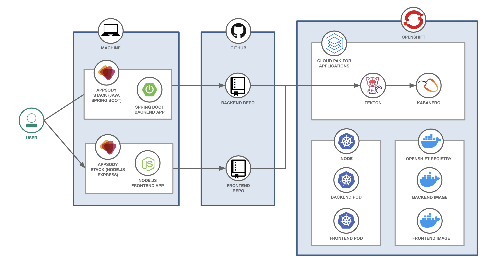

# Workshop Day 1

[Rewrite everything below this line]

## Day 1: Kabanero and Appsody for Developers and Operators

In this first day we'll learn how to use Appsody to run the *inner loop* of the development and test cycle for a developer, and how these tools can be integrated into your favorite IDE.

We'll also explore how to deploy an application to OpenShift, first manually with Appsody for dev/test purposes, and then using the standard Kabanero Tekton piplines with GitOps as part of a continual test/production cycle.

Our goal for the end of the day is represented below. But, don't worry about it right now, we'll get there together by following the exercises step-by-step.

## Agenda

| Section | Description |
| - | - |
| **[Lecture 1: What is Cloud Native?](https://ibm.box.com/s/3pvl4jdi3xifs1olzcl9np904zvk5ueo)** | Learn about the technologies that underpin Cloud Native applications |
| **[Lecture 2: Kabanero Overview](https://ibm.box.com/s/6jl4b7sj8xqgh7rvxtea5ykpsjyu1siz)** | Learn about Kabanero. An open source project to rapidly create Cloud Native applications |
| **[Exercise 1: Introduction to Appsody and Codewind](../exercise-1/README.md)** | Install the Appsody component of Kabanero into the IDE with Codewind, Learn about the developer flow, building your first application with Appsody |
| **[Exercise 2: Using Appsody CLI to develop, test, and debug applications](../exercise-2/README.md)** | Use the Appsody CLI to quickly create frontend and backend applications for a sample application using two different technologies (Spring and nodejs express) |
| **[Exercise 3: Deploying to OpenShift with Appsody](../exercise-3/README.md)** | Deploy the built applications to IBM Managed OpenShift with Appsody for dev/test purposes |
| **[Lecture 3: Adding value with IBM Cloud Pak for Applications](https://ibm.box.com/s/y4wh104vdos1vw5kdjwwuhebf8jgq580)** | Learn about how IBM Cloud Pak for Applications bundles everything together |
| **[Exercise 4: Use Tekton and Kabanero Pipelines to continuously deploy](../exercise-4/README.md)** | Deploy the built applications to IBM Managed OpenShift using GitOps to trigger a Tekton pipeline |
