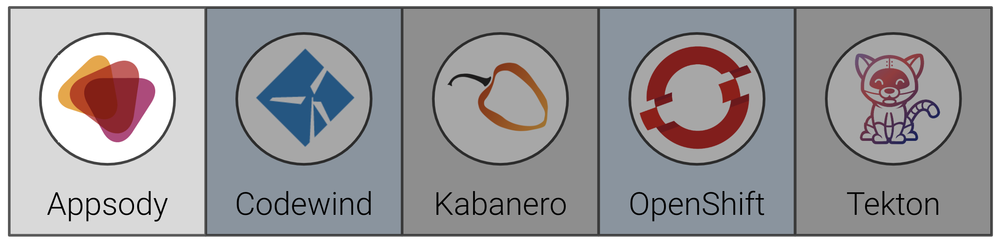

# Exercise 2: Using Appsody CLI to develop/test/debug applications

In this exercise, we will show how to create a sample insurance quote application using Appsody. Appsody is an open source project that provides the following tools you can use to build cloud-native applications:

* a command-line interface to develop containerized applications, test them locally, and then build and deploy them to Kubernetes
* a set of pre-configured "stacks" and templates for popular open source runtimes (such as Node.js and Spring Boot) on which to build applications

When you have completed this exercise, you will understand how to

* create a frontend web application and a backend REST application using the Appsody Node.js Express and Spring Boot stacks
* test the applications locally in a containerized environment



> **IMPORTANT** This example is used as the basis for the rest of the day 1 workshop, it's crucial to ensure it is working properly before continuing to the next exercise.

## Application architecture


1. The user enters the URL of the frontend application into a browser. The frontend application displays an insurance quote form in response.
2. The user fills in the form and clicks a button to submit it. The frontend application validates the form data and sends a REST request to the backend application.
3. The backend application uses the [Dacadoo Health Score API](https://info.dacadoo.com/) to compute a health score from the form data and then computes a quote from that.

## Prerequisites

You should have already carried out the prerequisites defined in the [Pre-work](../pre-work/README.md) section.

In addition to the pre-reqs above, we need to clone the repo: <https://github.com/IBM/cloudpakforapps-workshop>

We recommend putting this repo in your user home, i.e.:

```bash
cd ~
git clone https://github.com/IBM/cloudpakforapps-workshop
```

## Steps

1. [Create the frontend application and run it locally](#1-create-the-frontend-application-and-run-it-locally)
1. [Create the backend application and run it locally](#2-create-the-backend-application-and-run-it-locally)

### 1. Create the frontend application and run it locally

The frontend application is written in Node.js Express. First let's initialize an Appsody project that uses the Node.js Express stack. Create a directory somewhere outside where you cloned this project and run the `appsody init` command shown below.

```bash
cd ~/appsody-apps
mkdir quote-frontend
cd quote-frontend
appsody init kabanero/nodejs-express
```

After `appsody init` completes, list the content of the directory. You'll see that Appsody has created a starter application for you.

```bash
.
├── app.js
├── package-lock.json
├── package.json
└── test
    └── test.js
```

It's possible to run this application on your workstation immediately.

```bash
appsody run
```

You can see the output of the application by navigating to `http://localhost:3000` in a browser window.

Appsody builds a containerized version of the application for you and runs it in Docker. You can enter `http://localhost:3000` in a browser to see the default endpoint served by the application.

The Node.js Express stack also provides out-of-the-box health checking, application metrics endpoints and performance monitoring. In development containers (i.e. during Rapid Local Development Mode), it also provides an analysis dashboard.

* Health endpoint: <http://localhost:3000/health>
* Liveness endpoint: <http://localhost:3000/live>
* Readiness endpoint: <http://localhost:3000/ready>
* Metrics endpoint: <http://localhost:3000/metrics>
* Dashboard endpoint: <http://localhost:3000/appmetrics-dash> (development only)

While the containerized application is running you can edit the application and your changes will be reflected in the running container. You can test this by editing the app.js module and changing the message returned by the default endpoint. Watch the `appsody run` console session for the application to restart. Then re-enter `http://localhost:3000` in your browser and you will see the new message.

We're going to replace the starter code with the insurance quote frontend application. First you must edit the `package.json` file and add the following to the `dependencies` section:

```json
{
  .
  .
  "dependencies": {
    "body-parser": "^1.19.0",
    "config": "^3.2.0",
    "express-validator": "^6.2.0",
    "pug": "^2.0.0",
    "request": "^2.88.0"
  },
  .
  .
  .
}
```

The Node.js Express stack installs the package dependencies into the containerized application. However it won't do this when the containerized application is already running. You must stop the current application by entering `appsody stop` in a separate window, and then re-run `appsody run` to start it back up.

Now copy the files from the `quote-frontend` directory in the cloned git repo to your Appsody project, for example:

```bash
cp -R ~/cloudpakforapps-workshop/exercise-frontend/* .
```

The resulting directory structure of your Appsody project should look like this:

```bash
.
└── config
    ├── custom-environment-variables.json
    └── development.json
└── test
    └── test.js
└── views
    └── quote.pug
├── app.js
├── package-lock.json
├── package.json
└── quote.js
```

Watch for the container to restart and then refresh your browser again. You will see a form appear.


You can fill in the form and hit the button to submit it and a response will appear. In this case the frontend application is not sending a request to the backend application. Instead it is configured to use a mock endpoint for testing purposes in development mode. This works as follows.

* `quote.js` uses the [config](https://www.npmjs.com/package/config) module to get the value for the backend URL.
* When the application runs in development mode, the config module uses `config/development.json` to find the value for the backend URL.

This file sets the URL to the mock endpoint.

```json
{
    "backendUrl": "http://localhost:3000/quote/test"
}
```

* When the application runs in production mode (which we'll see later), the config module uses `config/custom-environment-variables.json` to find the value for the backend URL.

This file sets the URL from the `BACKEND_URL` environment variable.

```json
{
    "backendUrl": "BACKEND_URL"
}
```

Press `Ctrl-C` in the window where the application is running to stop it.

Appsody provides a way to run automated tests against the containerized application.

```bash
appsody test
```

This runs tests that come packaged with the stack (such as tests of the health and metrics endpoints), and of course you can add your own tests of your application as well. Look at tests that call `GET /quote` and `POST /quote` in `test/test.js` to how the frontend application is tested.

### 2. Create the backend application and run it locally

The backend application is written in Spring Boot. Let's initialize an Appsody project that uses the Spring Boot 2 stack. Create a directory somewhere outside where you cloned this project and run the `appsody init` command shown below.

```bash
cd ~/appsody-apps
mkdir quote-backend
cd quote-backend
appsody init kabanero/java-spring-boot2
```

After `appsody init` completes, list the content of the directory. You'll see that Appsody has created a starter application for you.

```bash
.
├── src/main/java/application/LivenessEndpoint.java
├──                          /Main.java
├── src/main/resources/public/index.html
├──                   /application.properties
├── test/java/application/MainTests.java
├── target/* (compiled code)
├── .appsody-config.yaml
├── .gitignore
└── pom.xml
```

It's possible to run this application on your workstation immediately.

```bash
appsody run
```

Appsody builds a containerized version of the application for you and runs it in Docker. You can enter `http://localhost:8080` in a browser to see the default endpoint served by the application.

The Spring Boot 2 stack also provides out-of-the-box health checking and application metrics endpoints.

* Health endpoint: <http://localhost:8080/actuator/health>
* Liveness endpoint: <http://localhost:8080/actuator/liveness>
* Metrics endpoint: <http://localhost:8080/actuator/metrics>
* Prometheus endpoint: <http://localhost:8080/actuator/prometheus>

We're going to replace the starter code with the insurance quote backend application. Edit the `pom.xml` file and add the following dependency to the dependencies section.

```xml
  <dependencies>
    .
    .
    .
    <dependency>
        <groupId>org.projectlombok</groupId>
        <artifactId>lombok</artifactId>
        <version>1.18.8</version>
    </dependency>
  </dependencies>
```

Now copy the files from the `quote-backend` directory in the cloned git repo to your Appsody project, for example:

```bash
cp -R ~/cloudpakforapps-workshop/exercise-backend/* .
```

The resulting directory structure of your Appsody project should look like this:

```bash
.
├── src/main/java/application/LivenessEndpoint.java
├──                          /Main.java
├── src/main/resources/public/index.html
├──                   /application.properties
├──                   /application.yaml
├── test/java/application/MainTests.java
├── test/java/application/QuoteTests.java
├── target/* (compiled code)
├── .appsody-config.yaml
├── .gitignore
├── backend-input.json
└── pom.xml
```

You can test the backend API using [curl](https://curl.haxx.se/download.html). The file `backend-input.json` contains sample input for the API. Issue the `curl` command from the project directory.

```bash
curl -X POST -d @backend-input.json  -H "Content-Type: application/json"  http://localhost:8080/quote
```

You should see output similar to the following:

```bash
$ curl -X POST -d @backend-input.json  -H "Content-Type: application/json"  http://localhost:8080/quote
{"quotedAmount":30,"basis":"mocked backend computation"}
```

In this case the backend application is not sending a request to the Dacadoo health score API. Instead it is configured to use a mock endpoint for testing purposes in development mode. This works as follows:

* `src/main/java/application/Quote.java` uses `@Value("${DACADOO_URL}")` and `@Value("${DACADOO_APIKEY}")` to get the values of the Dacadoo Health Score API endpoint URL and the API key.
* `src/main/resources/application.yaml` defines mock values for the URL and API key.

  ```yaml
  DACADOO_URL: http://localhost:8080/mockscore
  DACADOO_APIKEY: TEST
  ```

* When the application runs in production mode (which we'll see later), environment variables can be used to set the URL and API key. Environment variables override the values in the `application.yaml` file.

Press `Ctrl-C` in the window where the application is running to stop it.

You can use `appsody test` to run automated tests for this application.

```bash
appsody test
```

Look at [quote-backend/src/test/java/application/QuoteTests.java](quote-backend/src/test/java/application/QuoteTests.java) to see the tests for the backend application.

**Congratulations**! We have tested out our sample application locally and are ready to move on to the next step, deploying it!
