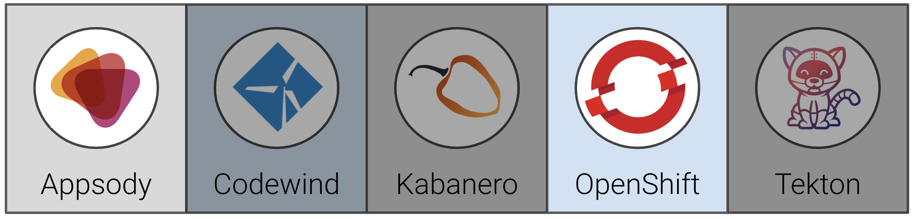
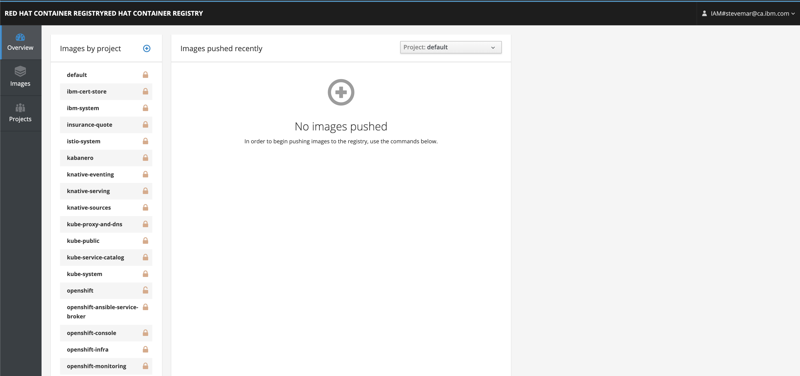
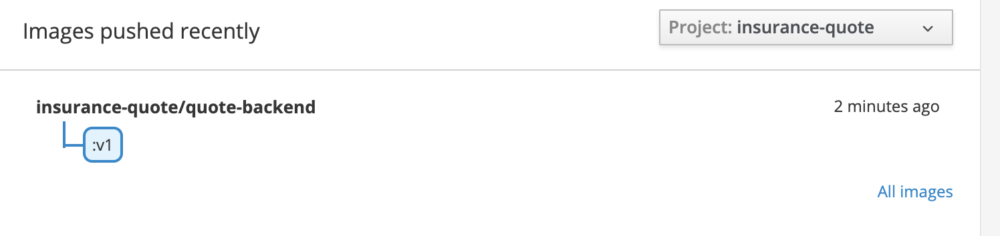
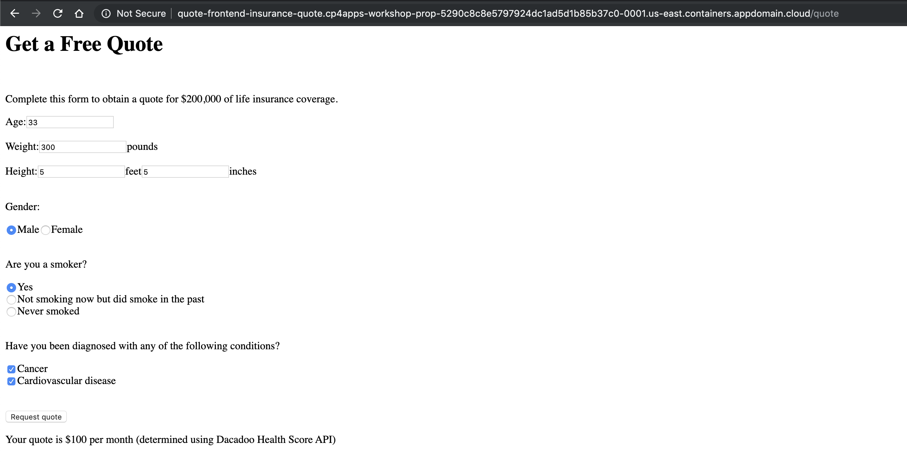

# Exercise 3: Use App Connect to easily integrate an external data source

[re-write everything below this line]

In [Exercise 2](../exercise-2/README.md) you were running the insurance quote application under "appsody control" in Local Rapid Development Mode (sometimes called the *inner loop* of development). In this exercise, we will show how to deploy the same application to OpenShift using Appsody. Appsody provides the functionaliy to build a standard Docker image for your applicaiton (including all the components from stack), for deployment to Docker or Kubernetes, enabling additional testings within these environment. In particular:

* `appsody build` will create a Docker image
* `apposdy deploy` will deploy the image to a Kubernetes cluster, by default using the Appsody Operator. For simplicity, `appsody deploy` will also execute a build ahead of the deployment.

When you have completed this exercise, you will understand how to:

* deploy the applications to OpenShift using the appsody CLI



## Prerequisites

You should have already carried out the prerequisites defined in the [Pre-work](../pre-work/README.md) section, and in addition:

* In order for the backend application to access the Dacadoo Health Score API, visit <https://models.dacadoo.com/doc/> to register and request an API key for evaluation purposes. Access to this API is usually granted individually to those that apply. You need to record the `url` for the API (displayed by clicking on the Health Score link under Models - usually `https://models.dacadoo.com/score/2`) and the `Key` (something similar to `UFDzMHAfsEg0oKzGp4rCSmXPClKKq3hDPLbPdvc2h`). There is a mock implementation of the API in the code that you can use if you do not want to register.

## Steps

1. [Set up a project namespace](#1-set-up-a-project-namespace)
1. [Access the internal Docker Registry](#2-access-the-internal-docker-registry)
1. [Deploy the backend application to OpenShift](#3-deploy-the-backend-application-to-openshift)
1. [Deploy the frontend application to OpenShift](#4-deploy-the-frontend-application-to-openshift)

### 1. Set up a project namespace

OpenShift applications are deployed within a project. So the first step is to create a new project:

``` bash
oc new-project insurance-quote
```

You should see output similar to the following:

``` bash
$ oc new-project insurance-quote
Now using project "insurance-quote" on server "https://c100-e.us-east.containers.cloud.ibm.com:31718".

You can add applications to this project with the 'new-app' command. For example, try:

    oc new-app centos/ruby-25-centos7~https://github.com/sclorg/ruby-ex.git

to build a new example application in Ruby.
```

Check that the current context is your team’s project space.

``` bash
oc project -q
```

### 2. Access the internal Docker Registry

We need a spot to push our newly built Docker images that Appsody created for us. Luckily, OpenShift comes with an internal Docker registry we can use. However, this registry is not enabled for public access by default.

Running the `oc get route --all-namespaces` command below shows us that only a dashboard for the registry is available. Not quite what we need.

```bash
oc get route --all-namespaces | grep registry
```

You should see output similar to the following:

```bash
$ oc get route --all-namespaces | grep registry
default    registry-console    registry-console-default.cp4apps-workshop-prop-5290c8c8e5797924dc1ad5d1b85b37c0-0001.us-east.containers.appdomain.cloud
```



To access the internal registry we need to create a route and expose it. See the [IBM Cloud documentation](https://cloud.ibm.com/docs/openshift?topic=openshift-openshift-images#openshift_internal_registry) for the complete steps, but here is the short version.

Run the following to create a new route.

```bash
oc create route reencrypt docker-registry --service=docker-registry -n default
```

We can now get the Docker registry URL:

```bash
oc get route --all-namespaces | grep registry
```

You should see output similar to the following:

```bash
$ oc get route --all-namespaces | grep registry
default    docker-registry    docker-registry-default.cp4apps-workshop-prop-5290c8c8e5797924dc1ad5d1b85b37c0-0001.us-east.containers.appdomain.cloud
default    registry-console    registry-console-default.cp4apps-workshop-prop-5290c8c8e5797924dc1ad5d1b85b37c0-0001.us-east.containers.appdomain.cloud
```

The URL we want to use is the `docker-registry` one, it'll look like `docker-registry-default.*.containers.appdomain.cloud`.

Once we have the URL, set it as a variable:

```bash
export IMAGE_REGISTRY=<docker_url>
```

And set our local `docker` command to use that registry, use `docker login`:

```bash
oc whoami -t | docker login -u $(oc whoami) --password-stdin $IMAGE_REGISTRY
```

### 3. Deploy the backend application to OpenShift

We will use the `appsody deploy` command for the deployments. This command:

* builds a deployment image for production usage (i.e. it does not include development-mode tools)
* pushes the image to your designated image registry
* builds a deployment yaml file (if you have not generated one already), as a CR for the Appsody Operator
* applies the yaml file to your Kubernetes cluster

Appsody has the ability to deploy directly to a kubernetes cluster using a default deployment manifest. This will work if the cluster does not require any specific credentials. In this case, we will need to provide these, so appsody allows you to generate the deployment manifest it would have used, but without doing the actual deployment. We can then modify this, and then ask appsody to use it for the deployment of our applications.

#### 3.1 Create a config map for the Dacadoo API key

In order to have the backend application send requests to the Dacadoo Health Score API, we need to create a secret that contains the configuration for making requests to the Dacadoo server, that you obtained in the pre-requisites of this exercise. (Note: If you do not want to use the Dacadoo Health Score API, you can skip this setup and continue to use the mock endpoint.)

```bash
oc create configmap dacadoo-config --from-literal=DACADOO_URL=<url> --from-literal=DACADOO_APIKEY=<apikey>
```

where:

* `<url>` is the URL of the Dacadoo server (usually `https://models.dacadoo.com/score/2`)
* `<apikey>` is the API key that you obtained when you registered to use the API.

for example:

```bash
oc create configmap dacadoo-config --from-literal=DACADOO_URL=https://models.dacadoo.com/score/2 --from-literal=DACADOO_APIKEY=Y3VB...RMGG
configmap/dacadoo-config created
```

#### 3.2 Deploy the backend application

Navigate to your `quote-backend` directory. We need to modify the deployment yaml to pass the secret's values to the application. The initial deployment yaml can be generated as follows.

```bash
cd ~/appsody-apps/quote-backend
appsody deploy --generate-only
```

This creates a file named `app-deploy.yaml` in your project.

```yaml
apiVersion: appsody.dev/v1beta1
kind: AppsodyApplication
metadata:
  name: quote-backend
spec:
  # Add fields here
  version: 1.0.0
  applicationImage: dev.local/quote-backend
  stack: java-spring-boot2
  service:
    type: NodePort
    port: 8080
    annotations:
      prometheus.io/scrape: 'true'
      prometheus.io/path: '/actuator/prometheus'
  readinessProbe:
    failureThreshold: 12
    httpGet:
      path: /actuator/health
      port: 8080
    initialDelaySeconds: 5
    periodSeconds: 2
  livenessProbe:
    failureThreshold: 12
    httpGet:
      path: /actuator/liveness
      port: 8080
    initialDelaySeconds: 5
    periodSeconds: 2
  expose: true
  createKnativeService: false
```

We need to add a section to the generated file. Under the `spec` key, create a new `envFrom` key that has the value of your OpenShift config map. `dacadoo-config` was used as the name in this workshop.

> **TIP**: Ensure there are two spaces before `name`, see <https://github.com/kubernetes/kubernetes/issues/46826#issuecomment-305728020>

```yaml
apiVersion: appsody.dev/v1beta1
kind: AppsodyApplication
metadata:
  name: quote-backend
spec:
  # Add fields here
  version: 1.0.0
  .
  .
  envFrom:
    - configMapRef:
        name: dacadoo-config
  expose: true
  createKnativeService: false
```

Now use `appsody deploy` to push the image and deploy it. When using the OpenShift docker registry, the urls used to push and pull a given image are different. `appsody deploy` allows us to specify these on the command line:

```bash
appsody deploy --tag insurance-quote/quote-backend:v1 --push-url $IMAGE_REGISTRY --push --pull-url docker-registry.default.svc:5000 --namespace insurance-quote
```

```bash
$ appsody deploy --tag insurance-quote/quote-backend:v1 --push-url $IMAGE_REGISTRY --push --pull-url docker-registry.default.svc:5000 --namespace insurance-quote
.
.
[Docker] Successfully built 4294712e0f9e
[Docker] Successfully tagged docker-registry-default.cp4apps-workshop-prop-5290c8c8e5797924dc1ad5d1b85b37c0-0001.us-east.containers.appdomain.cloud/insurance-quote/quote-backend:v1
Built docker image docker-registry-default.cp4apps-workshop-prop-5290c8c8e5797924dc1ad5d1b85b37c0-0001.us-east.containers.appdomain.cloud/insurance-quote/quote-backend:v1
Using applicationImage of: docker-registry-default.cp4apps-workshop-prop-5290c8c8e5797924dc1ad5d1b85b37c0-0001.us-east.containers.appdomain.cloud/insurance-quote/quote-backend:v1
Pushing docker image docker-registry-default.cp4apps-workshop-prop-5290c8c8e5797924dc1ad5d1b85b37c0-0001.us-east.containers.appdomain.cloud/insurance-quote/quote-backend:v1
Attempting to apply resource in Kubernetes ...
Running command: kubectl apply -f app-deploy.yaml --namespace insurance-quote
Deployment succeeded.
Appsody Deployment name is: quote-backend
Running command: kubectl get rt quote-backend -o jsonpath="{.status.url}" --namespace insurance-quote
Attempting to get resource from Kubernetes ...
Running command: kubectl get route quote-backend -o jsonpath={.status.ingress[0].host} --namespace insurance-quote
Deployed project running at quote-backend-insurance-quote.cp4apps-workshop-prop-5290c8c8e5797924dc1ad5d1b85b37c0-0001.us-east.containers.appdomain.cloud
```

> **NOTE**: If the deployment times out, see the section [Pushing to the OpenShift registry times out](../instructor-guide/README.md#pushing-to-the-openshift-registry-times-out) in the Admin Guide.
> **NOTE**: Running `appsody deploy` will install the [appsody operator](https://github.com/appsody/appsody-operator) on the *Default* namespace of the cluster.

After the deployment completes, you can test the service using curl. The last line output (above) in the deploy gives you the url to the backend application. For simplicity, let's put that in an environment variable, i.e, for the example above:

```bash
export  BACKEND_URL=quote-backend-insurance-quote.cp4apps-workshop-prop-5290c8c8e5797924dc1ad5d1b85b37c0-0001.us-east.containers.appdomain.cloud
```

```bash
curl -X POST -d @backend-input.json  -H "Content-Type: application/json"  http://$BACKEND_URL/quote
```

You should see output similar to the following:

```bash
$ curl -X POST -d @backend-input.json -H "Content-Type: application/json" http://$BACKEND_URL/quote
{"quotedAmount":70,"basis":"Dacadoo Health Score API"}
```

> **NOTE**: If you are not using the Dacadoo Health Score API, you may see different text for the value of "basis" -- ("mocked backend computation" instead of "Dacadoo Health Score API").

Navigating back to the registry dashboard should show the new image.



### 4. Deploy the frontend application to OpenShift

We are now going to deploy the frontend application to OpenShift. The steps are similar to what we did for the backend application. The difference here is that we need to tell the frontend application how to talk to the backend application. The frontend will look at an environment variable `BACKEND_URL` to find the address of the backend, so we will set this in the application CR.

Now we could specify this as the actual exposed backend url we used earlier, however since both front and backend are running within the same cluster, it is better to use the service that is defined for the backend. You can see this by entering:

```bash
oc get services
```

which should produce something like:

```bash
$ oc get services
NAME             TYPE       CLUSTER-IP       EXTERNAL-IP   PORT(S)          AGE
quote-backend    NodePort   172.21.175.254   <none>        8080:32379/TCP   15m
```

In order to be able to reference this in the application CR, we first we need to generate the deployment yaml so that we can edit it. Change the current directory back to the frontend application and generate the deployment yaml.

```bash
cd ../quote-frontend
appsody deploy --generate-only
```

Edit the file that was created, `app-deploy.yaml`, and add the `env` section as shown below (which defines an environment variable with the URL of the backend application within the cluster). Be careful to match the indentation (`env:` is indented the same number of spaces as `applicationImage:`):

```yaml
apiVersion: appsody.dev/v1beta1
kind: AppsodyApplication
metadata:
  name: quote-frontend
spec:
  # Add fields here
  version: 1.0.0
  applicationImage: quote-frontend
  env:
  - name: BACKEND_URL
    value: http://quote-backend:8080/quote
  .
  .
  .
```

Save the yaml file and do the deployment.

```bash
appsody deploy --tag insurance-quote/quote-frontend:v1 --push-url $IMAGE_REGISTRY --push --pull-url docker-registry.default.svc:5000 --namespace insurance-quote
```

```bash
$ appsody deploy --tag insurance-quote/quote-frontend:v1 --push-url $IMAGE_REGISTRY --push --pull-url docker-registry.default.svc:5000 --namespace insurance-quote
...
[Docker] Successfully built ba7451568a04
[Docker] Successfully tagged docker-registry-default.cp4apps-workshop-prop-5290c8c8e5797924dc1ad5d1b85b37c0-0001.us-east.containers.appdomain.cloud/insurance-quote/quote-frontend:v1
Built docker image docker-registry-default.cp4apps-workshop-prop-5290c8c8e5797924dc1ad5d1b85b37c0-0001.us-east.containers.appdomain.cloud/insurance-quote/quote-frontend:v1
Using applicationImage of: docker-registry-default.cp4apps-workshop-prop-5290c8c8e5797924dc1ad5d1b85b37c0-0001.us-east.containers.appdomain.cloud/insurance-quote/quote-frontend:v1
Pushing docker image docker-registry-default.cp4apps-workshop-prop-5290c8c8e5797924dc1ad5d1b85b37c0-0001.us-east.containers.appdomain.cloud/insurance-quote/quote-frontend:v1
Attempting to apply resource in Kubernetes ...
Running command: kubectl apply -f app-deploy.yaml --namespace insurance-quote
Deployment succeeded.
Appsody Deployment name is: quote-frontend
Running command: kubectl get rt quote-frontend -o jsonpath="{.status.url}" --namespace insurance-quote
Attempting to get resource from Kubernetes ...
Running command: kubectl get route quote-frontend -o jsonpath={.status.ingress[0].host} --namespace insurance-quote
Deployed project running at quote-frontend-insurance-quote.cp4apps-workshop-prop-5290c8c8e5797924dc1ad5d1b85b37c0-0001.us-east.containers.appdomain.cloud
```

You can then use a browser to open the frontend application, at the url given above (in the example above the URL is `quote-frontend-insurance-quote.cp4apps-workshop-prop-5290c8c8e5797924dc1ad5d1b85b37c0-0001.us-east.containers.appdomain.cloud`). Fill in the form and click the button to submit it. You should get a quote from the backend application.



> **NOTE**: If you are not using the Dacadoo Health Score API, you may see different text after the quote
("determined using mocked backend computation" instead of "determined using Dacadoo Health Score API").

**Congratulations**! You have now deployed both front and backend applications to OpenShift, hooked them together as well as enable outreach to an external service.

In general, using appsody to deploy your application in this fashion is recommended only to enable additional testing within a Docker or Kubernetes environment. As you are probably aware, using such a manual approach inside formal test, staging and production environments doesn't solve the problems of maintaining consistency, repeatability and control. In later exercises we will learn how to use appsody and kabanero to achieve these - using a Tekton pipeline, hooked to a git repository of the code of the application, ensuring triggering of automated builds and deployments. This is the recommended methodology supported by Kabanero and Cloud Pak for Applications.
