# Exercise 4: Add a payment flow from your application into MQ

[re-write everything below this line]

In this exercise we're going to take our insurance quote application from exercise 3 and instead of deploying it as a stand alone app, we will push the code up to a GitHub repo and use Tekton pipelines to automatically deploy the app to our OpenShift cluster and speed up your deployment process.

Recall that the application from exercise 3 consists of:

* a front-end constructed with Node.js (we used the `nodejs-express` collection)
* a back-end constructed with Java (we used the `java-spring-boot2` collection)

When you have completed this exercise, you will understand how to:

* leverage Tekton pipelines with Collections to deploy applications to OpenShift


## Prerequisites

You should have already carried out the prerequisites defined in [Exercise 3](../exercise-3/README.md), and in addition:

First we delete the deployments, run the `appsody deploy delete` command to remove them.

```bash
cd ~/appsody-apps/quote-frontend
appsody deploy delete --namespace insurance-quote
cd ~/appsody-apps/quote-backend
appsody deploy delete --namespace insurance-quote
```

You should see output similar to the following:

```bash
$ appsody deploy delete --namespace insurance-quote
Deleting deployment using deployment manifest app-deploy.yaml
Attempting to delete resource from Kubernetes...
Running command: kubectl delete -f app-deploy.yaml --namespace insurance-quote
Deployment deleted
```

Note, we still have the `insurance-quote` namespace, the `dacadoo-config` config map, the `appsody-operator` deployment, and the images in our registry.

## Steps

1. [Launch the Tekton dashboard](#1-launch-the-tekton-dashboard)
1. [Get a GitHub Access Token](#2-get-a-github-access-token)
1. [Upload insurance quote frontend, and backend to GitHub](#3-upload-insurance-quote-frontend-and-backend-to-github)
1. [Add webhooks to Tekton to watch Github repo changes](#4-add-webhooks-to-tekton-to-watch-github-repo-changes)
1. [Test it all out](#5-test-it-all-out)

### 1. Launch the Tekton dashboard

You can launch the tekton dashboard by accessing the *Cloud Pak for Applications* dashboard and selecting the Tekton link. Revisit the [Pre-work](../pre-work/README.md) section if unable to recall how to access the *Cloud Pak for Applications* dashboard.

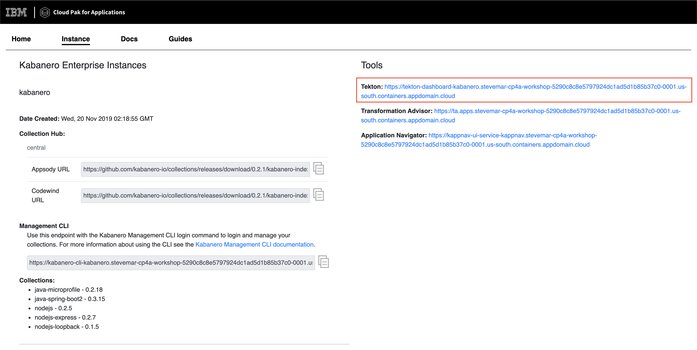

You can also obtain the URL for the tekton dashboard by using `oc get routes`. We want to use the address that looks like `tekton-dashboard-kabanero.xyz.domain.containers.appdomain.cloud`.

```bash
$ oc get routes --namespace kabanero
NAME               HOST/PORT                                                                                                             PATH      SERVICES           PORT      TERMINATION          WILDCARD
icpa-landing       ibm-cp-applications.cpa-workshop-dev-5290c8c8e5797924dc1ad5d1b85b37c0-0001.us-east.containers.appdomain.cloud                   icpa-landing       <all>     reencrypt/Redirect   None
kabanero-cli       kabanero-cli-kabanero.cpa-workshop-dev-5290c8c8e5797924dc1ad5d1b85b37c0-0001.us-east.containers.appdomain.cloud                 kabanero-cli       <all>     passthrough          None
kabanero-landing   kabanero-landing-kabanero.cpa-workshop-dev-5290c8c8e5797924dc1ad5d1b85b37c0-0001.us-east.containers.appdomain.cloud             kabanero-landing   <all>     passthrough          None
tekton-dashboard   tekton-dashboard-kabanero.cpa-workshop-dev-5290c8c8e5797924dc1ad5d1b85b37c0-0001.us-east.containers.appdomain.cloud             tekton-dashboard   <all>     reencrypt/Redirect   None
```

#### Review pre-installed pipelines and tasks on Cloud Pak for Apps

There are 5 **Pipelines**, one for each collection kabanero comes with (java microprofile, spring, nodejs, express, and loopback). **Pipelines** are a first class structure in Tekton. **Pipelines** are a series of **Tasks**.

Run this command to see the available pipelines.

```bash
oc get pipeline -n kabanero
```

You will see something similar to this.

```bash
$ oc get pipeline -n kabanero
NAME                                           AGE
java-microprofile-build-deploy-pipeline        15d
java-spring-boot2-build-deploy-pipeline        15d
nodejs-build-deploy-pipeline                   15d
nodejs-express-build-deploy-pipeline           15d
nodejs-loopback-build-deploy-pipeline          15d
pipeline0                                      15d
```

These are visible through the UI, too:

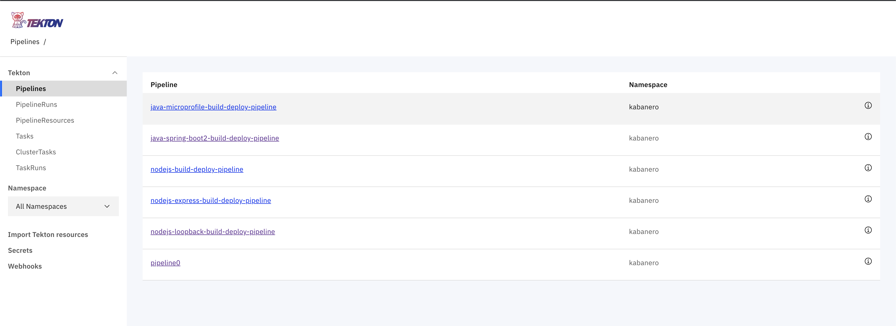

There are 10 **Tasks**, two for each collection kabanero comes with. Each collection has 2 **Tasks**, a *Build Task* and a *Deploy Task*.

```bash
oc get tasks -n kabanero
```

You will see something similar to this.

```bash
$ oc get tasks -n kabanero
NAME                            AGE
java-microprofile-build-task    27d
java-microprofile-deploy-task   27d
java-spring-boot2-build-task    27d
java-spring-boot2-deploy-task   27d
monitor-result-task             27d
nodejs-build-task               27d
nodejs-deploy-task              27d
nodejs-express-build-task       27d
nodejs-express-deploy-task      27d
nodejs-loopback-build-task      27d
nodejs-loopback-deploy-task     27d
pipeline0-task                  27d
```

These are visible through the UI, too:

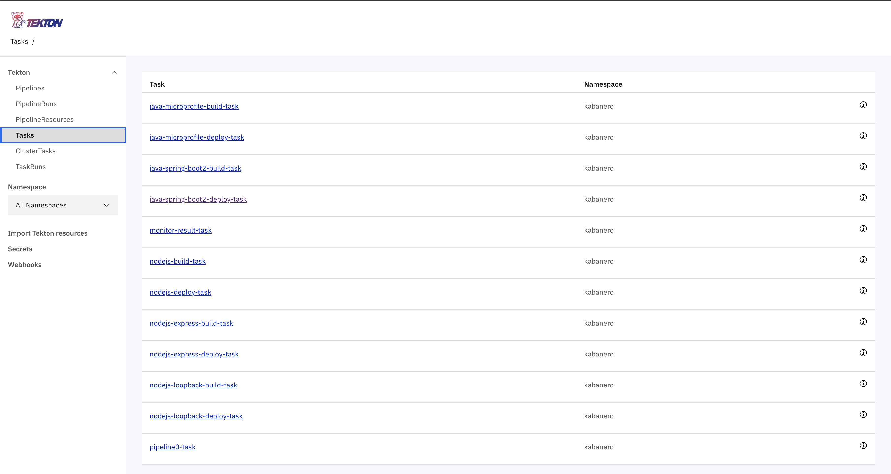

### 2. Update Kabanero to deploy to alternate namespaces with Tekton

Out of the box, Kabanero will only allow deployments to the kabanero namespace. It is recommended that you create separate namespaces either for individual applications or classes of application. To do this, you need to add these new namespaces to the kabanero custom resource. To find this resource

```bash
$ oc get kabaneros -n kabanero
NAME       AGE       VERSION   READY
kabanero   13d       0.1.0     True
```

Edit the kabanero custom resource

```bash
oc edit kabaneros kabanero -n kabanero
```

Add a `targetNamespaces` key to `spec` with, in this case, a single value of `insurance-quote`:

```yaml
spec:
  collections:
    repositories:
    - activateDefaultCollections: true
      name: incubator
      url: https://github.com/kabanero-io/collections/releases/download/v0.1.2/kabanero-index.yaml
  targetNamespaces:
  - insurance-quote
```

#### Update `app-deploy.yml` to specify the namespace

Go to your frontend code `cd ~/appsody-apps/quote-frontend` and update `app-deploy.yaml` to include the `namespace`

```yaml
apiVersion: appsody.dev/v1beta1
kind: AppsodyApplication
metadata:
  name: quote-frontend
  namespace: insurance-quote
```

Go to your backend code `cd ~/appsody-apps/quote-backend` and update `app-deploy.yaml` to include the `namespace`

```yaml
apiVersion: appsody.dev/v1beta1
kind: AppsodyApplication
metadata:
  name: quote-backend
  namespace: insurance-quote
```

### 2. Get a GitHub Access Token

When using Tekton, building a pipeline will require code to be pulled from either a public or private repository. When configuring Tekton, for security reasons, we will create an *Access Token* instead of using a password.

To create an *Access Token*, from [Github.com](Github.com) click on your profile icon in the top left. Then go to `Settings` -> `Developer Settings` -> `Personal Access Tokens`. Or go directly to <https://github.com/settings/tokens>

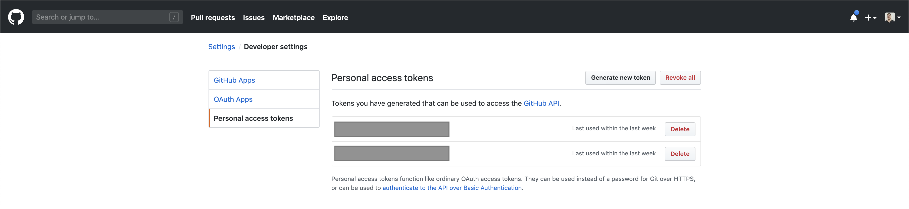

Here we want to generate a token, so `Click` on the `Generate a Token`. The token permissions need to be the `repo` which gives read and write access to the repository.

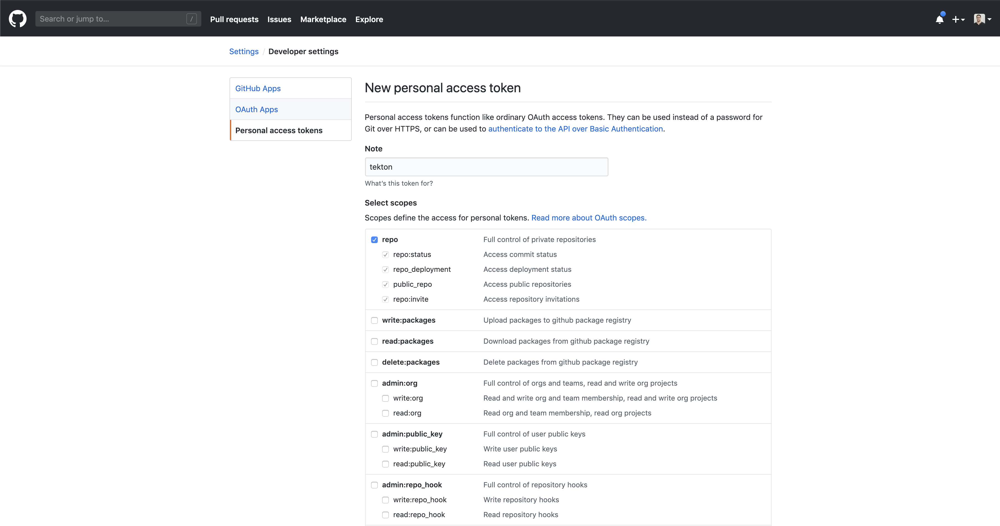

Once the token is created, make sure to copy it down. We will need it later.

### 3. Upload insurance quote frontend, and backend to GitHub

Go to <https://github.com/new> and create two new repositories, `quote-frontend`, and `quote-backend`. Do not initiatize the repos with a license file or README.

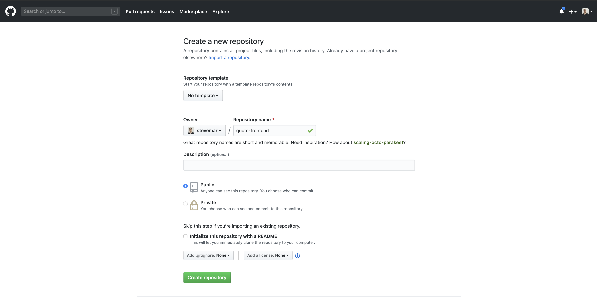

From your `quote-backend` directory, run the commands below, replacing `<username>` with your own.

```bash
git init
git add -A
git commit -m "first commit"
git remote add origin git@github.com:<username>/quote-backend.git
git push -u origin master
```

The repo for your backend code should look like this:

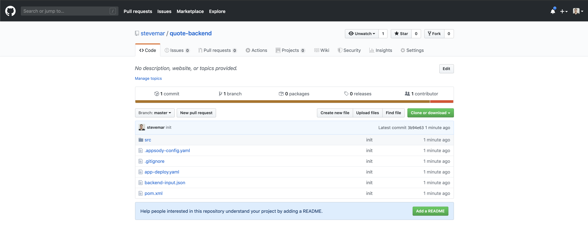

From your `quote-frontend` directory, run the commands below, replacing `<username>` with your own.

```bash
git init
git add -A
git commit -m "first commit"
git remote add origin git@github.com:<username>/quote-frontend.git
git push -u origin master
```

The repo for your frontend code should look like this:

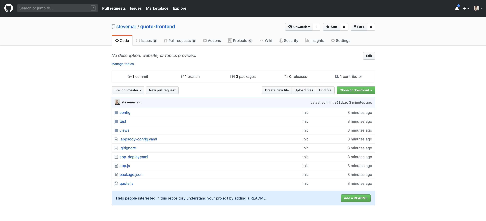

### 4. Add webhooks to Tekton to watch Github repo changes

Configure the GitHub webhook to your repo. Go to `Webhooks` > `Add Webhook` and then create the webhook.

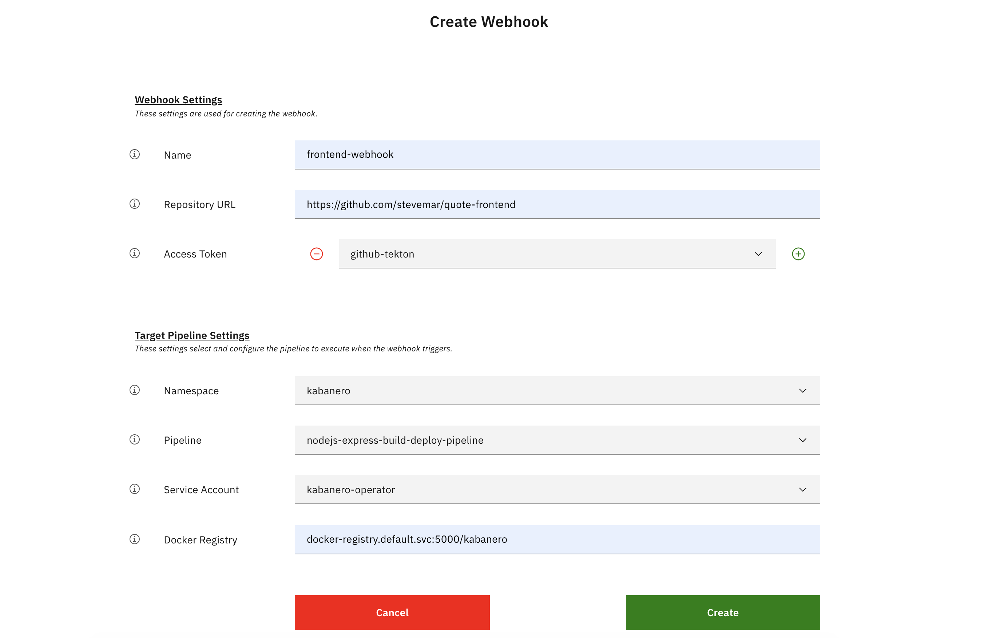

Note that the first time creating a webhook a new access token must also be created, use the access token from the earlier step:

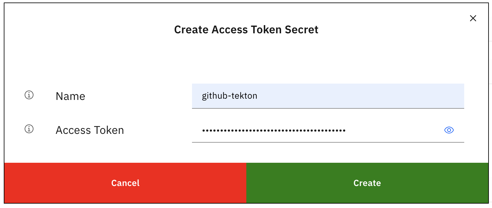

#### Create a webhook for the backend

```ini
Name: backend-webhook
Repository URL: http://github.com/{username}/quote-backend
Access Token: github-tekton

Namespace: kabanero
Pipeline: java-spring-boot2-build-deploy-pipeline
Service account: kabanero-operator
Docker Registry: docker-registry.default.svc:5000/insurance-quote
```

#### Create a webhook for the frontend

```ini
Name: frontend-webhook
Repository URL: http://github.com/{username}/quote-frontend
Access Token: github-tekton

Namespace: kabanero
Pipeline: nodejs-express-build-deploy-pipeline
Service account: kabanero-operator
Docker Registry: docker-registry.default.svc:5000/insurance-quote
```

Verify both are created successfully.

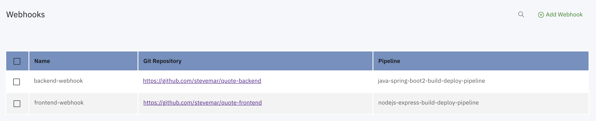

#### Check Github repo settings

Go to the repo and check the settings tab to see the webhooks, Click the webhook

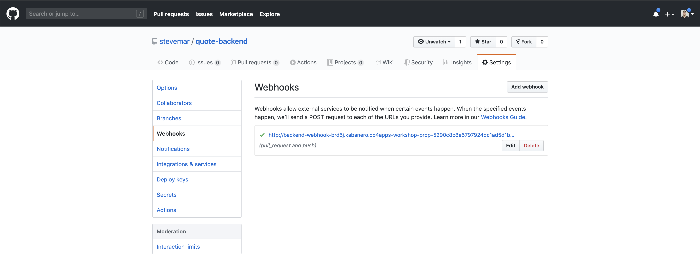

Scroll down to see any payloads being delivered. There is currently a bug where the first payload is not delivered. Not to worry, we'll be making changes to the code anyway, that will trigger a new payload.

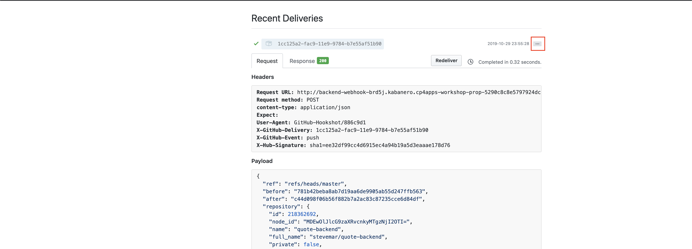

### 5. Test it all out

In your `quote-backend` repo, change the file `quote-backend/src/main/java/application/Quote.java`. Change a value in a logger statement. Then commit this change and push to your github repo, for example:

```bash
git add -u
git commit -m "test change"
git push -f -u origin master
```

This will trigger the `java-spring-boot2-build-deploy` tekton pipeline. Go to the tekton dashboard and access the new pipeline run it created.

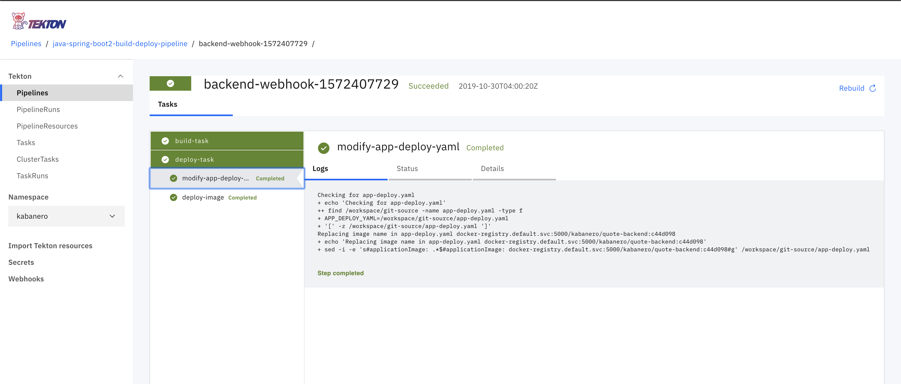

Wait until the task is complete, and then in your `quote-frontend` repo, change the file `quote-frontend/app.js`. Change a value in a comment statement. Then commit this change and push to your github repo, for example:

```bash
git add -u
git commit -m "test change"
git push -f -u origin master
```

This should trigger another pipeline run to be created, using the `nodejs-express-build-deploy` pipeline.

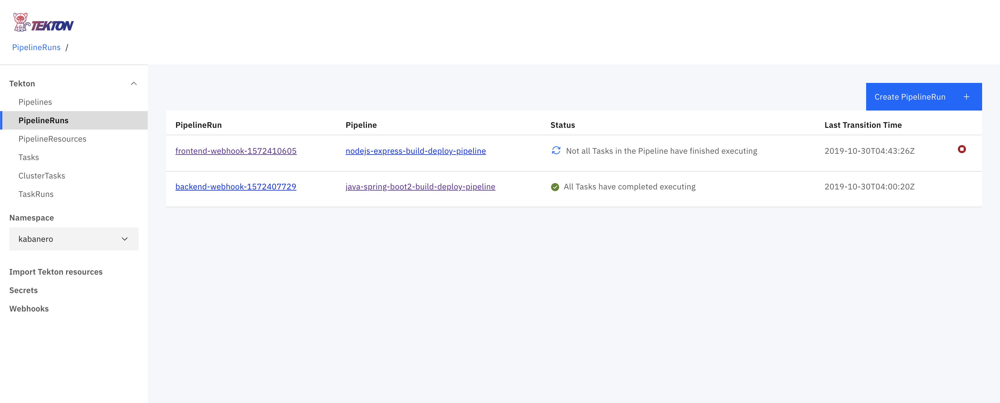

Wait until the task is complete, then find the route using `oc get routes`:

```bash
$ oc get routes -n insurance-quote | grep frontend
quote-frontend     quote-frontend-insurance-quote.cp4apps-workshop-prop-5290c8c8e5797924dc1ad5d1b85b37c0-0001.us-east.containers.appdomain.cloud
```

Open a browser to `http://<url-from-above>` and see the usual interface for the insurance quote app. Try entering information to ensure the frontend and backend are communicating.

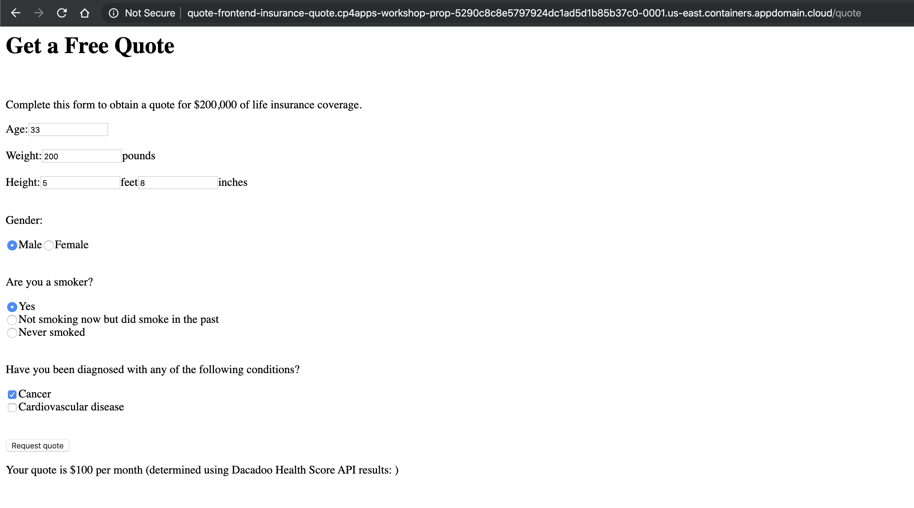

**Congratulations**! You have deployed the sample application to OpenShift using Tekton. Day 1 of the workshop is now complete!
