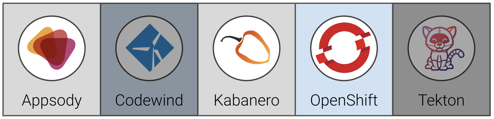

# Exercise 7: Using a custom collection with Appsody

In this exercise, we will show how to add the custom collection to your Appsody cli and to create an example application. Hint, this is going to be a lot like one of the exercises from day 1, but this time with your custom collection.

When you have completed this exercise, you will understand how to

* update Appsody CLI to point to a new collection
* test out the custom stack in our custom collection



## Prerequisites

You should have already carried out the prerequisites defined in [Exercise 6](../exercise-6/README.md).

## Steps

1. [Get the collection URL](#1-get-the-collection-url)
2. [Test the new stack and collection](#2-test-the-new-stack-and-collection)
3. [Prepare the new application for deployment](#3-prepare-the-new-application-for-deployment)

### 1. Get the collection URL

Obtain the URL to the collection repository. If a Git release was created for the collections, generally, the URL format will be: `https://<git repository>/<organization>/collections/releases/download/<release>/kabanero-index.yaml`

In our workshop, it'll likely be:

`https://github.com/<username>/collections/releases/download/0.2.1-custom/kabanero-index.yaml`

* Replace `<username>` with your Github username

### 2. Test the new stack and collection

Now that we know the URL, let's add the repo to our local appsody

```bash
appsody repo add stevemar https://github.com/stevemar/collections/releases/download/0.2.1-custom/kabanero-index.yaml
```

Create a new directory to work in:

```bash
cd ~/appsody-apps
mkdir test-custom-stack
cd test-custom-stack
```

Initialize the appsody stack

```bash
appsody init stevemar/my-nodejs-express
```

You should see output similar to the following:

```bash
$ appsody init stevemar/my-nodejs-express
Running appsody init...
Downloading my-nodejs-express template project from https://github.com/stevemar/collections/releases/download/0.2.1-custom/incubator.my-nodejs-express.v0.2.8.templates.simple.tar.gz
Download complete. Extracting files from /Users/stevemar/appsody-apps/testo/my-nodejs-express.tar.gz
...
Pulling docker image docker-registry-default.cp4apps-workshop-prop-5290c8c8e5797924dc1ad5d1b85b37c0-0001.us-east.containers.appdomain.cloud/kabanero-noauth/my-nodejs-express:0.2
...
docker-registry-default.cp4apps-workshop-prop-5290c8c8e5797924dc1ad5d1b85b37c0-0001.us-east.containers.appdomain.cloud/kabanero-noauth/my-nodejs-express:0.2 -c find /project -type f -name .appsody-init.sh
Successfully initialized Appsody project
```

Run the stack:

```bash
appsody run
```

You should see output similar to the following:

```bash
$ appsody run
Running development environment...
...
Running docker command: docker run --rm -p 3000:3000 -p 9229:9229 --name testo-dev -v /Users/stevemar/appsody-apps/testo/:/project/user-app -v testo-deps:/project/user-app/node_modules -v /Users/stevemar/.appsody/appsody-controller:/appsody/appsody-controller -t --entrypoint /appsody/appsody-controller docker-registry-default.cp4apps-workshop-prop-5290c8c8e5797924dc1ad5d1b85b37c0-0001.us-east.containers.appdomain.cloud/kabanero-noauth/my-nodejs-express:0.2 --mode=run
[Container] Running APPSODY_PREP command: npm install --prefix user-app && npm audit fix --prefix user-app
added 170 packages from 578 contributors and audited 295 packages in 2.989s
[Container] found 0 vulnerabilities
...
Application Metrics 5.0.3.201908230949 (Agent Core 4.0.3)
[Container] [Tue Nov 12 03:13:32 2019] com.ibm.diagnostics.healthcenter.mqtt INFO: Connecting to broker localhost:1883
[Container] App started on PORT 3000
```

Test it out with `curl` and you'll see the helmet headers.

Use the `appsody stop` command in another terminal in the same directory to stop the running application.

### 3. Prepare the new application for deployment

Before you can deploy this application using the pipeline you will be building in the upcoming exercises, there needs to be a deployment file added to the application. The deployment file is called `app-deploy.yaml`. This file was created automatically for you in day 1 exercise 3 with the `appsody deploy` command.

It can also be created without deploying an application using the `--generate-only` flag. Run this command:

```bash
appsody deploy --generate-only
```

```bash
$ appsody deploy --generate-only
Extracting project from development environment
Pulling docker image docker-registry-default.timro-roks1-5290c8c8e5797924dc1ad5d1b85b37c0-0001.us-east.containers.appdomain.cloud/kabanero-noauth/my-nodejs-express:0.3
Running command: docker pull docker-registry-default.timro-roks1-5290c8c8e5797924dc1ad5d1b85b37c0-0001.us-east.containers.appdomain.cloud/kabanero-noauth/my-nodejs-express:0.3
0.3: Pulling from kabanero-noauth/my-nodejs-express
Digest: sha256:9145b3477ca00e2401d100380460a5d813a6f291ee149d10ac7d989f1923f1e3
Status: Image is up to date for docker-registry-default.timro-roks1-5290c8c8e5797924dc1ad5d1b85b37c0-0001.us-east.containers.appdomain.cloud/kabanero-noauth/my-nodejs-express:0.3
Running command: docker run --name test-custom-stack-extract -v C:/Users/TimRobinson/appsody-apps/test-custom-stack/:/project/user-app --entrypoint /bin/bash docker-registry-default.timro-roks1-5290c8c8e5797924dc1ad5d1b85b37c0-0001.us-east.containers.appdomain.cloud/kabanero-noauth/my-nodejs-express:0.3 -c cp -rfL /project /tmp/project
...
```

After the command completes, check the contents of the application directory with `ls`

```bash
app.js  app-deploy.yaml  node_modules/  package.json  package-lock.json  test/
```

**Congratulations!!** We've got a published custom stack and it can be used for local development.
