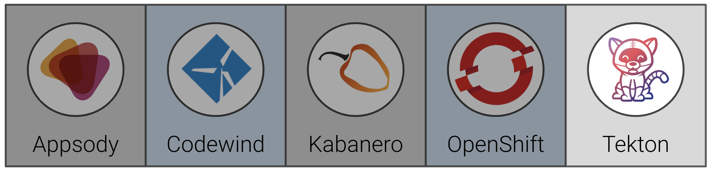
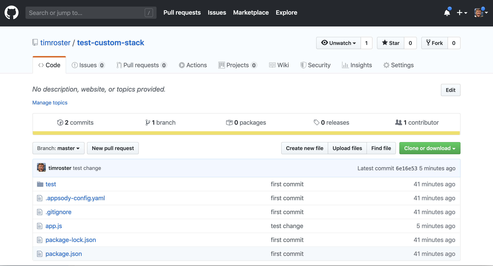
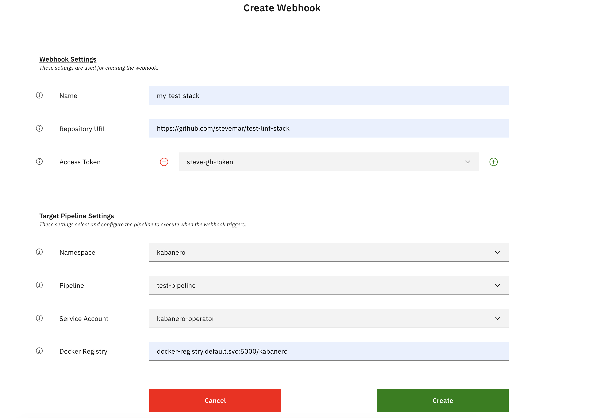
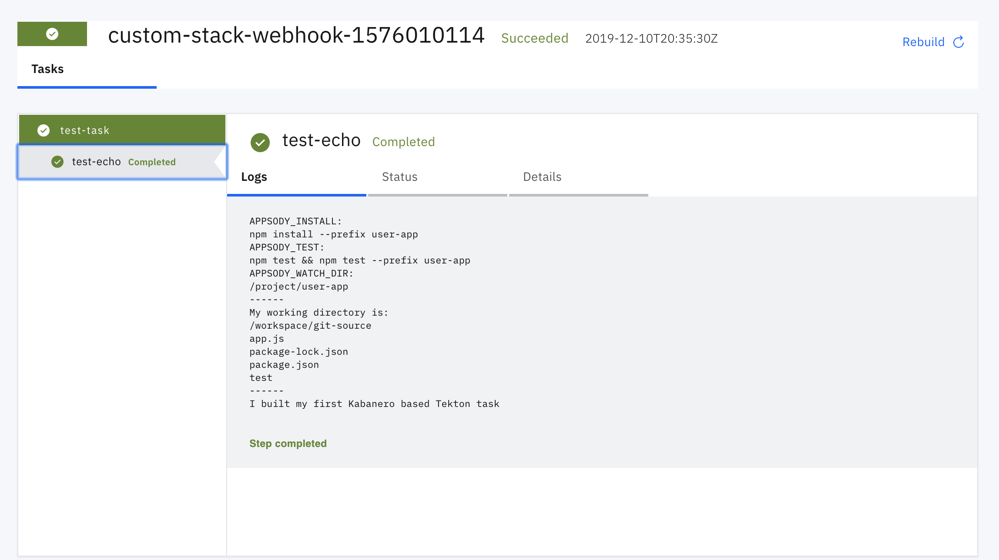

# Exercise 8: Create a custom Tekton Task and Pipleline

In this exercise, we will show how to create Tekton artifacts, and how to plug into the existing pipelines and environment knowledge that Kabanero provides to those artifacts.

When you have completed this exercise, you will understand how to

* create a custom Task in Tekton
* create a custom Pipeline in Tekton



## Prerequisites

You should have already carried out the prerequisites defined in [Exercise 7](../exercise-7/README.md).

In addition, recall how to do the following from [Exercise 4](../exercise-4/README.md)

* [Access the Tekton Dashboard](../exercise-4/README.md#1-launch-the-tekton-dashboard)
* [Get a GitHub Access Token](../exercise-4/README.md#2-get-a-github-access-token)

## Steps

1. [Upload custom stack test to GitHub](#1-upload-custom-stack-test-to-github)
1. [Create a custom Tekton Task](#2-create-a-custom-tekton-task)
1. [Create a custom Tekton Pipeline](#3-create-a-custom-tekton-pipeline)
1. [Add a webhook to Tekton to watch Github for changes](#4-add-a-webhook-to-tekton-to-watch-github-for-changes)
1. [Test it all out](#5-test-it-all-out)

### 1. Upload custom stack test to GitHub

From completing the previous exercise you should now have a code base in the following folder

```bash
cd ~/appsody-apps/test-custom-stack
ls -la
```

Should result in output that looks like the following:

```bash
$ ls -la
total 144
drwxr-xr-x  14 stevemar  staff    448 19 Nov 14:20 .
drwxr-xr-x   9 stevemar  staff    288 19 Nov 16:26 ..
-rw-r--r--   1 stevemar  staff     70 15 Nov 10:02 .appsody-config.yaml
-rw-r--r--   1 stevemar  staff   1316 15 Nov 10:02 .gitignore
-rw-r--r--   1 stevemar  staff    130 15 Nov 10:12 app.js
drwxr-xr-x   2 stevemar  staff     64 15 Nov 10:03 node_modules
-rw-r--r--   1 stevemar  staff  51421 15 Nov 10:02 package-lock.json
-rw-r--r--   1 stevemar  staff    455 19 Nov 12:52 package.json
drwxr-xr-x   3 stevemar  staff     96 15 Nov 10:02 test
```

We will now upload that code to Github.

Go to <https://github.com/new> and create a new repository, `test-custom-stack`. Do not initiatize the repos with a license file or README.

From your `test-custom-stack` directory, run the commands below, replacing `<username>` with your own.

```bash
git init
git add -A
git commit -m "first commit"
git remote add my-org https://github.com:<username>/test-custom-stack.git
git push -u my-org master
```

The repo should look like this:



### 2. Create a custom Tekton Task

Create a new directory to iterate on new tasks

```bash
cd ~/appsody-apps
mkdir tekton-tasks
cd tekton-tasks
```

Create a new file named `test-task.yaml` with the following contents:

```yaml
apiVersion: tekton.dev/v1alpha1
kind: Task
metadata:
  name: test-task
spec:
  inputs:
    resources:
      - name: git-source
        type: git
  steps:
    - name: test-echo
      image: kabanero/nodejs-express:0.2
      workingDir: ${inputs.resources.git-source.path}
      command:
        - /bin/bash
      args:
        - -c
        - |
          set -e
          echo "APPSODY_INSTALL:"
          echo $APPSODY_INSTALL
          echo "APPSODY_TEST:"
          echo $APPSODY_TEST
          echo "APPSODY_WATCH_DIR:"
          echo $APPSODY_WATCH_DIR
          echo "------"
          echo "My working directory is:"
          pwd
          ls
          echo "------"
          echo "I built my first Kabanero based Tekton task"
```

Run the following to create the Task in Tekton:

```bash
oc apply -f test-task.yaml -n kabanero
```

### 3. Create a custom Tekton Pipeline

Create a new file named `test-pipeline.yaml` with the following contents:

```yaml
apiVersion: tekton.dev/v1alpha1
kind: Pipeline
metadata:
  name: test-pipeline
spec:
  resources:
    - name: git-source
      type: git
    - name: docker-image
      type: image
  tasks:
    - name: test-task
      taskRef:
        name: test-task
      resources:
        inputs:
        - name: git-source
          resource: git-source
```

Run the following to create the Pipeline in Tekton:

```bash
oc apply -f test-pipeline.yaml -n kabanero
```

### 4. Add a webhook to Tekton to watch Github for changes

From the Tekton dashboard, we need to add a new webhook. Launch a browser and access the dashboard.

To configure the GitHub webhook to your repo. Go to `Webhooks` > `Add Webhook` and then create the webhook.



#### Create a webhook for the backend

```ini
Name: custom-stack-webhook
Repository URL: http://github.com/{username}/test-custom-stack
Access Token: github-tekton

Namespace: kabanero
Pipeline: test-pipeline
Service account: kabanero-operator
Docker Registry: docker-registry.default.svc:5000/kabanero
```

Return to your git repo and check the `Settings` > `Webhooks` panel to verify that the webhook has been added and is working.

### 5. Test it all out

In your `test-custom-stack` repo, change the file `app.js`. Change a value in the `res.send("Hello from Appsody!");` function. Then commit this change and push to your github repo, for example:

```bash
git add -u
git commit -m "test change"
git push -f -u origin master
```

This will trigger the tekton pipleine. Go to the tekton dashboard and access the new pipeline it created.


