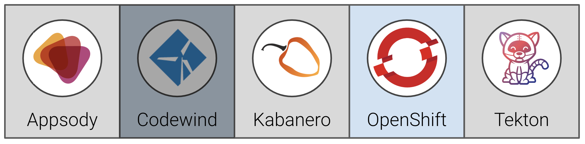
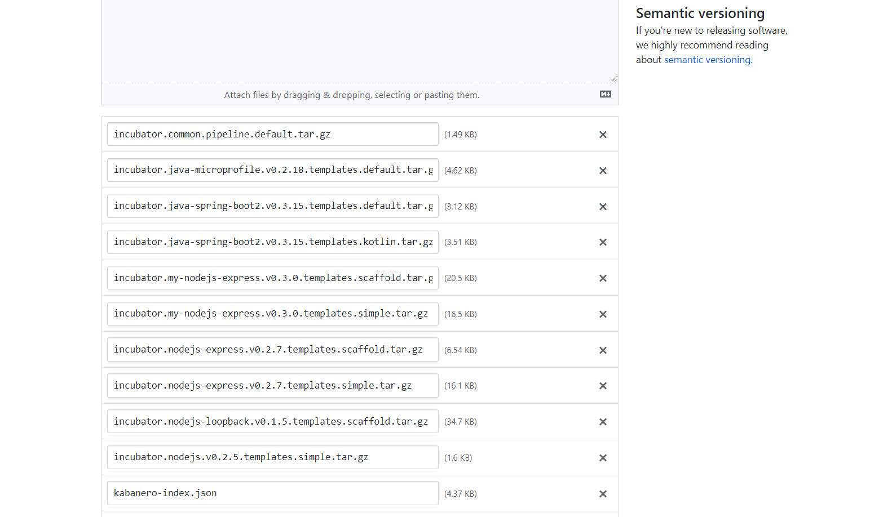
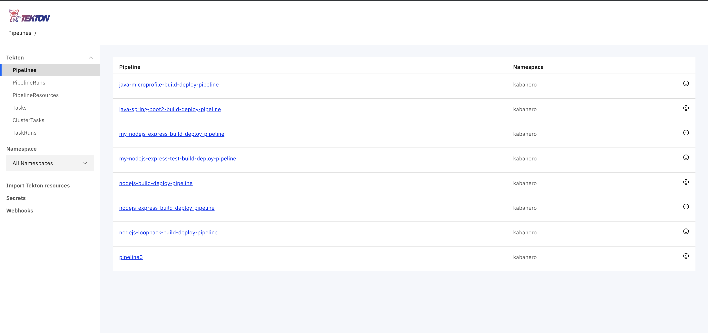
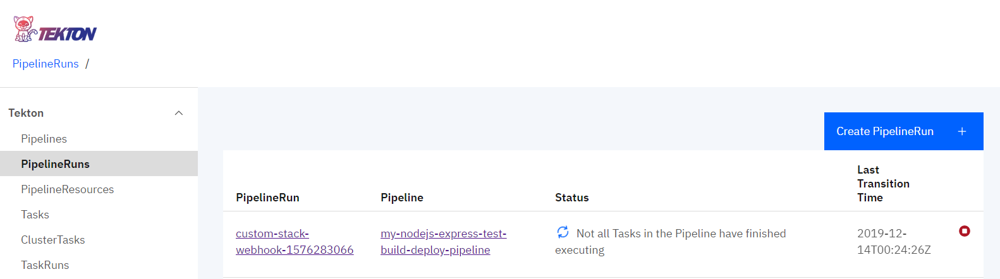
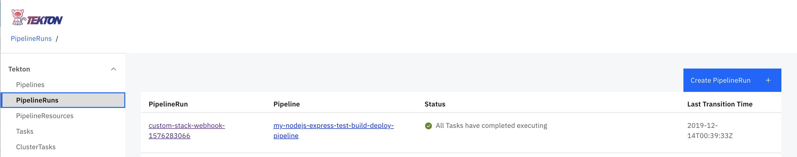
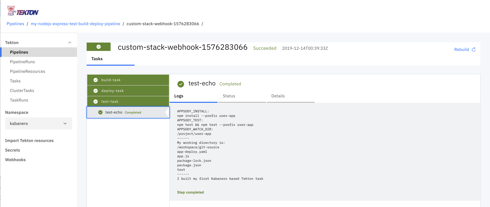

# Exercise 9: Deploy an application with a custom Stack, custom Collection, and custom Pipeline

In this exercise, we will show how to bring all the custom components (Stacks, Collections, Pipelines) together.

When you have completed this exercise, you will understand how to

* Create a custom pipeline and add it to a collection
* Update the Kabanero Custom Resource to point to a new collection
* Deploy an application based on a custom stack using a custom Tekton pipeline



## Prerequisites

You should have already carried out the prerequisites defined in [Exercise 8](../exercise-8/README.md).

* Delete the webhook from Exercise 8:
  * Open the Tekton dashboard, and select `Webhooks`.
  * Next, click on the box next to the `custom-slack-webhook` to select it and click on *Delete*.
  * In the dialog, check the box to delete pipeline runs associated with the webhook and click on *Confirm*.

* Delete the task and pipeline from Exercise 8, too.

    ```bash
    cd ~/appsody-apps/tekton-tasks
    oc delete -f test-pipeline.yaml
    oc delete -f test-task.yaml
    ```

## Steps

### 1. Add the tasks to the collection

In your local `collections/incubator/my-nodejs-express/pipelines` folder add a new folder called `custom-pipeline` and add two files `test-task.yaml` and `test-build-deploy-pipeline.yaml`. The file structure is seen below

```ini
incubator
└── my-nodejs-express/
    └── pipelines/
        └── custom-pipeline/
              └── test-task.yaml
              └── test-build-deploy-pipeline.yaml
```

The `test-task.yaml` is slightly updated from exercise 8 to pull in the relevant basename from any collection that uses it

```yaml
#Kabanero! on activate substitute CollectionId for text 'CollectionId'
apiVersion: tekton.dev/v1alpha1
kind: Task
metadata:
  name: CollectionId-test-task
spec:
  inputs:
    resources:
      - name: git-source
        type: git
  outputs:
    resources:
      - name: docker-image
        type: image
  steps:
    - name: test-echo
      image: kabanero/nodejs-express:0.2
      workingDir: ${inputs.resources.git-source.path}
      command:
        - /bin/bash
      args:
        - -c
        - |
          set -e
          echo "APPSODY_INSTALL:"
          echo $APPSODY_INSTALL
          echo "APPSODY_TEST:"
          echo $APPSODY_TEST
          echo "APPSODY_WATCH_DIR:"
          echo $APPSODY_WATCH_DIR
          echo "------"
          echo "My working directory is:"
          pwd
          ls
          echo "------"
          echo "I built my first Kabanero based Tekton task"
```

And the `test-build-deploy-pipeline.yaml` is a modification of the defauly pipeline:

```yaml
#Kabanero! on activate substitute CollectionId for text 'CollectionId'
apiVersion: tekton.dev/v1alpha1
kind: Pipeline
metadata:
  name: CollectionId-test-build-deploy-pipeline
spec:
  resources:
    - name: git-source
      type: git
    - name: docker-image
      type: image
  tasks:
    - name: test-task
      taskRef:
        name: CollectionId-test-task
      resources:
        inputs:
        - name: git-source
          resource: git-source
        outputs:
        - name: docker-image
          resource: docker-image
    - name: build-task
      taskRef:
        name: CollectionId-build-task
      runAfter: [test-task]
      resources:
        inputs:
        - name: git-source
          resource: git-source
        outputs:
        - name: docker-image
          resource: docker-image
    - name: deploy-task
      taskRef:
        name: CollectionId-deploy-task
      runAfter: [build-task]
      resources:
        inputs:
        - name: git-source
          resource: git-source
        - name: docker-image
          resource: docker-image
```

In `incubator/my-nodejs-express` update `collection.yaml` to change the default pipeline

```yaml
default-image: my-nodejs-express
default-pipeline: my-nodejs-express-test-build-deploy-pipeline
images:
- id: my-nodejs-express
  image: $IMAGE_REGISTRY_ORG/my-nodejs-express:0.3
```

Unusually in these exercises, we have been using a version of appsody that is ahead of the current level baked into some the standard kabanero tekton artifacts, so there is one additional change that is needed to get around this. You need to update a tag in the common `build-task.yaml` used for all stacks in the collection. This update will select a builder container that uses appsody 0.5.3 to support the private registry semantics used in these exercises.

Open the `incubator/common/pipelines/default/build-task.yaml` file and add the tag `:0.5.3-buildah1.9.0` to the image spec in the **assemble-extract** step as shown:

```yaml
#Kabanero! on activate substitute CollectionId for text 'CollectionId'
apiVersion: tekton.dev/v1alpha1
kind: Task
metadata:
  name: CollectionId-build-task
spec:
  inputs:
    resources:
      - name: git-source
        type: git
    params:
      - name: pathToDockerFile
        default: /workspace/extracted/Dockerfile
      - name: pathToContext
        default: /workspace/extracted
  outputs:
    resources:
      - name: docker-image
        type: image
  steps:
    - name: assemble-extract
      securityContext:
        privileged: true
      image: appsody/appsody-buildah:0.5.3-buildah1.9.0
      command: ["/bin/bash"]
      args:
        - -c
        - "/extract.sh"
      env:
        - name: gitsource
          value: git-source
      volumeMounts:
        - mountPath: /var/lib/containers
          name: varlibcontainers
...
```

### 2. Re-run the scripts

Run `build.sh` and `release.sh` as before. From collections home run:

```bash
IMAGE_REGISTRY_ORG=$IMAGE_REGISTRY/$IMAGE_REGISTRY_ORG ./ci/build.sh
IMAGE_REGISTRY="" IMAGE_REGISTRY_PASSWORD="" ./ci/release.sh
```

Check the `ci/release/` folder to make sure there is a file called (your version may be different):

```ini
incubator.my-nodejs-express.v0.3.0.pipeline.custom-pipeline.tar.gz
```

And that the generated `ci/release/kabanero-index.yaml` has a section like the following:

```yaml
- default-image: my-nodejs-express
  ...
  pipelines:
  - id: custom-pipeline
    sha256: e3c3050850bf88b97c8fba728592d0cf671bb9d27b582ebaa9f90d939bfa60a5
    url: https://github.com/stevemar/collections/releases/download/0.2.1-custom/incubator.my-nodejs-express.v0.3.0.pipeline.custom-pipeline.tar.gz
```

### 3. Update the current release

Upload the changes

```bash
# Add your custom stack changes
git add -A

# Create a commit message
git commit -m "Add custom task and pipeline"

# Push the changes to your repository.  For example:
git push -u my-org
```

Navigating back to your GitHub repo, select the current custom release:


Clicking on the release name (0.2.1-custom) will allow you to edit the release. Click on *Edit tag*. Click on the **x** to delete existing items from the release and then upload all the files in `collections/ci/release/` which were generated from the previous steps, by clicking on the *Attach binaries...* box.



### 4. Update the Kabanero Custom Resource

Use `oc get kabaneros -n kabanero` to obtain a list of all Kabanero CR instances in namespace `kabanero`. The default name for the CR instance is `kabanero`.

```bash
oc get kabaneros -n kabanero
```

You should see output similar to the following:

```bash
$ oc get kabaneros -n kabanero
NAME       AGE       VERSION   READY
kabanero   17d       0.1.0     True
```

Edit the specific CR instance using `oc edit kabaneros <name> -n kabanero`, replacing `<name>` with the instance name.

```bash
oc edit kabaneros kabanero -n kabanero
```

Modify your Kabanero custom resource (CR) instance to target the new collections that were pushed to the remote Github repository. The `Spec.Collections.Repositories.url` attribute should be set to the URL of the collection repository.

```yaml
apiVersion: kabanero.io/v1alpha1
kind: Kabanero
metadata:
  name: kabanero
  namespace: kabanero
spec:
  collections:
    repositories:
    - name: custom
      url: https://github.com/<username>/collections/releases/download/0.2.1-custom/kabanero-index.yaml
      activateDefaultCollections: true
```

When you are done editing, save your changes and exit the editor. The updated Kabanero CR instance will be applied to your cluster.

### 5. Test it all out

If you go to the tekton dashboard, you should see the new pipeline and task (it was added when updating the Kabanero CR by the Kabanero Operator)



Re-add the webhook, this time you should see the new pipeline as an option (without having to do `kubectl apply`). Use similar settings for the webhook as in Exercise 8:

```ini
Name: custom-stack-webhook
Repository URL: http://github.com/{username}/test-custom-stack
Access Token: github-tekton

Namespace: kabanero
Pipeline: my-nodejs-express-test-build-deploy-pipeline
Service account: kabanero-operator
Docker Registry: docker-registry.default.svc:5000/kabanero
```

When the pipeline runs, it should, in addition to running the new test task, also run the build and deploy task. You can test this by making a minor update to your test-custom-stack repo. Once you have done this then re-commit to trigger the webhook by:

```bash
git add -u
git commit -m "Minor update to test pipeline"
git push -u my-org
```

Return to the Tekton *Pipeline Runs* tab to check on the status of your deployment.



 After a while it should show that the pipeline run is complete.



You can also click on the specific pipeline run link (`custom-stack-1576283066` in the above example), and see the progress of the three tasks which make up the new pipeline. Once they are all complete, it should look similar to the picture below. Notice how you can click on a given task (e.g. the new test-task we created) to see the output.



Although the task we added was a test task, you can imagine how you might add additional tasks that are more relevant to your enterprise environment - for example to check that the application code added by the developer meets your security standards.

Once the pipeline run is complete, you can confirm that our test application, with the upgraded stack, is now running with a curl -v to the route. You should see helmet responses, e.g.:

```bash
$ curl -v http://test-custom-stack-kabanero.timro-roks1-5290c8c8e5797924dc1ad5d1b85b37c0-0001.us-east.containers.appdom
ain.cloud/
*   Trying 169.62.48.20...
* TCP_NODELAY set
* Connected to test-custom-stack-kabanero.timro-roks1-5290c8c8e5797924dc1ad5d1b85b37c0-0001.us-east.containers.appdomain.cloud (169.62.48.20) port 80 (#0)
> GET / HTTP/1.1
> Host: test-custom-stack-kabanero.timro-roks1-5290c8c8e5797924dc1ad5d1b85b37c0-0001.us-east.containers.appdomain.cloud
> User-Agent: curl/7.63.0
> Accept: */*
>
< HTTP/1.1 200 OK
< X-DNS-Prefetch-Control: off
< X-Frame-Options: SAMEORIGIN
< Strict-Transport-Security: max-age=15552000; includeSubDomains
< X-Download-Options: noopen
< X-Content-Type-Options: nosniff
< X-XSS-Protection: 1; mode=block
< X-Powered-By: Express
< Content-Type: text/html; charset=utf-8
< Content-Length: 34
< ETag: W/"22-E8hT/HhjJRx/5AG3TOq9TBd5R7g"
< Date: Sat, 14 Dec 2019 00:40:30 GMT
< Set-Cookie: e23eec15db4cc24793d795555bb55650=b8749458e2714fe3be1767f782a35058; path=/; HttpOnly
< Cache-control: private
<
Hello from a Custom Appsody Stack!* Connection #0 to host test-custom-stack-kabanero.timro-roks1-5290c8c8e5797924dc1ad5d1b85b37c0-0001.us-east.containers.appdomain.cloud left intact
```

**Congratulations!!** You have completed Day 2 of the workshop! You have successfully created a custom appsody stack, included it in a custom Collection that also includes a custom pipeline - showing how you can adapt the standard kabanero infrastructure to suit the needs of your enterprise.
