# Exercise: Create and publish a managed API endpoint for an existing REST service, using API Connect

As you build your server applications with REST interfaces, you need to consider how these interfaces are exposed to other developers. While it is technically possible to simply give them a direct URL to the component in question, typically you will want to take a much more managed approach to formally publishing a URL endpoint. For instance, you need to consider:

* How can you horizontally scale the resources running your API endpoint?
* How can you monitor and manage the endpoint?
* How will you enable transition to new versions of your API, deprecating old versions over time
* How can you secure the traffic to the endpoint?

While you could implement the above directly in your service along with your code, it is good practice to separate the above functionality - particularly if you have multiple services. Having a standard way of implementing the above will bring consistency to the experience received by developers using your API. This is the goal of the API Connect component of Cloud Pak for Integration.

In this exercise, we will show you how to use API Connect to accomplish some of above, by creating and publishing a new, managed API endpoint for the REST service you built with App Connect in the [previous exercise](../exercise-app-connect/README.md)

When you have completed this exercise, you will understand how to

* Created a managed API endpoint, by importing an OpenAPI definition for an existing REST service.
* Publish the new API endpoint
* Tested the API in the API Connect developer toolkit.

## Steps

All the steps below are carried out on the desktop Linux OS VM.

1. [Define what your API will call, by importing the OpenAPI definition for your REST service](#1-define-what-your-api-will-call-by-importing-the-openapi-definition-for-your-rest-service)
1. [Configure the API](#2-configure-the-api)
1. [Test the API](#3-test-the-api)
1. [Summary](#summary)

### 1. Define what your API will call, by importing the OpenAPI definition for your REST service

In the [previous exercise](../exercise-app-connect/README.md) you created a REST service for synchronizing data with Salesforce. This is the service for which you are going to build a new, managed API endpoint. The first thing you need to do is import, into API Connect, the OpenAPI definition for the API you created as part of this service. This is going to be what your new, managed API endpoint will call to satisfy requests it receives.

To obtain the OpenAPI specification for your existing REST service, in the App Connect Dashboard click on the tile for your existing server:

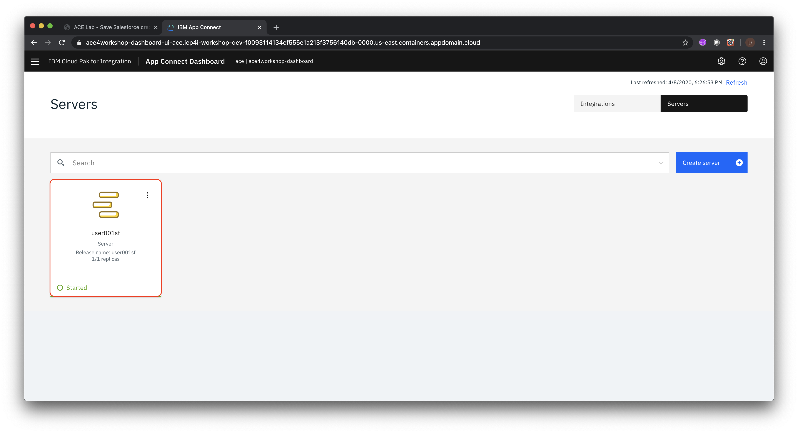

Click on the API tile to see the details of the flow's API

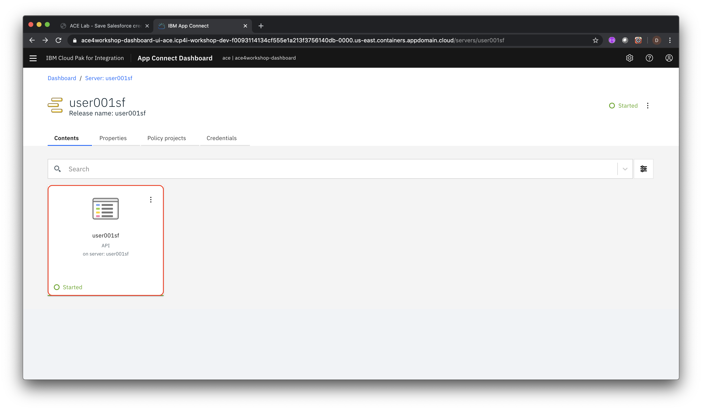

You should see the details of your flow's API. In your your browser, right click on the **OpenAPI document** link and select **Save Link As ...** from the context menu (alternatively you can click on the link and select **Save** from the menu bar).

Now you can import this into API Connect as the API for your new managed endpoint to call. In a new browser tab open the **Cloud Pak for Integration** tab and under **View Instances** click on the link for **API Connect**.

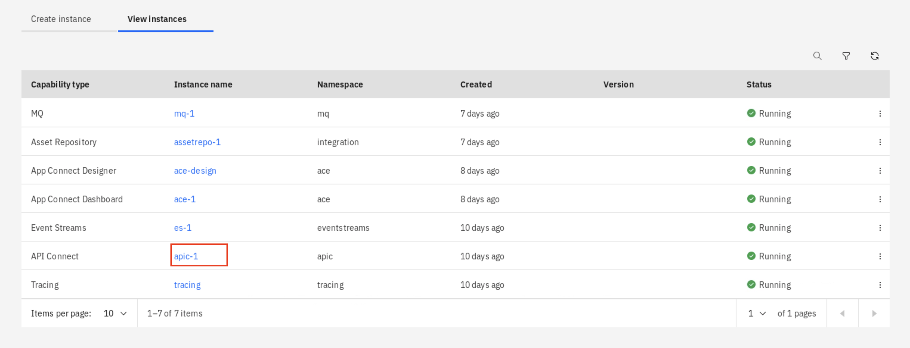

Click on the **Develop APIs and Products tile**

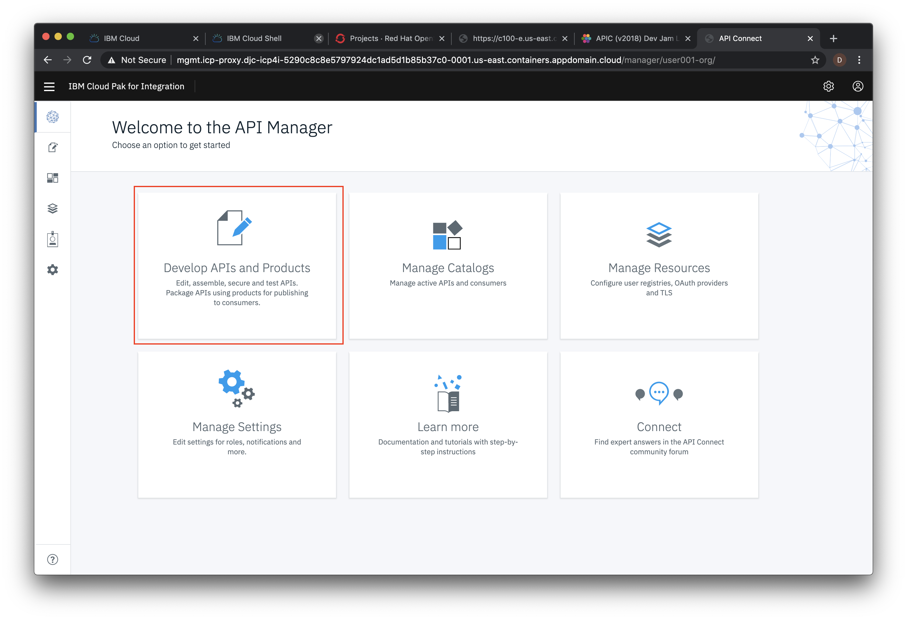

Click **ADD->API**

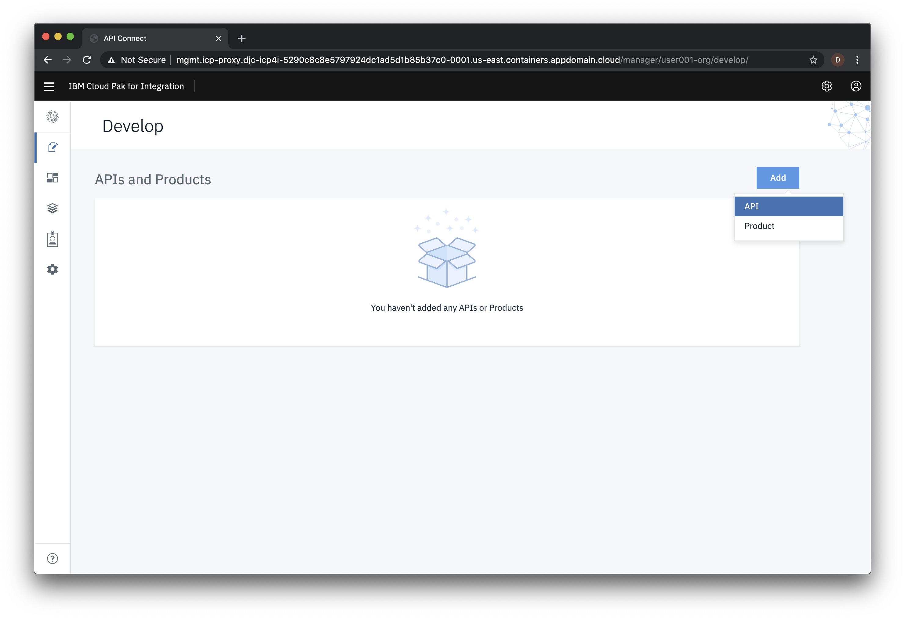

On the next screen select **Existing OpenAPI** under **Import** and then click **Next**.

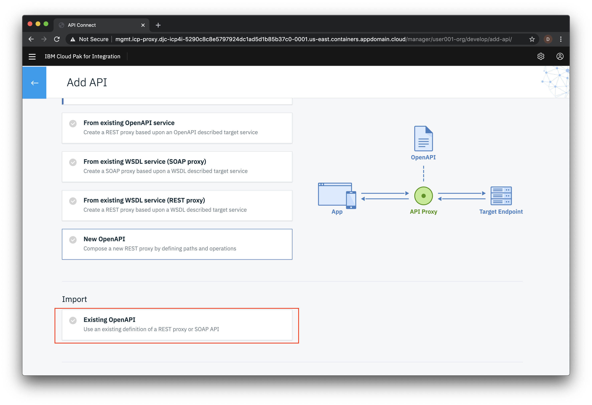

Now choose **user001sf.json** from your local file system and click **Next**.

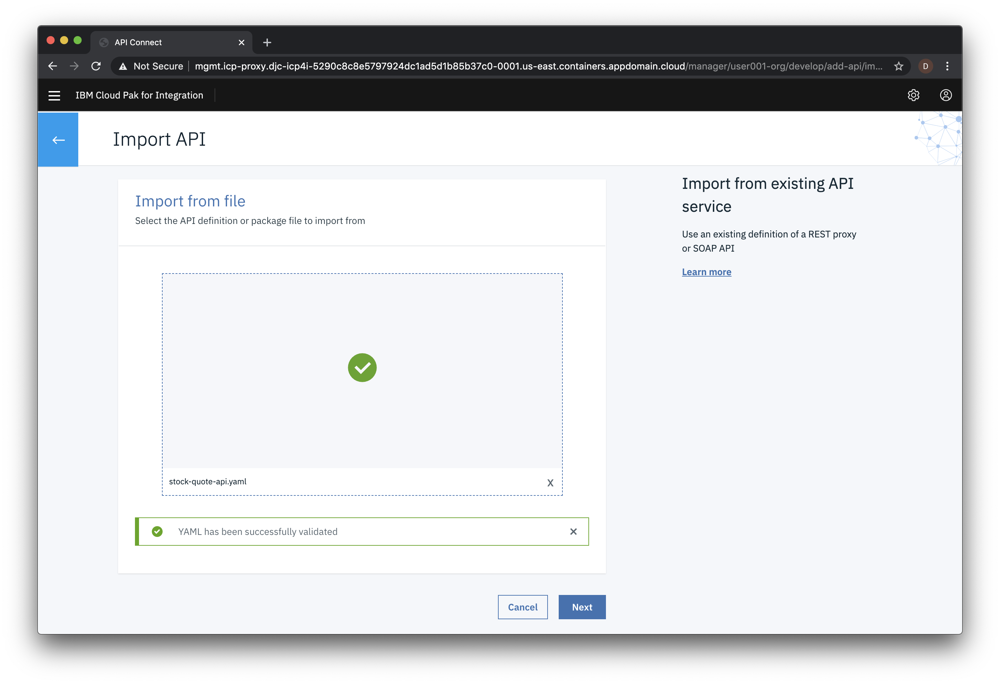

Choose the default values in the next few panels. You'll reach the **Summary** panel and the API should be imported successfully as shown below. Click **Edit API**.

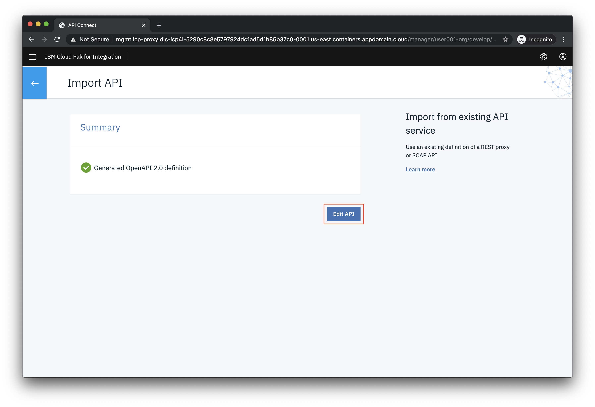

### 2. Configure the API

After importing the API you'll be given an opporunity to add or modify existing properties

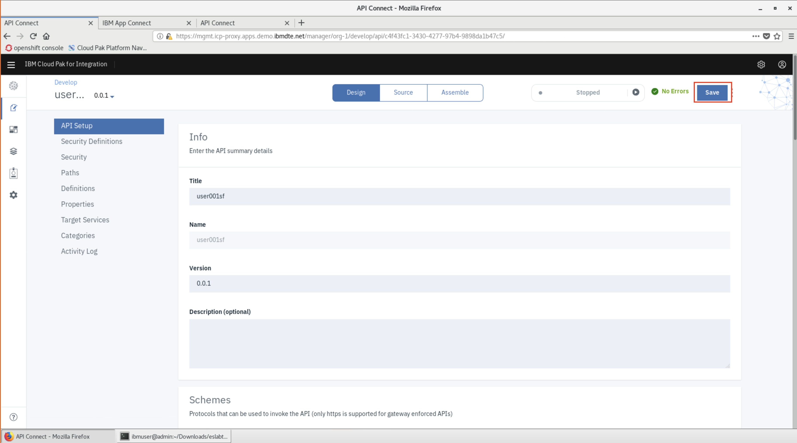

Click **Save** to complete the configuration.

### 3. Test the API

In the API designer, you have the ability to test the API immediately after creation in the **Assemble** view.

On the top Navigation, click **Assemble**.

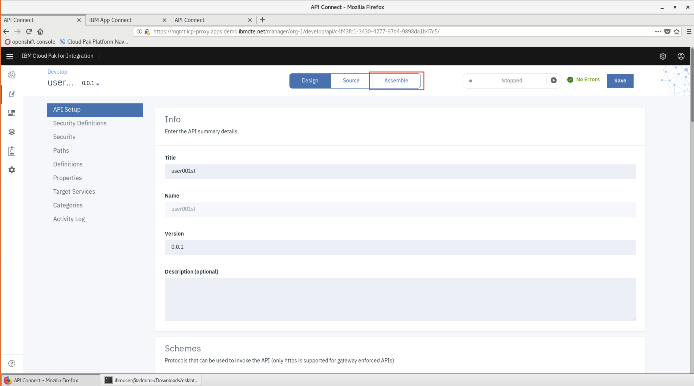

Click **proxy** in the flow designer. Note the window on the right with the configuration. It calls the **target-url** with the same request path sent to the API Connect endpoint. Ensure the **URL** is set to `$(target-url)$(request.path)`.

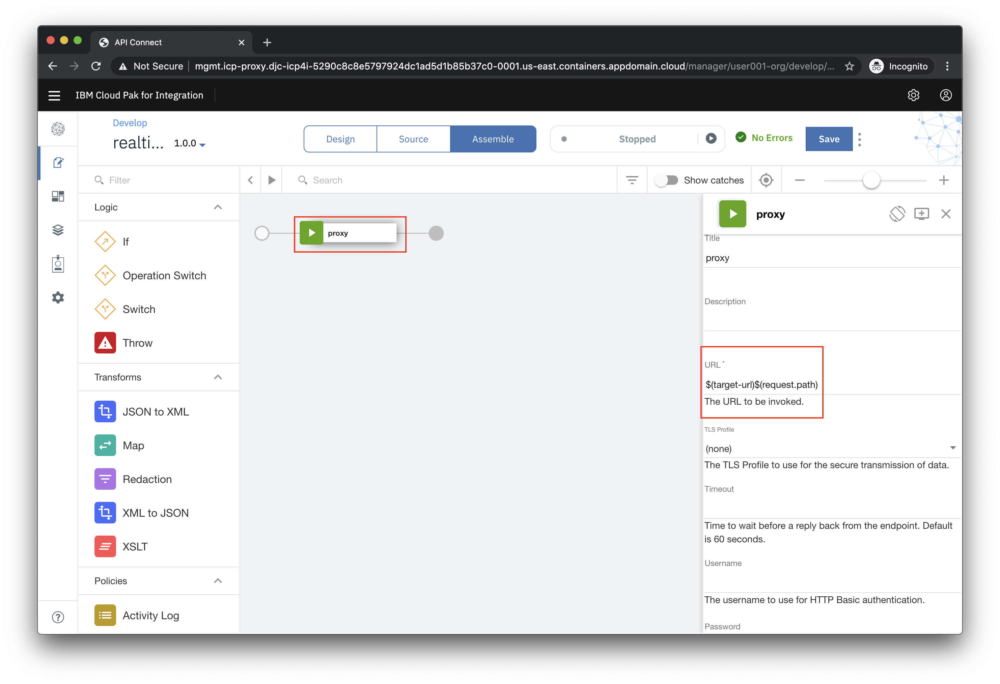

Click the play icon as indicated in the image below.

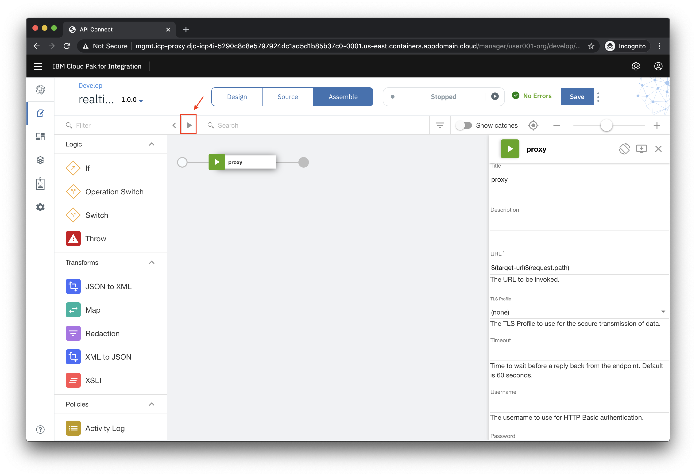

Click **Activate API** to publish the API to the gateway for testing.

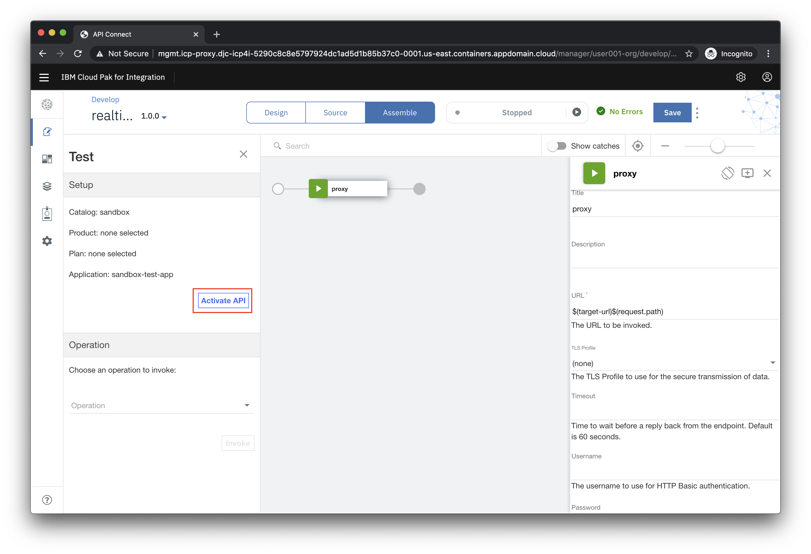

After the API is published, find the **Operation** field and choose **post /Client**. Note that your **Client ID** is prefilled for you.

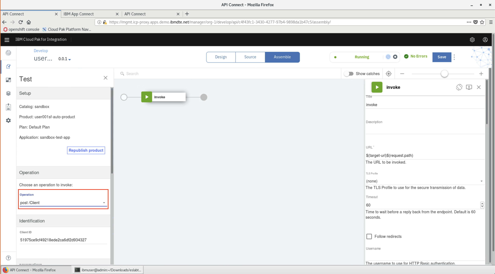

Choose to **Generate** data for a request and **REMOVE the Client ID**. Scroll all the way to the bottom of the browser window and click **Invoke**.

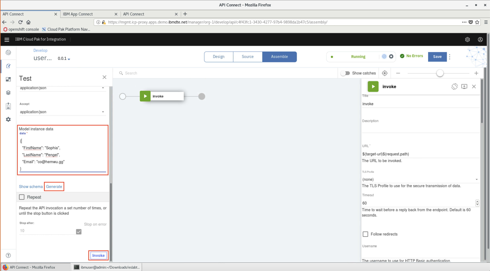

If this is the first test of the API, you may see a certificate exception. Simply click on the URL and choose the option to proceed.

Go back to the test view and click **Invoke** again.

Now you should see a Response section with status code `201 Created` and the body displaying the new Salesforce client ID.

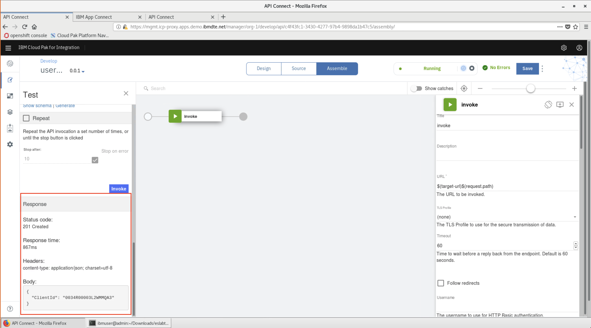

## Summary

**Congratulations**! You successfully completed this part of the lab!
