# Exercise: Publish your API, using API Connect

In this exercise, we will show how to use API Connect to publish API.

When you have completed this exercise, you will understand how to

* Created a managed API endpoint, by importing an OpenAPI definition for an existing REST service.
* Configured a ClientID/API Key for security set up a proxy to the existing API.
* Tested the API in the API Connect developer toolkit.

## Steps

1. [Download the OpenAPI definition file](#1-download-the-openapi-definition-file)
1. [Create a Topology](#2-create-a-topology)
1. [Create an Organization](#3-create-an-organization)
1. [Add a Gateway to the Catalog](#4-add-a-gateway-to-the-catalog)
1. [Import the OpenAPI definition file](#5-import-the-openapi-definition-file)
1. [Configure the API](#6-configure-the-api)
1. [Test the API](#7-test-the-api)
1. [Summary](#summary)

### 1. Download the OpenAPI definition file

In your browser right click on the OpenAPI document link and select **Save Link As ...** from the context menu.

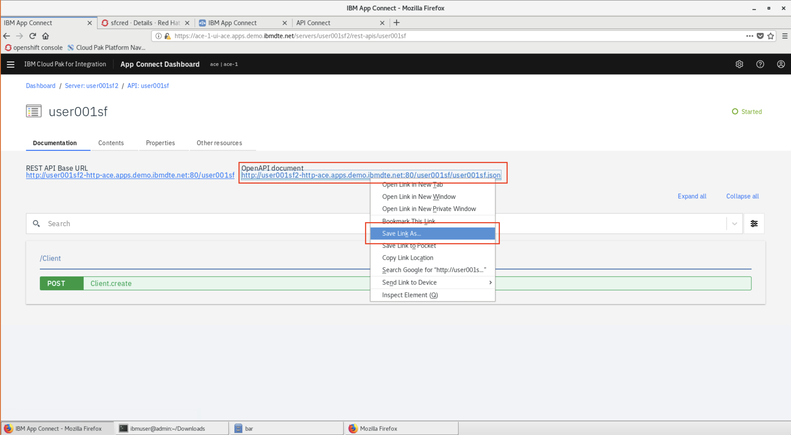

### 2. Create a Topology

From the hamburger menu click on the API Connect service, right click the kebab menu, and click **Manage**.

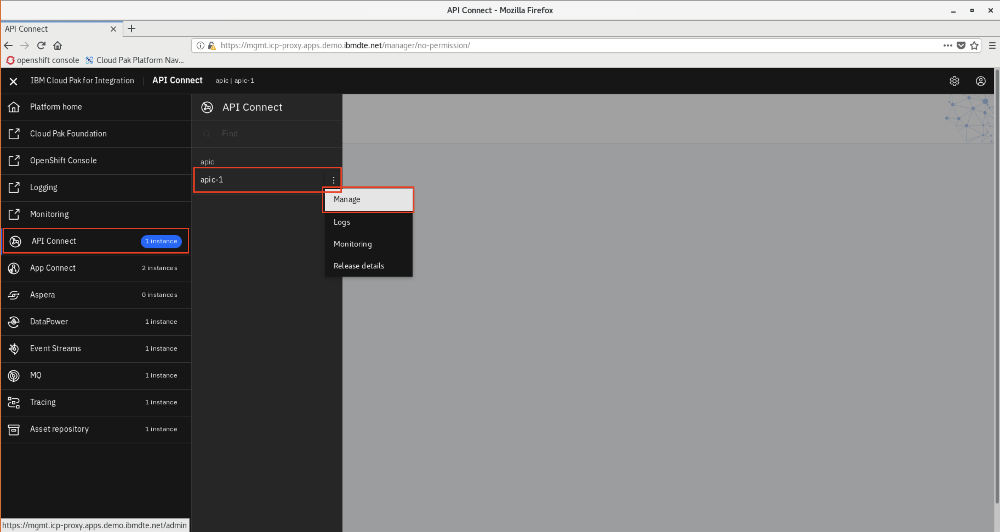

Click **Configure Topology**.

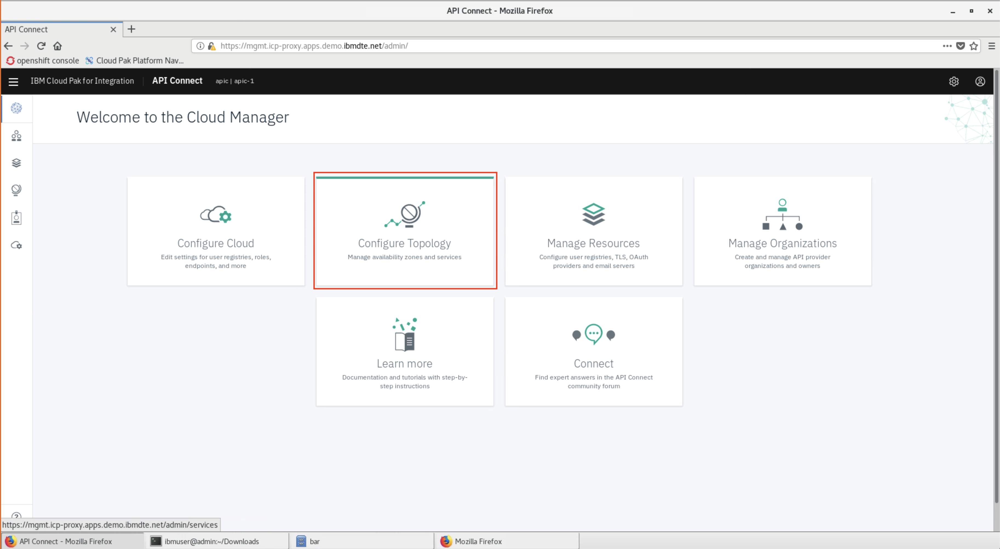

Click **Register Service**.

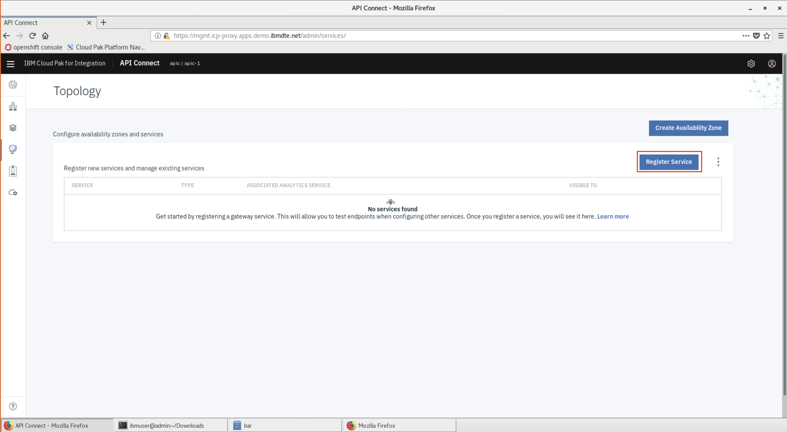

Click **DataPower Gateway**.

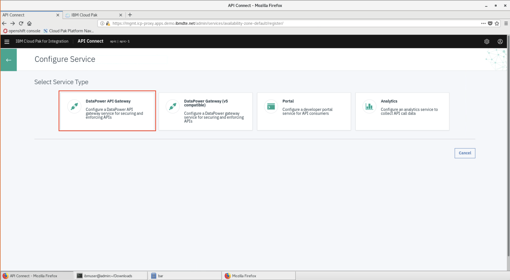

In the config menu...

* **Details**
  * *Title*: `Gateway 1`
* **Management Endpoint**
  * *Endpoint*: `https://gws.icp-proxy.apps.demo.ibmdte.net`
* **API Invocation Endpoint**
  * *Endpoint*: `https://gwy.icp-proxy.apps.demo.ibmdte.net`

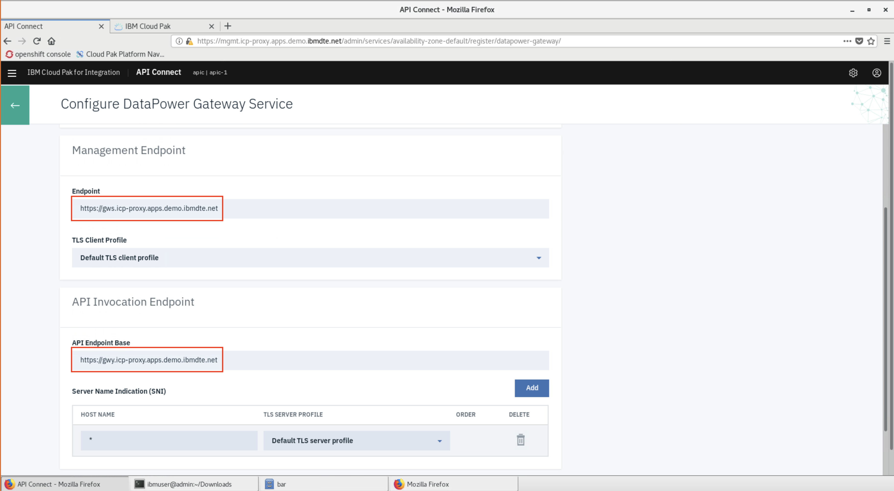

Click **Save** on the bottom of the page.

### 3. Create an Organization

From the hamburger menu click on the API Connect service, right click the kebab menu, and click **Manage**.

Click **Manage Organizations**.

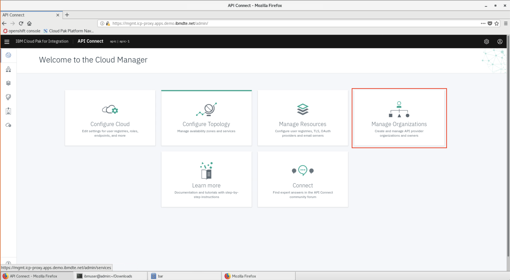

* Click on **Add** and choose **Create organization**

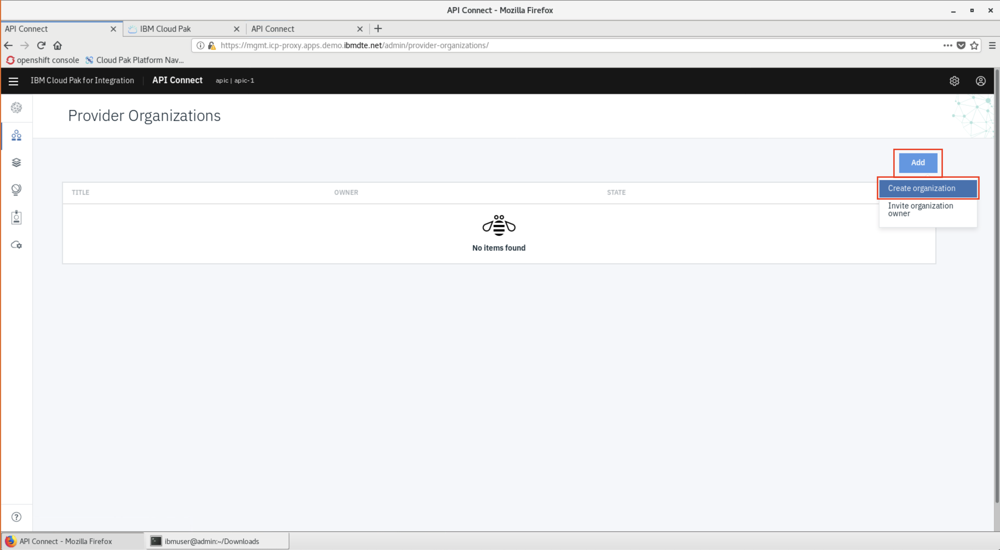

In the config menu...

* **Provider Organization**
  * *Title*: `Org 1`
* **Owner**
  * *User registry*: `API Manager Local User Registry`
  * Create a new user by giving it a `username`, `password`, `first name`, and `email`.

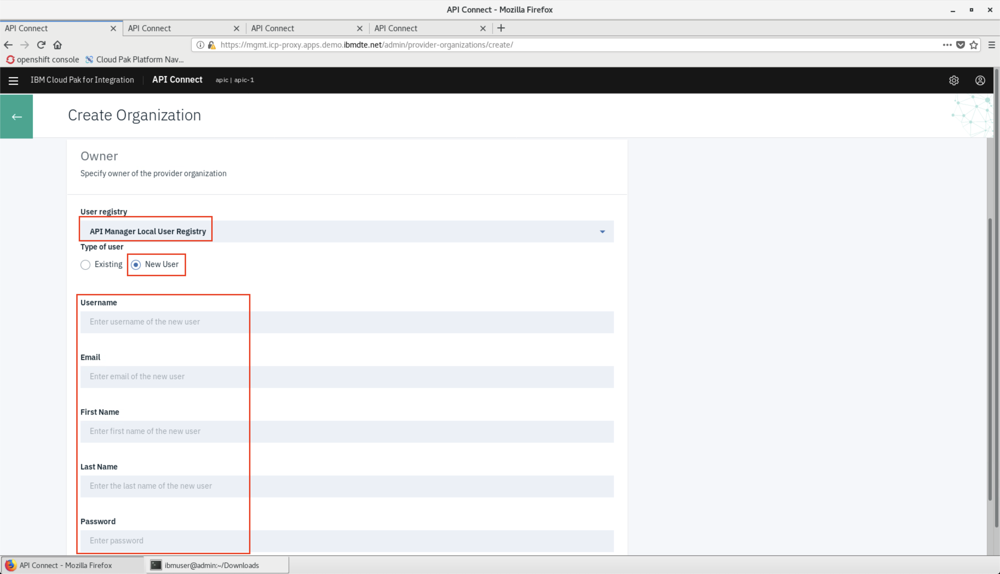

* Click **Create**

> **NOTE** You may see an error message `504 Gateway Time-out`, but that's OK.

### 4. Add a Gateway to the Catalog

In a new browser tab open the **Cloud Pak for Integration** tab and under **View Instances** click on the link for **API Connect**.

You will be prompted to login, choose to login with **API Manager Local User Regitry**, and use the new username and password you just created.

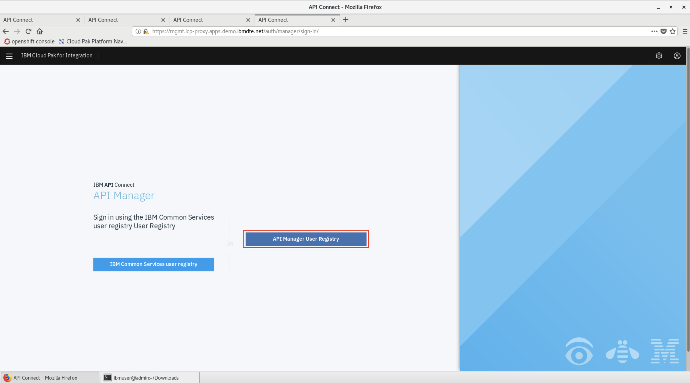

Click on **Manage Catalogs**.

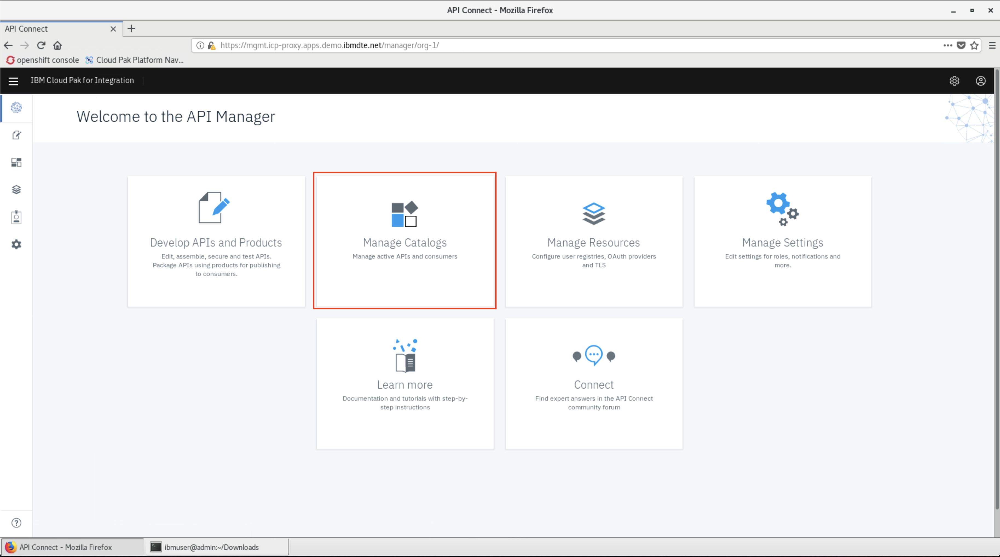

Click on the **Sandbox** tile.

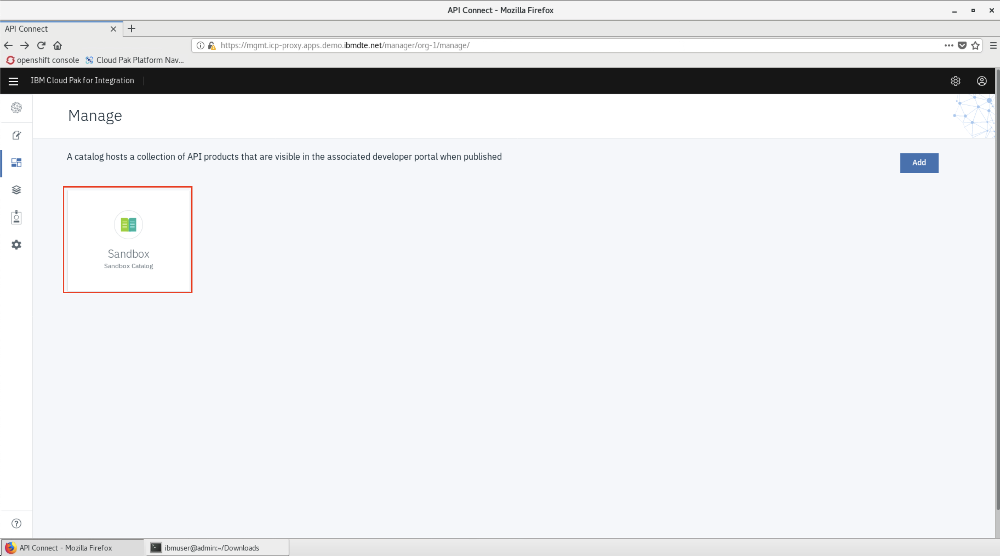

From the **Settings** (gear icon), choose the **Gateway Services** menu option, and add `Gateway-1` as the default.

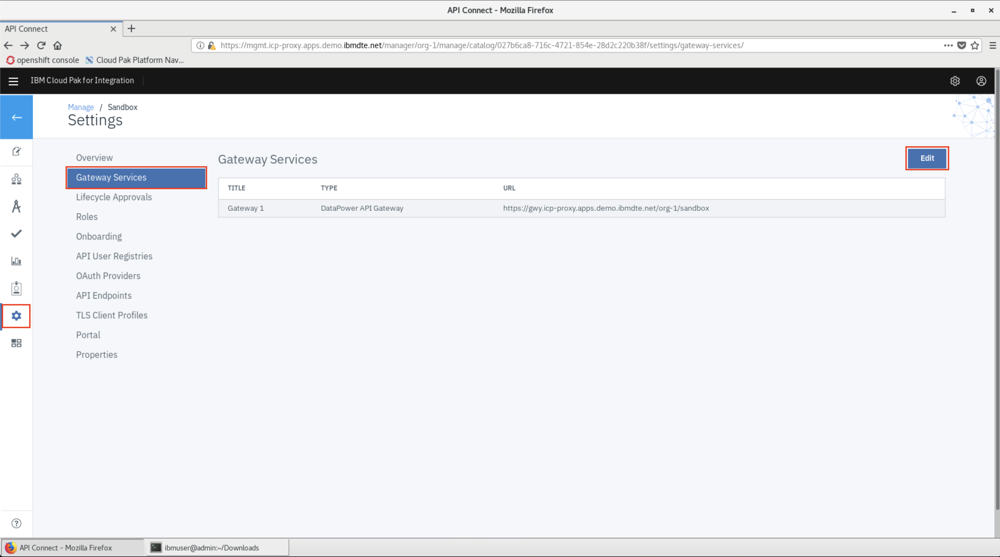

### 5. Import the OpenAPI definition file

In a new browser tab open the **Cloud Pak for Integration** tab and under **View Instances** click on the link for **API Connect**.

Click on the **Develop APIs and Products tile**

Click **ADD->API**

On the next screen select **Existing OpenAPI** under **Import** and then click **Next**.

Now choose **user001sf.json** from your local file system and click **Next**.

Choose the default values in the next few panels. You'll reach the **Summary** panel and the API should be imported successfully as shown below. Click **Edit API**.

### 6. Configure the API

After importing the API you'll be given an opporunity to add or modify existing properties

Click **Save** to complete the configuration.

### 7. Test the API

In the API designer, you have the ability to test the API immediately after creation in the **Assemble** view.

On the top Navigation, click **Assemble**.

Click **proxy** in the flow designer. Note the window on the right with the configuration. It calls the **target-url** with the same request path sent to the API Connect endpoint. Ensure the **URL** is set to `$(target-url)$(request.path)`.

Click the play icon as indicated in the image below.

Click **Activate API** to publish the API to the gateway for testing.

After the API is published, find the **Operation** field and choose **post /Client**. Note that your **Client ID** is prefilled for you.

Choose to **Generate** data for a request and **REMOVE the Client ID**. Scroll all the way to the bottom of the browser window and click **Invoke**.

If this is the first test of the API, you may see a certificate exception. Simply click on the URL and choose the option to proceed.

Go back to the test view and click **Invoke** again.

Now you should see a Response section with status code `201 Created` and the body displaying the new Salesforce client ID.

## Summary

**Congratulations**! You successfully completed this part of the lab!
