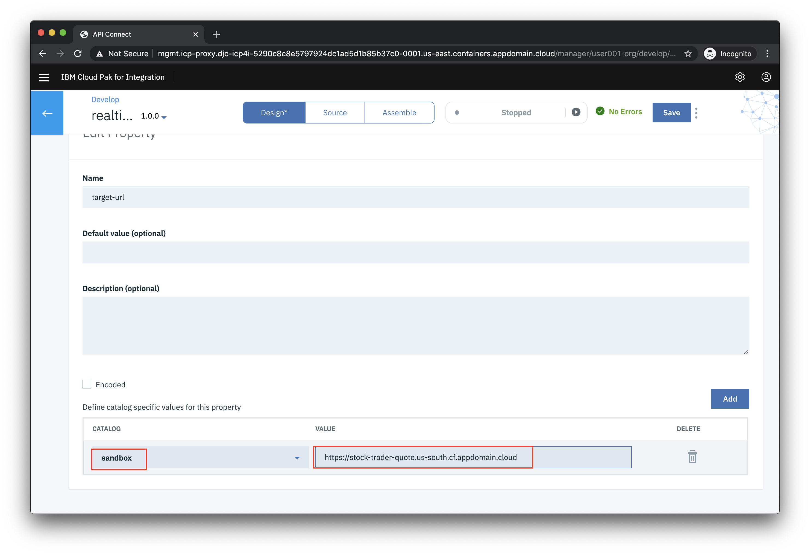
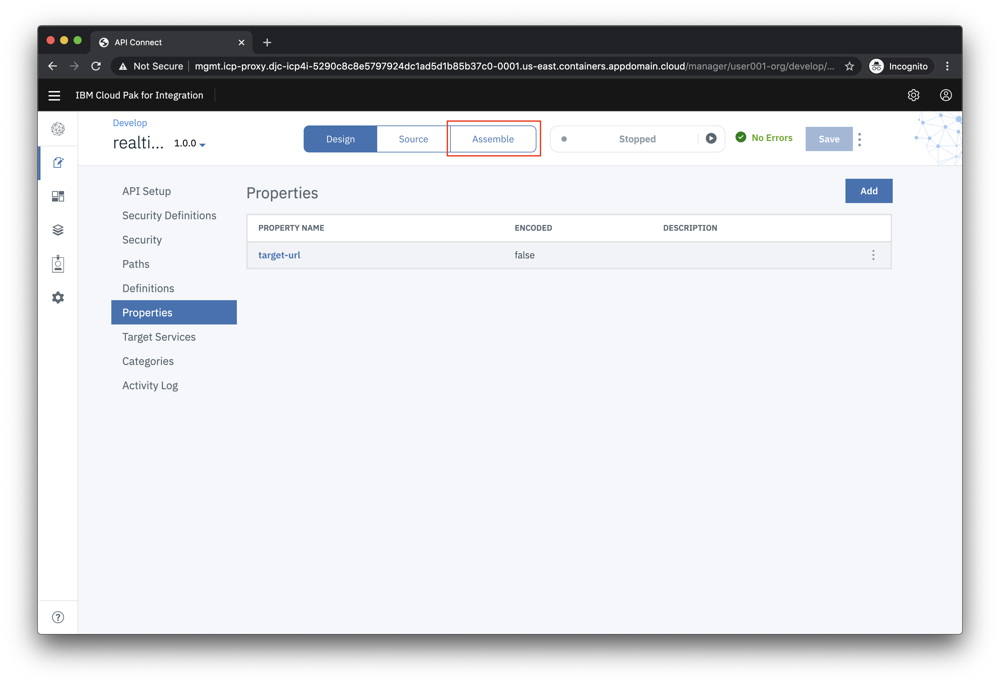
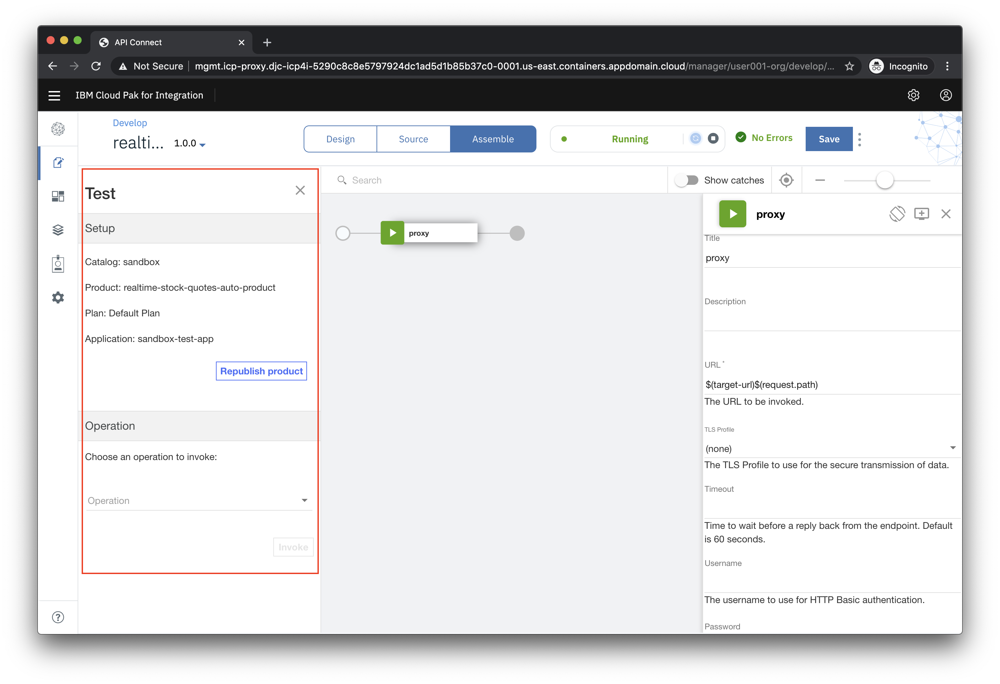
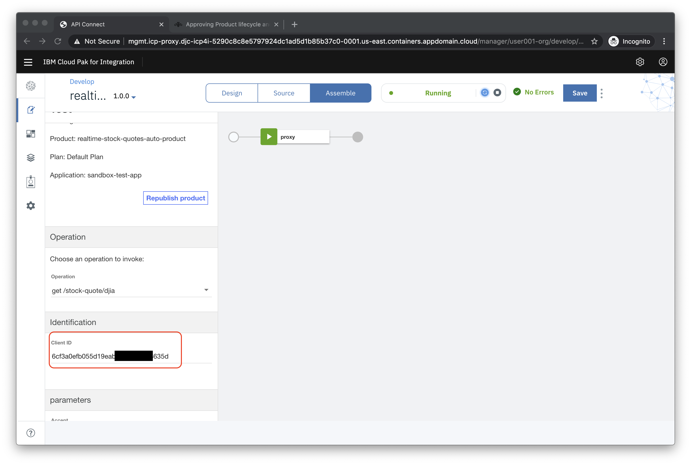
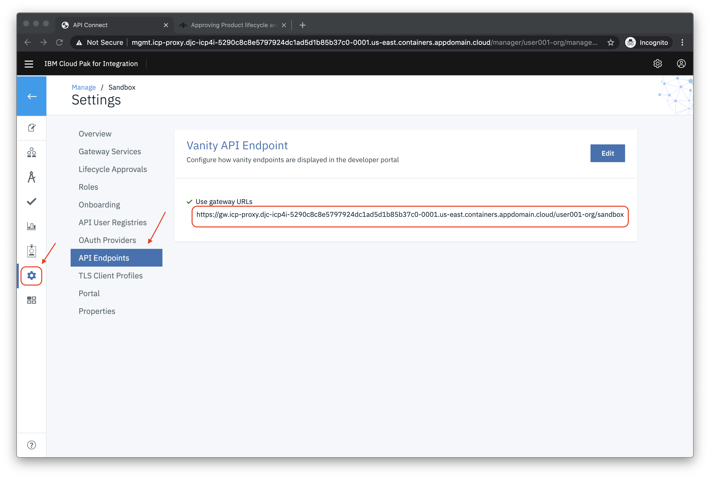

# Exercise: Add an API Management point to the application

In this exercise, we will show how to use API Connect to create and test an API.

When you have completed this exercise, you will understand how to

* Created an API by importing an OpenAPI definition for an existing REST service.
* Configured a ClientID/API Key for security set up a proxy to the existing API.
* Tested the API in the API Connect developer toolkit.

## Steps

1. [Download the OpenAPI definition file](#1-download-the-openapi-definition-file)
1. [Create a Topology](#2-create-a-topology)
1. [Create an Organization](#3-create-an-organization)
1. [Add a Gateway to the Catalog](#4-add-a-gateway-to-the-catalog)
1. [Import the OpenAPI definition file](#5-import-the-openapi-definition-file)
1. [Configure the API](#6-configure-the-api)
1. [Test the API](#7-test-the-api)
1. [Summary](#summary)

### 1. Download the OpenAPI definition file

In your browser right click on the OpenAPI document link and select **Save Link As ...** from the context menu.

### 2. Create a Topology

From the hamburger menu click on the API Connect service, right click the kebab menu, and click **Manage**.

Click **Configure Topology**.

Click **Register Service**.

Click **DataPower Gateway**.

In the config menu...

* **Details**
  * *Title*: `Gateway 1`
* **Management Endpoint**
  * *Endpoint*: `https://gws.icp-proxy.apps.demo.ibmdte.net`
* **API Invocation Endpoint**
  * *Endpoint*: `https://gwy.icp-proxy.apps.demo.ibmdte.net`

Click **Save** on the bottom of the page.

### 3. Create an Organization

From the hamburger menu click on the API Connect service, right click the kebab menu, and click **Manage**.

Click **Manage Organizations**.

* Click on **Add** and choose **Create organization**

In the config menu...

* **Provider Organization**
  * *Title*: `Org 1`
* **Owner**
  * *User registry*: `API Manager Local User Registry`
  * Create a new user by giving it a `username`, `password`, `first name`, and `email`.

* Click **Create**

> **NOTE** You may see an error message `504 Gateway Time-out`, but that's OK.

### 4. Add a Gateway to the Catalog

In a new browser tab open the **Cloud Pak for Integration** tab and under **View Instances** click on the link for **API Connect**.

You will be prompted to login, choose to login with **API Manager Local User Regitry**, and use the new username and password you just created.

Click on **Manage Catalogs**.

Click on the **Sandbox** tile.

From the **Settings** (gear icon), choose the **Gateway Services** menu option, and add `Gateway-1` as the default.

### 5. Import the OpenAPI definition file

In a new browser tab open the **Cloud Pak for Integration** tab and under **View Instances** click on the link for **API Connect**.

Click on the **Develop APIs and Products tile**

Click **ADD->API**

On the next screen select **Existing OpenAPI** under **Import** and then click **Next**.

Now choose **user001sf.json** from your local file system and click **Next**.

**Do not** select **Activate API**. Click **Next**

The API should be imported successfully as shown below. Click **Edit API**.

### 6. Configure the API

After importing the existing API, the first step is to configure basic security before exposing it to other developers.

In the **Edit API** screen update the following properties:

In the **Schemes** section, select both **HTTP** and **HTTPS**, and choose to **Save** the changes. This will remove any immediate errors from initially importing the file.

Click on **Security Definitions** and choose the **clientIdHeader** defintion.

Ensure the following properties are set:

* **Type** is set to **API Key**.
* **Located In** is set to **Header**
* **Key Type** is set to **Client ID**

Click the **Save** button to return to the **Security Definitions** section.

Click **Security** in the left menu. Click **Add**. Select the **clientIdHeader** as shown below and then click **Save**.

Next you'll the define the endpoint for the external API. Click on **Properties** in the left menu and choose the **target-url** property

Scroll down to the button and choose the **Sandbox** catalog and for the URL copy and paste the following URL:

`https://user001sf-http-ace.apps.demo.ibmdte.net`

Click **Save** to complete the configuration.

### 7. Test the API

In the API designer, you have the ability to test the API immediately after creation in the **Assemble** view.

On the top Navigation, click **Assemble**.

Click **proxy** in the flow designer. Note the window on the right with the configuration. It calls the **target-url** with the same request path sent to the API Connect endpoint.

Click the play icon as indicated in the image below.

Click **Activate API** to publish the API to the gateway for testing.

After the API is published, your screen should look like the image below.

Under **Operation** choose get **/stock-quote/djia**.

Note that your **client-id** is prefilled for you.

Scroll all the way to the bottom of the browser window and click **Invoke**.

If this is the first test of the API, you may see a certificate exception. Simply click on the URL and choose the option to proceed.

Go back to the test view and click **Invoke** again.

Now you should see a Response section with Status code 200 OK and the Body displaying the details of the Dow Industrial average.

Scroll up in the test view until you see the **Client ID**. Copy the value to to a local text file so it can be used in the Stock Trader application later (**Note:** this is a shortcut to the regular process of publishing the API and then subscribing to it as a consumer).

Next we'll get the endpoint for your API. Click on the **Home** icon (top left) and then click on the **Manage Catalogs** tile.

Click on the **Sandbox** tile.

Click on the **Settings** icon and then on **API Endpoints**. Copy the gateway URL and put it in the same file that you used for the **Client ID**

## Summary

**Congratulations**! You successfully completed this part of the lab!
