# Exercise: Add an API Management point to the application

In this exercise, we will show how to use API Connect to create and test an API.

When you have completed this exercise, you will understand how to

* Created an API by importing an OpenAPI definition for an existing REST service.
* Configured a ClientID/API Key for security set up a proxy to the existing API.
* Tested the API in the API Connect developer toolkit.

## Steps

1. [Download the OpenAPI definition file for the external Stock Quote service](#1-download-the-openapi-definition-file-for-the-external-stock-quote-service)
1. [Import the OpenAPI definition file into API Manager](#2-import-the-openapi-definition-file-into-api-manager)
1. [Configure the API](#3-configure-the-api)
1. [Test the API](#4-test-the-api)
1. [Create a new OpenShift project for the Stock Trader app](#5-create-a-new-openshift-project-for-the-stock-trader-application)
1. [Prepare for Installation](#6-prepare-for-installation)
1. [Install the Stock Trader app](#7-install-the-stock-trader-app)
1. [Verify that the Stock Trader app is calling your API successfully](#8-verify-that-the-stock-trader-app-is-calling-your-api-successfully)
1. [Summary](#summary)

### 1. Download the OpenAPI definition file for the external Stock Quote service

In your browser right click on the following link, right click and select **Save Link As ...** from the context menu. Save the file *stock-quote-api.yaml* to your local system.

[stock-quote-api.yaml](https://raw.githubusercontent.com/IBMStockTraderLite/stocktrader-cp4I/master/apic/stock-quote-api.yaml)

### 2. Import the OpenAPI definition file into API Manager

Go to the browser tab with the API Manager Portal and click on the **Develop APIs and Products tile**


Click **ADD->API**


On the next screen select **Existing OpenAPI** under **Import** and then click **Next**.


Now choose **stock-quote-api.yaml** fromyour local file system and click **Next**.


**Do not** select **Activate API**. Click **Next**

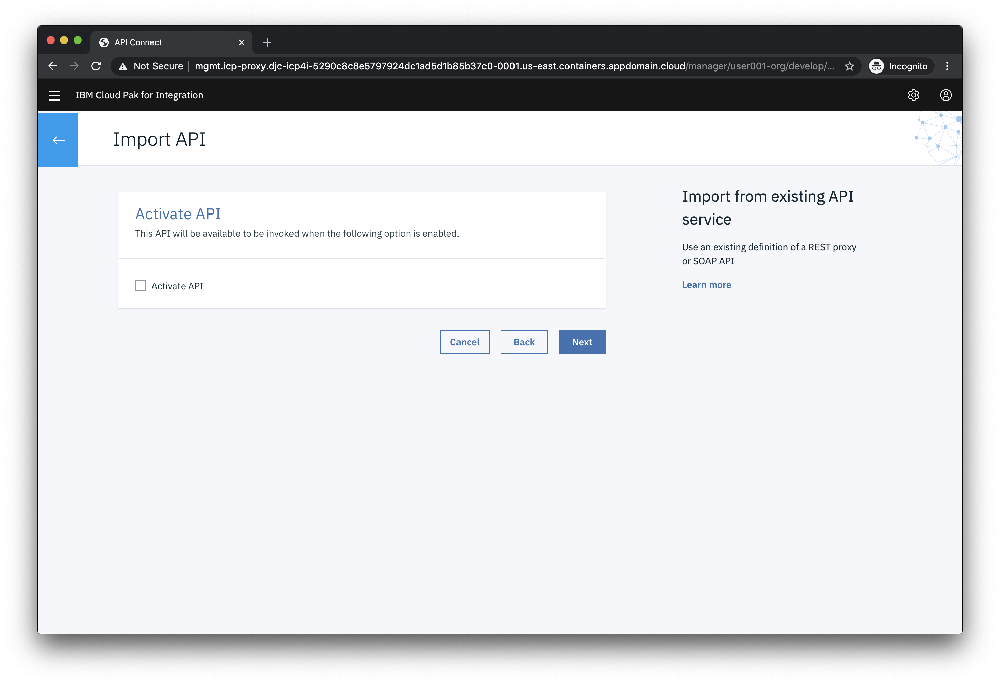

The API should be imported successfully as shown below. Click **Edit API**.


### 3. Configure the API

After importing the existing API, the first step is to configure basic security before exposing it to other developers. By creating a client key you are able to identify the app using the services. Next, we will define the backend endpoints where the API is actually running. API Connect supports pointing to multiple backend endpoints to match your multiple build stage environments.

In the Edit API screen click **Security Definitions**

In the **Security Definition** section, click the **Add** button on the right. This will open a new view titled **API Security Definition**.

In the **Name** field, type `client-id`.

Under **Type**, choose **API Key**. This will reveal additional settings.

For **Located In** choose **Header**. For **Key Type** choose **Client ID**. Your screen should look like the image below.

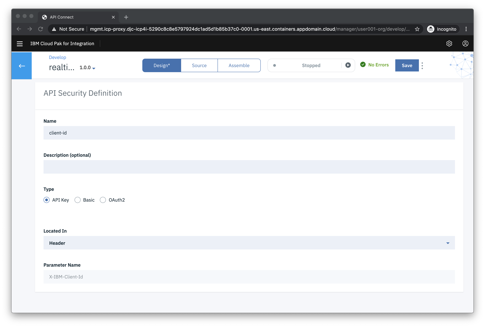

Click the **Save** button to return to the **Security Definitions** section.

Click **Security** in the left menu. Click **Add**. Select the **client-id** as shown below and then click **Save**.

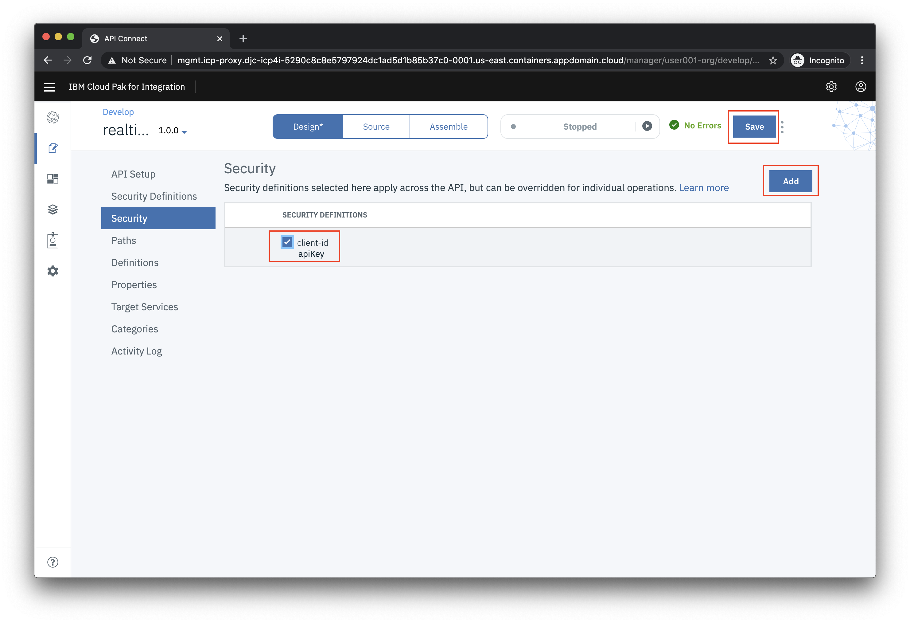

Next you'll the define the endpoint for the external API. Click on **Properties** in the left menu.

Click on the **target-url** property. Click **Add**.

Choose the **sandbox** catalog and for the URL copy and paste the following URL:

`https://stock-trader-quote.us-south.cf.appdomain.cloud`


Click **Save** to complete the configuration.

### 4. Test the API

In the API designer, you have the ability to test the API immediately after creation in the **Assemble** view.

On the top Navigation, click **Assemble**.


Click **proxy** in the flow designer. Note the window on the right with the configuration. It calls the **target-url** with the same request path sent to the API Connect endpoint.


Click the play icon as indicated in the image below.


Click **Activate API** to publish the API to the gateway for testing.


After the API is published, your screen should look like the image below.


Under **Operation** choose get **/stock-quote/djia**.

Note that your **client-id** is prefilled for you.

Scroll all the way to the bottom of the browser window and click **Invoke**.

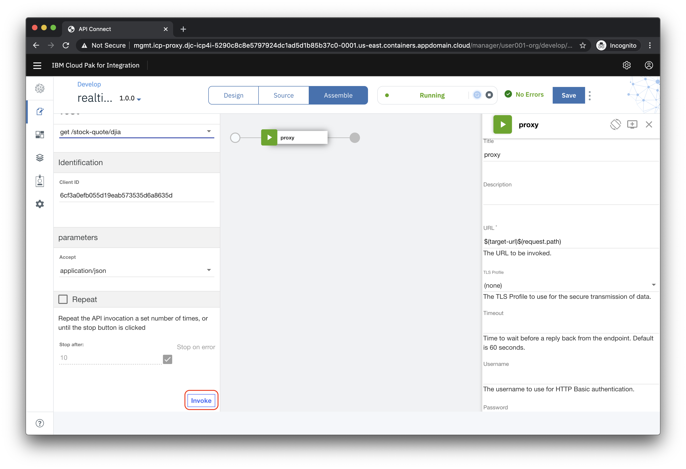

If this is the first test of the API, you may see a certificate exception. Simply click on the URL and choose the option to proceed.

Go back to the test view and click **Invoke** again.

Now you should see a Response section with Status code 200 OK and the Body displaying the details of the Dow Industrial average.

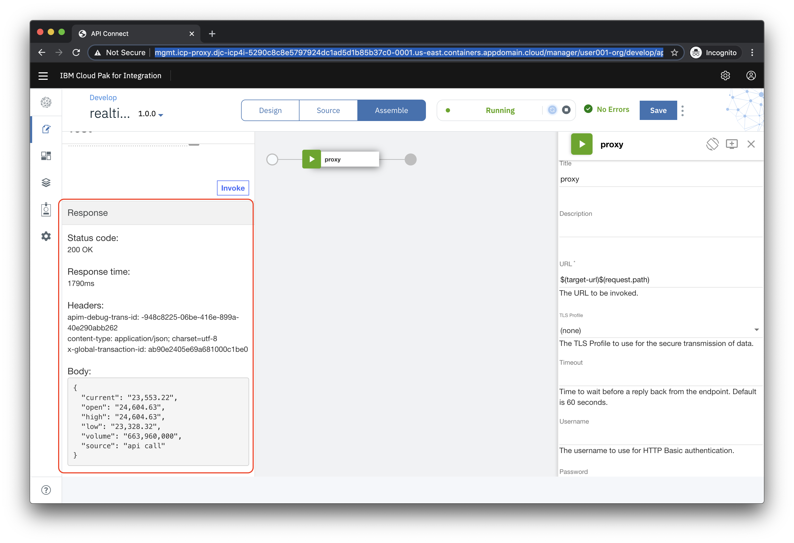

Scroll up in the test view until you see the **Client ID**. Copy the value to to a local text file so it can be used in the Stock Trader application later (**Note:** this is a shortcut to the regular process of publishing the API and then subscribing to it as a consumer).


Next we'll get the endpoint for your API. Click on the **Home** icon (top left) and then click on the **Manage Catalogs** tile.

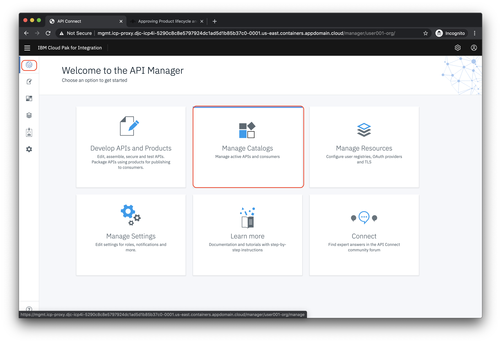

Click on the **Sandbox** tile.

Click on the **Settings** icon and then on **API Endpoints**. Copy the gateway URL and put it in the same file that you used for the **Client ID**


### 5. Create a new OpenShift project for the Stock Trader application

In the IBM Cloud Shell set an environment variable for the *studentid* assigned to you by the instructors (e.g. **user001**):

```bash
export STUDENTID=user???
```

Create a new OpenShift project

```bash
oc new-project trader-$STUDENTID
```

### 6. Prepare for installation

Like a typical Kubernetes app, Stock Trader use secrets to store sensitive data needed by one or more microservices to access external services and other microservices. You'll run a script to store your API Connect endpoint and apikey as secrets that the Stock Trader application references to get this information.

From the IBM Cloud Shell terminal

```bash
git clone https://github.com/IBMStockTraderLite/stocktrader-cp4i.git
```

Go to the directory required to run the setup scripts

```bash
cd stocktrader-cp4i/scripts
```

Run the following command, substituting your API Connect endpoint URL and API Key that saved previously.

```bash
./setupAPIConnectAccess.sh [YOUR API CONNECT EXTERNAL URL] [YOUR API KEY]
```

The output should look like the following

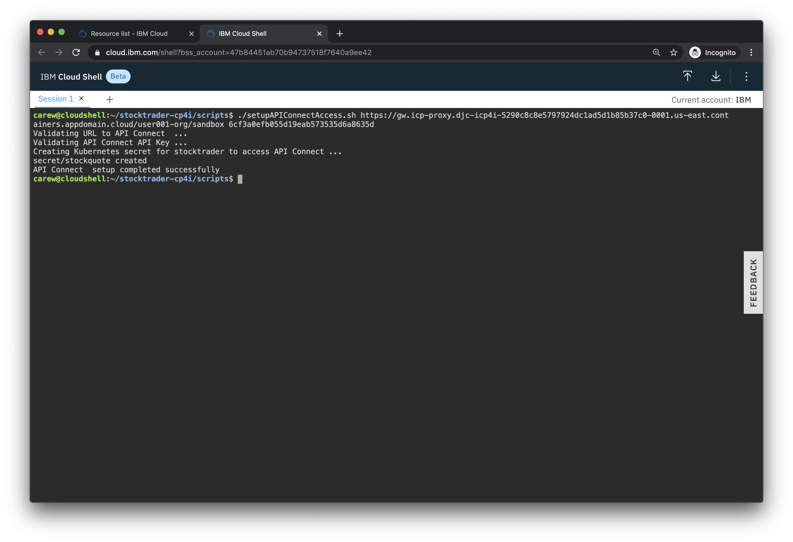

### 7. Install the Stock Trader app

You'll install Stock Trader using an OpenShift template.

Run the following script

```bash
./initialInstall.sh
```

Verify that the output looks like the following:

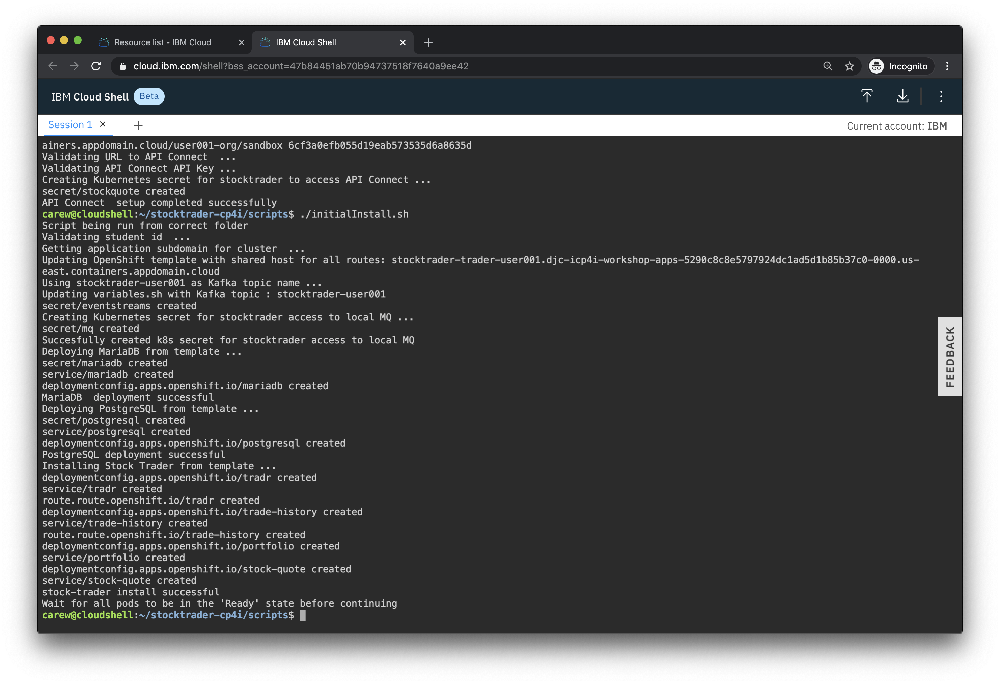

Wait for all the pods to start. Run the following command repeatedly until all the pods are in the *Ready* state as shown below

```bash
oc get pods | grep -v deploy
```

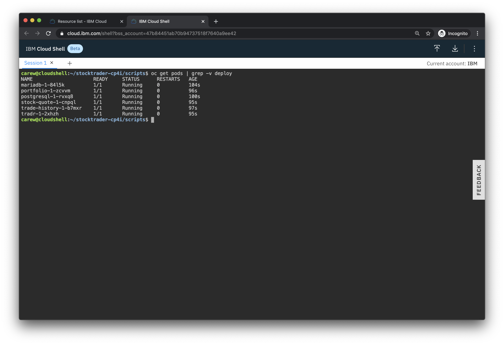

Initialize the database pods by running the following command

```bash
./createDbTables.sh
```

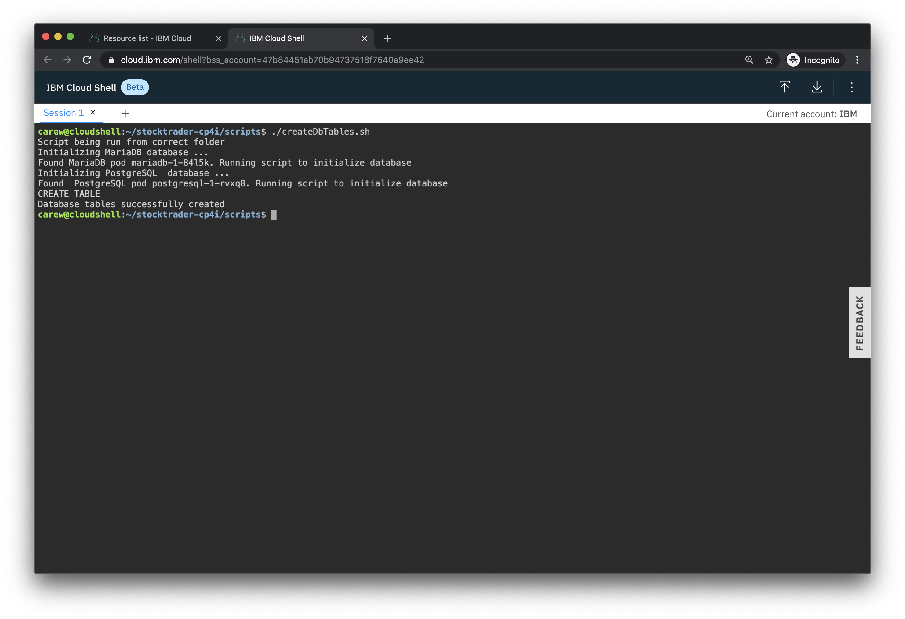

### 8. Verify that the Stock Trader app is calling your API successfully

You will verify the configuration that you created that points at the API you created in API Connect.

From the command line run the following script:

```bash
./showTradrURL.sh
```

Copy the URL that is output and access it with your browser

Log in using the username `stock` and the password `trader`

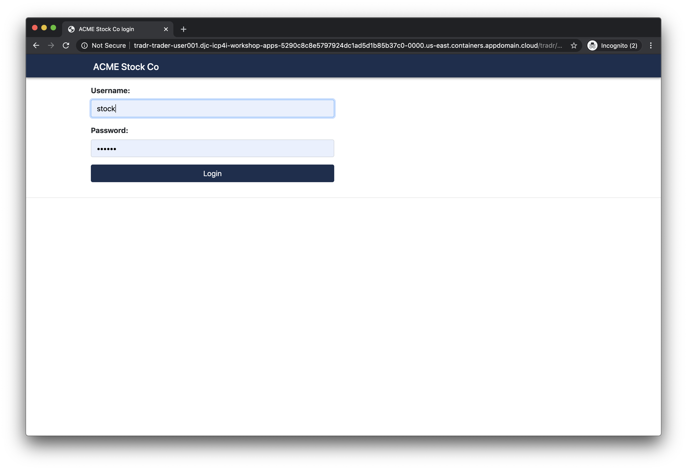

If the DJIA summary has data then you know that the API you created in API Connect is working!

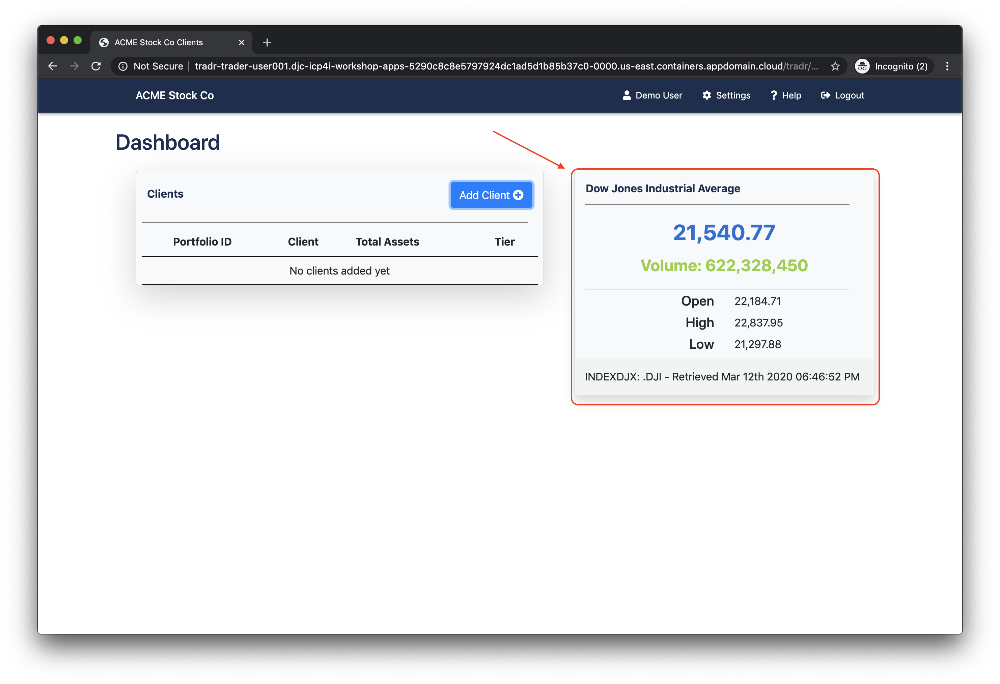

## Summary

**Congratulations**! You successfully completed the following key steps in this lab:
