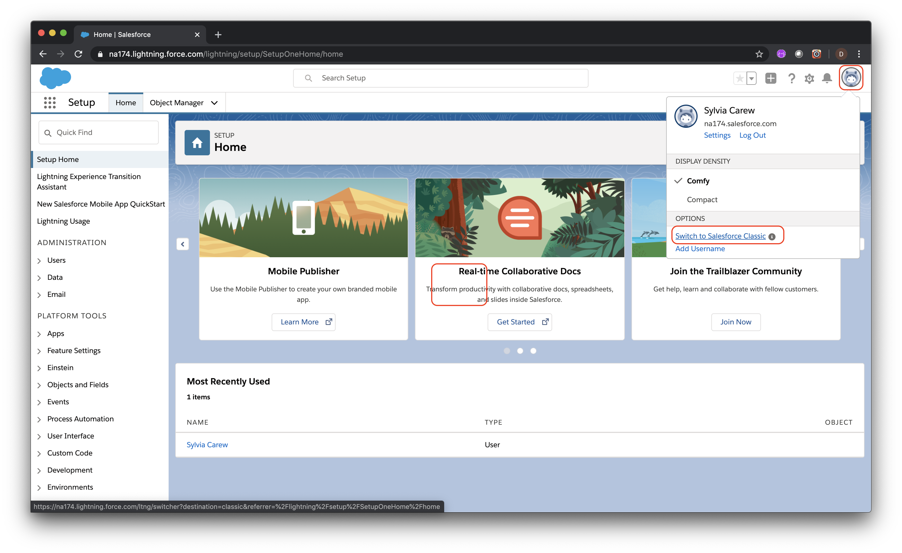

# Exercise: Create a new API that syncs with Salesforce, using App Connect

A common requirement, when developing enterprise applications, is the need to access existing data sources in other external servies - for example exchanging data with a SaaS application. A good design practice is to enable this by creating a bespoke API that provides just the specific access you need. In this lab you will create an API to push client data to Salesforce, using App Connect. This will occur whenever a user interacts with the API.

## Steps

1. [Sign up for Salesforce Developer Edition](#1-sign-up-for-salesforce-developer-edition)
1. [Create a Salesforce Connected App](#2-create-a-salesforce-connected-app)
1. [Setup connectivity to Salesforce in App Connect Designer](#3-setup-connectivity-to-salesforce-in-app-connect-designer)
1. [Create the flow in App Connect Designer](#4-create-the-flow-in-app-connect-designer)
1. [Save your Salesforce credentials as a Kubernetes secret](#5-save-your-salesforce-credentials-as-a-kubernetes-secret)
1. [Create an Integration Server instance and deploy your flow](#6-create-an-integration-server-instance-and-deploy-your-flow)
1. [Test your App Connect Flow](#7-test-your-app-connect-flow)
1. [Summary](#summary)

### 1. Sign up for Salesforce Developer Edition

In your browser go to the following URL to sign up for Salesforce Developer Edition - a full featured version of the Salesforce Lightning Platform. **Note:** If you already have access to the Salesforce Developer Edition or a paid version of Salesforce, skip to **Step 2**.

[Salesforce Developer Edition signup](https://developer.salesforce.com/signup)

Enter the required information and follow the prompts to complete the signup process.

### 2. Create a Salesforce Connected App

In this section you'll create a *Connected App* in Salesforce so that the App Connect flow that you create later will be able to access your Salesforce data.

Login to [Salesforce](https://www.salesforce.com)

Click on your avatar (top right) and select **Switch to Salesforce Classic** from the context menu.



Click on **Setup**.


In the left navigation area, scroll down to the **Build** section, expand **Create** and click on **Apps**


Scroll down to the **Connected Apps** section and click on **New**


Fill in the required values for a new Connected App

* Set the **Connected App Name** property to `IBM App Connect`
* Set the **API Name** to `IBM_App_Connect`
* Enter your email address as the **Contact Email**


Configure the OAuth settings

* Select the **Enable OAuth Setting** check box.
* Set the **Callback URL** to `https://www.ibm.com`
* Under **Selected OAuth Scopes** select **Access and manage your data (api)** and click the arrow under the **Add** label


Scroll down to the bottom of the web page and click **Save**


Copy the **Consumer Key** and **Consumer Secret** to a text file. You will need them later to connect to Salesforce

Check your email for the email address that you use as your Salesforce username. You should have received an email from Salesforce with the subject **Your new Salesforce security token**. Copy the **Security Token** to the same text file that you used for the **Consumer Key** and **Consumer Secret**


> **NOTE** To force a **Security Token** reset, go to the account **Settings** and click on **Reset My Security Token**.


### 3. Setup connectivity to Salesforce in App Connect Designer

App Connect Designer is a component of Cloud Pak for Integration that provides an authoring environment in which you can create, test, and share flows for an API. You can share your flows by using the export and import functions, or by adding them to an Asset Repository for reuse.

In a new browser tab open the **Cloud Pak for Integration** tab and under **View Instances** click on the link for **App Connect Designer**.


Once loaded, click the **Settings** icon and then select **Catalog**.


Scroll down to find the **Salesforce** entry and expand it. If there are existing connections shown in a drop down list select **Add a new account ...** from that list.


> **NOTE** If there are no existing connection shown click on **Connect**

Enter the following values referring to the text file from the previous section where you saved your Salesforce credentials.

* For the **Login URL** enter `https://login.salesforce.com`.
* For the **Username** enter the email you use to login to Salesforce.
* For the **Password** enter the password you use to login to Salesforce. Then append the value of the **Security Token** (that you saved in the previous section) to the password. For example if your password is `foo` and your security token is `bar` you would enter `foobar` into the password field.
* For the **Client Id** copy and paste the value of the **Consumer Key** (that you saved in the previous section).
* For the **Client Secret** copy and paste the value of the **Consumer Secret** (that you saved in the previous section).


Click on **Connect**. If successful, the connection will be given a default name of the form *Account n*.

### 4. Create the flow in App Connect Designer

In App Connect Designer, click the **Settings** icon and then select **Dashboard**


Click **New** and select **Flows for an API**


* Name the flow `user001sf` or some other unique name.
* Name the model `Client`.


Click **Create Model**

Next you will add the properties of the input data for your flow.

> **NOTE**: Name the properties **exactly** as instructed (including matching case) so that your flow will work with the *Stock Trader Lite* app.

* Enter `ClientId` as the first property and then click **Add property +**
* Enter `FirstName` as the next property and then click **Add property +**
* Enter `LastName` as the next property and then click **Add property +**
* Enter `Email` as the next property

When you're done the screen should look like the following:


Click **Operations** and then select **Create Client**


Click **Implement flow**. Click on the **+** icon.

* Scroll down to Salesforce
* Select your account from the dropdown
* Expand **Contacts**
* Click **Create Contact**


Next you'll map the properties from your model to the Salesforce Contact properties. Click in the text box for the **Account Id** property and then click on the icon just to the right of the field. Select the **ClientId** property of your model.


The remaining properties have the same names as their Salesforce equivalents so click on **Auto match fields** to complete the mapping.


Click on **Response** to configure what will be returned by the flow. Click in the text box for the **Client Id** property and then click on the icon just to the right of the field. Select the **Contact Id** property of the **Salesforce/Create** contact menu.


Next you'll test the flow to make sure it works. Click on the middle part of the flow and then click on the edit icon.


Click on **Request body parameters** and then edit the input parameters that will be used in the test.

* Set the **Client Id** to blank. This value will be generated by Salesforce and returned.
* Enter a **FirstName** value.
* Enter a **LastName** value.
* Enter an **Email** in a valid email format


Click the test icon. Verify that the operation returns a 200 HTTP status code.


Click **View details** to see the raw data returned from the call to Salesforce (note this is not the same as the data returned by the flow which you defined in the **Response** stage of the flow). Click **Done**.

Next you'll export the flow so it can deployed in an Integration Server instance. Click the **Settings** icon and then select **Dashboard**. Click the 3 vertical dots on the tile for your new flow and select **Export ...** from the context menu.


Select **Export for integration server (BAR)** and click **Export**

Save the file to a folder of your choosing.

### 5. Save your Salesforce credentials as a Kubernetes secret

To deploy an Integration Server for your flow, you need to create a Kubernetes secret with your Salesforce credentials in the OpenShift cluster running Cloud Pak for Integration.

Navigate to the OpenShift console in a new tab. Click the profile on the top right and choose the **Copy Login Command** option.


You'll be forced to choose a login method, choose **htpasswd** and use the pre-filled credentials.


Click the **Display Token** option and copy the `oc login` command.


In a new *Terminal* window paste the `oc login` command.

```bash
$ oc login --token=KoSCnw....SmQz0 --server=https://api.demo.ibmdte.net:6443
Logged into "https://api.demo.ibmdte.net:6443" as "ibmadmin" using the token provided.

You have access to 67 projects, the list has been suppressed. You can list all projects with 'oc projects'
```

Switch to the `ace` project:

```bash
$ oc project ace
Now using project "ace" on server "https://api.demo.ibmdte.net:6443".
```

To create a secret, copy and paste the following text into a file (use: `nano sfcred.yaml` for instance), substituting your own values in place of the generic values.

> **Note** that the **name** attribute must match the account name of the SalesForce connection in App Designer - by default it should be **Account 1** unless changed explicitly.

```yaml
---
accounts:
  salesforce:
    - credentials:
        authType: "oauth2Password"
        username: "<your_sf_email_login>"
        password: "<passowrd_and_security_token>"
        clientIdentity: "<consumer_key>"
        clientSecret: "<consumer_secret>"
      endpoint:
        loginUrl: "https://login.salesforce.com"
      name: "Account 1"
```

Once updated with your correct values, run the following command. The command below will name the secret `sfcred`, you'll need this name later so choose one that you will remember.

```bash
oc create secret generic sfcred --from-file=credentials=sfcred.yaml
```

### 6. Create an Integration Server instance and deploy your flow

In this step you'll create an Integration Server instance and deploy your flow to it.

In a new browser tab open the **Cloud Pak for Integration** tab and under **View Instances** click on the link for **App Connect Dashboard**.


Once loaded, click on **Create server**


Click **Add a BAR file** and select the file you exported at the end of the previous section.


Click **Continue**. Skip the next prompt asking to download a configuration package.

Select **Designer** as the type of Integration that you want to run and click **Next**


Change the setting for **Show everything** to **ON**.


Enter the following settings:

* In the **Details** section for the **Name** enter the name of the *Flow* from step 3, we used `user001sf`.
* In the **Details** section for **IBM App Connect Designer flows** select **Enabled for local connectors only**
* In the **Integration Server** section for **Name of the secret that contains the server configuration** enter `sfcred`.
* In the **Configuration for deployments** section change the **Replica count** to 1

The top half of the dialog should look like the following:


The bottom half of the dialog should look like the following:


Click **Create**. The status of the server will be eventually shown. Wait until the server status shows as **Started**. Note you may have to refresh the page to see the status change.


### 7. Test your App Connect Flow

In the App Connect Dashboard click on the tile for your new server


Click on the API tile to see the details of the flow's API


You should see the details of your flow's API


Copy the **REST API Base URL** to the clipboard

In a Terminal copy this `curl` command:

```bash
curl -X POST -H "Content-Type: application/json" -d '{"FirstName":"Steve", "LastName":"Martinelli", "Email":"stevemar@ca.ibm.com"}' http://user001sf2-http-ace.apps.demo.ibmdte.net:80/user001sf/Client
```

You should see output like the example below. Verify that the ID of the new Salesforce contact is returned.

```bash
$ curl -X POST -H "Content-Type: application/json" -d '{"FirstName":"Steve", "LastName":"Martinelli", "Email":"stevemar@ca.ibm.com"}' http://user001sf2-http-ace.apps.demo.ibmdte.net:80/user001sf/Client

{"ClientId":"0034R00003L1YPuQAN"}
```

In a new browser tab login to Salesforce. Click on the **+** icon and then on **Contacts**


Verify that the new contact you created via your test is there


## Summary

**Congratulations**! You successfully completed the following key tasks in this lab:

* Connected to Salesforce
* Created an App Connect designer flow to push client data to Salesforce contacts.
* Deployed the flow as an Integration Server in App Connect Dashboard
* Configured a ClientID/API Key for security set up a proxy to the existing API.
* Tested the flow with new data.
