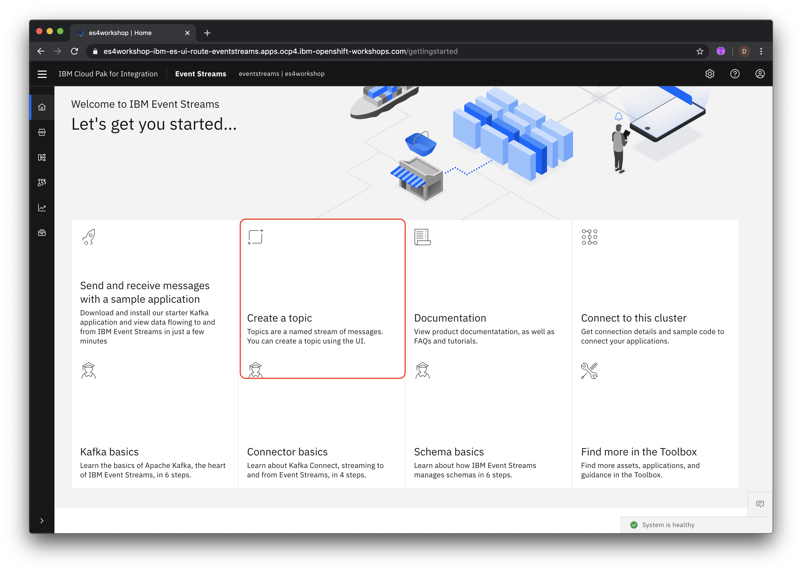
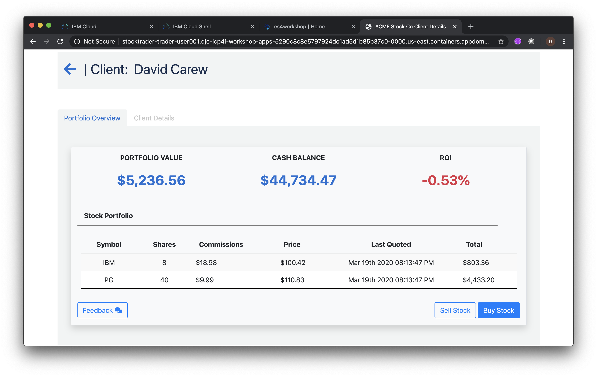

# Exercise: Using IBM Event Streams for near real-time data replication

In this lab you will use IBM MQ and IBM Event Streams to replicate data from a transactional database to a reporting database. The pattern used allows for seamless horizontal scaling to minimize the latency between the time the transaction is committed to the transactional database and when it is available to be queried in the reporting database.

* The **event-producer** microservice consumes the transaction data from IBM MQ and sends it to a topic in Event Streams. By scaling this service horizontally you can decrease the latency between the time the transaction is committed to the transactional database and when it is available to be queried in the reporting database,

* The **event-consumer** microservice receives the transaction data from Event Streams and calls the **trade-history** service to publish the data to the reporting database. By scaling this service horizontally you can decrease the latency between the time the transaction is committed to the transactional database and when it is available to be queried in the reporting database.

## Steps

1. [Create a topic in the Event Streams Management Console](#1-create-a-topic-in-the-event-streams-management-console)
1. [Get credentials for your Event Streams topic](#2-get-credentials-for-your-event-streams-topic)
1. [Upload the Java truststore to the IBM Cloud Shell](#3-upload-the-java-truststore-to-the-ibm-cloud-shell)
1. [Add messaging components to the Stock Trader app](#4-add-messaging-components-to-the-stock-trader-app)
1. [Generate some test data with the Stock Trader app](#5-generate-some-test-data-with-the-stock-trader-app)
1. [Verify transaction data was replicated to the Trade History database](#6-verify-transaction-data-was-replicated-to-the-trade-history-database)
1. [Examine the messages sent to your Event Streams topic](#7-examine-the-messages-sent-to-your-event-streams-topic)
1. [Summary](#summary)

### 1. Create a topic in the Event Streams Management Console

Access the Event Streams Management Console using the URL provided to you by your instructors.

Sign in with the credentials provided to you by your instructors.

Click on the **Create a topic** tile



Name the topic `stocktrader-user???` where `user???` is your assigned student id. For example if your student id is `user002` then name the topic `stocktrader-user002`. Click **Next**.

Leave the default for the number of partitions and click **Next**.

Leave the default for message retention and click **Next**.

Change the Replication factor to 1 and click **Create topic**.


You should see your new topic listed.

### 2. Get credentials for your Event Streams topic

From the Event Streams Management Console click **Connect to this cluster**.


Click on the icon next to the **Bootstrap server** hostname to copy it to the clipboard.


Create a local file and paste the bootstrap server hostname into it. You'll need this later to connect the Stock Trader application to your Event Streams topic.

Click **Generate API key**


Name the application `stocktrader-user???` where `user???` is your assigned student id. For example if your student id is `user002` then name the application`stocktrader-user002`.

Select **Produce and consume** for the capabilities of the API Key. Click **Next**.


Enter the name of your topic e.g. `stocktrader-user002`. Click **Next**.

Click **Generate API key**

Click **Copy API key** and paste the API Key into the same file that you used to save the bootstrap hostname.


Click on the download icon to download the Java truststore needed for Java applications to connect to Event Streams


This will prompt you to save the file **es-cert.jks** locally. Save the file.

Keep this browser tab open for later on in the lab.

### 3. Upload the Java truststore to the IBM Cloud Shell

In the IBM Cloud Shell browser tab, click on the upload icon


Select the file **es-cert.jks** that you downloaded in the previous step and follow the prompts to upload it to the IBM Cloud Shell.

### 4. Add messaging components to the Stock Trader app

you haven't previously cloned the Github repo with the Stock Trader app deployment artifacts, run the following command in the IBM Cloud Shell

```bash
git clone https://github.com/IBMStockTraderLite/stocktrader-cp4i.git
```

Go to the directory required to run the setup scripts

```bash
cd stocktrader-cp4i/scripts
```

Run the following command, substituting the Bootstrap hostname and API Key that you saved earlier. Note that the third parameter is the Java truststore file that you just uploaded.

```bash
./addMessaging.sh [BOOTSTRAP SERVER HOSTNAME] [YOUR API KEY] ../../es-cert.jks
```

The output should look like the following:


Wait for all the pods to start. Run the following command repeatedly until all the pods are in the *Ready* state as shown below

```bash
oc get pods | grep -v deploy
```


### 5. Generate some test data with the Stock Trader app

From the command line run the following script:

```bash
./showTradrURL.sh
```

Copy the URL that is output and access it with your browser

Log in using the username `stock` and the password `trader`

Click on **Add Client**


Click on the Portfolio ID of the added client


Click **Buy Stock**. Select a company and enter the number of shares. Click **Buy shares**.

Do 2 or 3 more transactions (either buy or sell).



### 6. Verify transaction data was replicated to the Trade History database

From the IBM Cloud Shell terminal, run the following command to show the Trader History service URL for listing trade data

```bash
./showHistoryURL.sh
```

Copy the URL that is output and access it with your browser

Verify that trade data in JSON format is shown and the **xactionsrc** fields is set to `Event Streams` indicating that this data was propagated to the Trade History database via IBM MQ and Event Streams.


### 7. Examine the messages sent to your Event Streams topic

In this step you'll examine the data sent to your Event Streams topic.

From the Event Streams Management Console click on the topics icon


Click on your topic name


Click on **Messages** and then select an individual message to see the details.


Details of the message you selected should appear at the right


## Summary

**Congratulations**! You successfully completed the following key steps in this lab:

* Created an Event Streams topic
* Retrieved all the credentials needed to access the topic from an application .
* Configured the Stock Trader app to use your topic
* Generated transactions in the Stock Trader app and verified that the data is being replicated via Event Streams.
* Examined messages sent to your topic in the Event Streams Management console.
