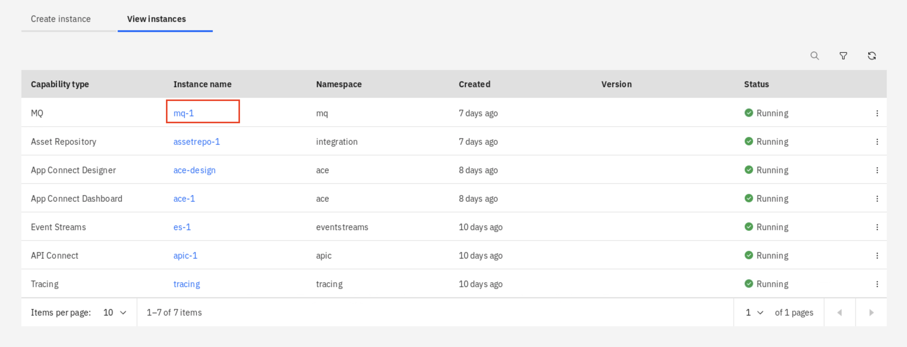
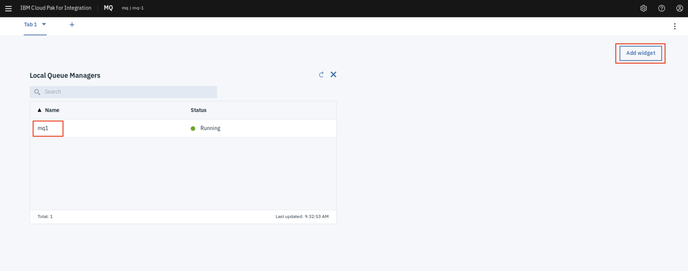
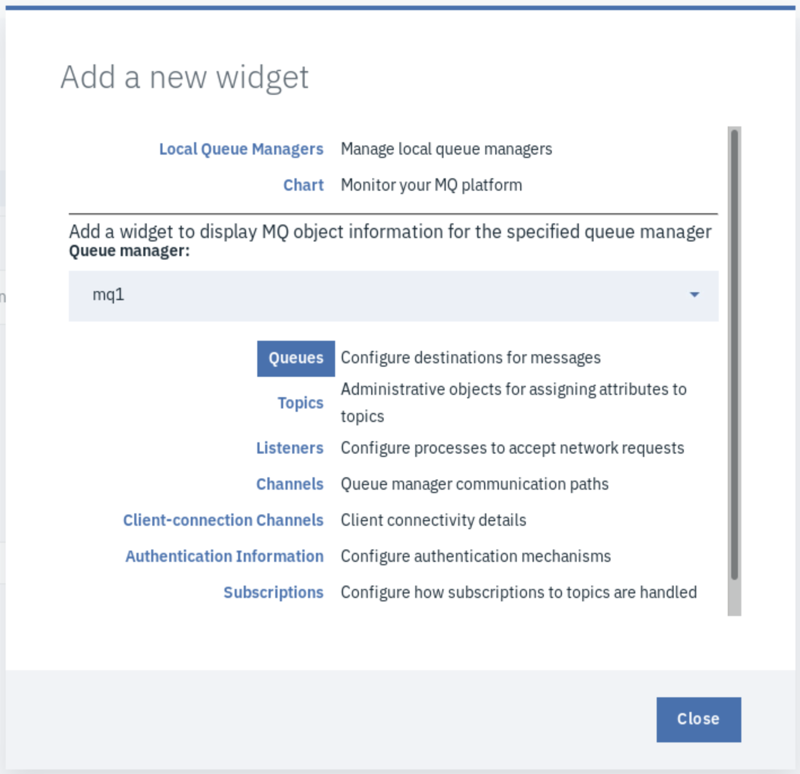
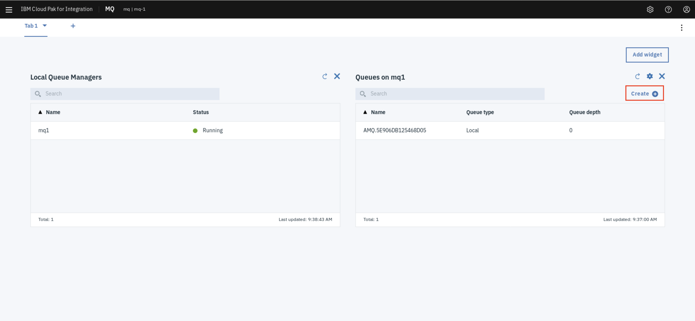
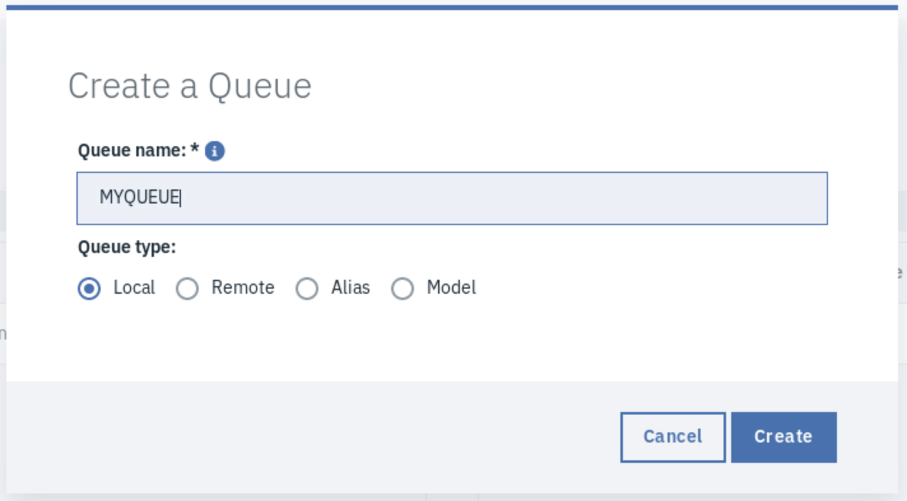
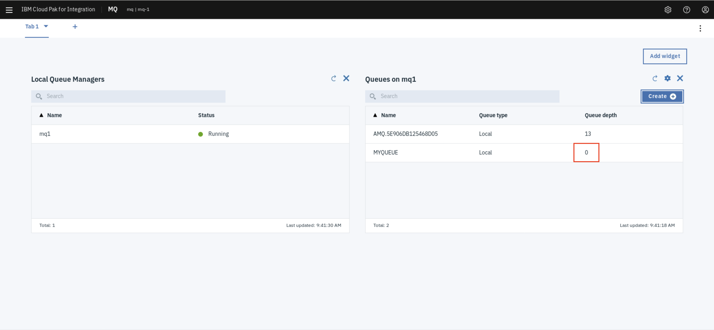
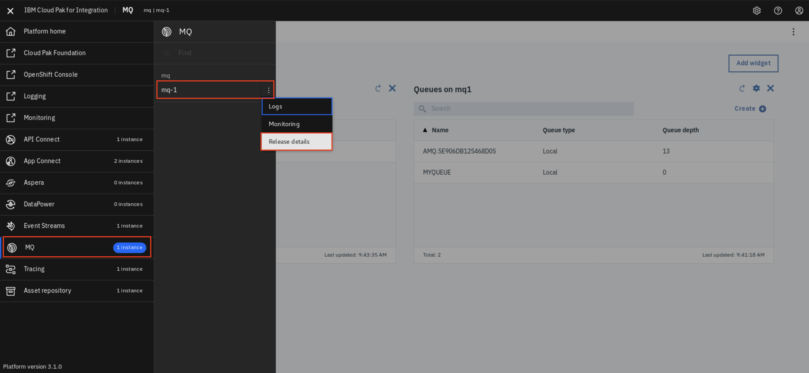
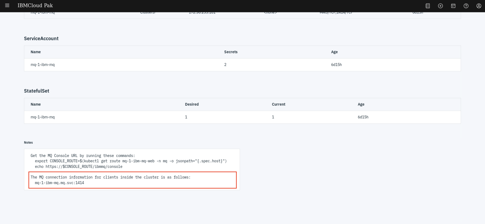

# Exercise: Integrate MQ with

In this task, you navigate to the MQ Console and check the MQ configuration. You create the queue which accepts the resulting data from the call to the "NEWORDER" API.

## Steps

Launch the MQ service. *If a security warning is see, add an exception and proceed.*

In the MQ Console page you should have a single queue manager named `mq1`. If you see queues on `mq1` skip ahead, otherwise, click the *Add Widget* button.

Click *Queues* to create a queue widget. You can add different widgets into MQ Console, including MQ objects such as: charts, queues, topics, listeners, channels, etc.

From the new Queue Widget, click the *Create(+)* button to create a queue for the `mq1` queue manager.

In the pop-up window create a new local queue named `MYQUEUE`.

A new queue will be created, take a look at the queue depth, it should be 0.

To connect to the queue we'll need information such as the hostname and port of the queue manager. To get this information go to the (☰) menu and choose *MQ* > *mq-1* > *Release details*.

Scroll down to the bottom of page, make a note of the queue manager hostname and listener port.

**MORE TO COME**
