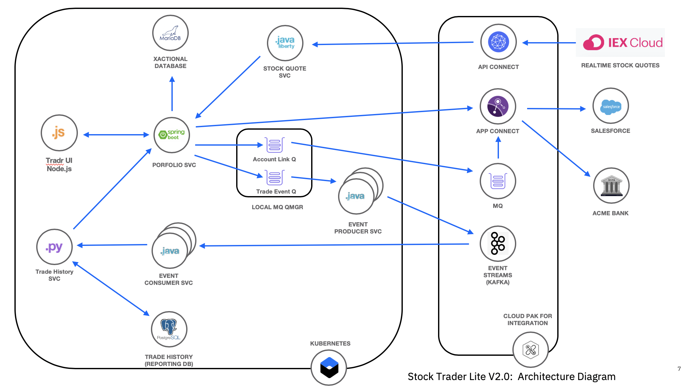

# Exercise: Introduction to the example application

In this exercise, we will introduce the sample application that we'll use for the workshop, an application called "Stock Trader". "Stock Trader" is written in multiple languages such as Java and Node.js.

## Prerequisites

You should have already carried out the prerequisites defined in the [Pre-work](../pre-work/README.md).

> **NOTE:** In the exercises that follow you will see the actual command to run, followed by a separate example of running the command with the expected output. You only need to run the first example and never need to run a command you see preceded by a "$". You can even use the copy button on the right side of the command to make copying easier.

```bash
git clone https://github.com/bee-travels/bee-travels-node.git
```

You should see output similar to the following:

```bash
$ git clone https://github.com/bee-travels/bee-travels-node.git
Cloning into 'bee-travels-node'...
...
```

## About the application

The architecture of the solution you will build is shown below:



* **Tradr** is a Node.js UI for the portfolio service

* The **portfolio** microservice sits at the center of the application. This microservice:

  * persists trade data  using JDBC to a MariaDB database
  * invokes the **stock-quote** service that invokes an API defined in API Connect in CP4I to get stock quotes
  * sends completed transactions to a local IBM MQ queue.
  * calls the **trade-history** service to get aggregated historical trade data.

## Steps

1. [Clone the GitHub repo](#1-clone-the-github-repo)
1. [Launch the application locally](#2-launch-the-application-locally)
1. [Use the application locally](#3-use-the-application-locally)
1. [Stop the application](#4-stop-the-application)

### 1. Clone the GitHub repo

In this section we'll configure our Appsody CLI to pull in Collections.

```bash
git clone https://github.com/bee-travels/bee-travels-node.git
cd bee-travels-node
```

### 2. Launch the application locally

Now use Docker Compose to build all the microservices

```bash
docker-compose up --build
```

### 3. Use the application locally

Launch a browser by navigating to <http://localhost:9000>.

<!-- TODO insert screenshot here -->

### 4. Stop the application

**Ctrl+C** will stop docker compose.
