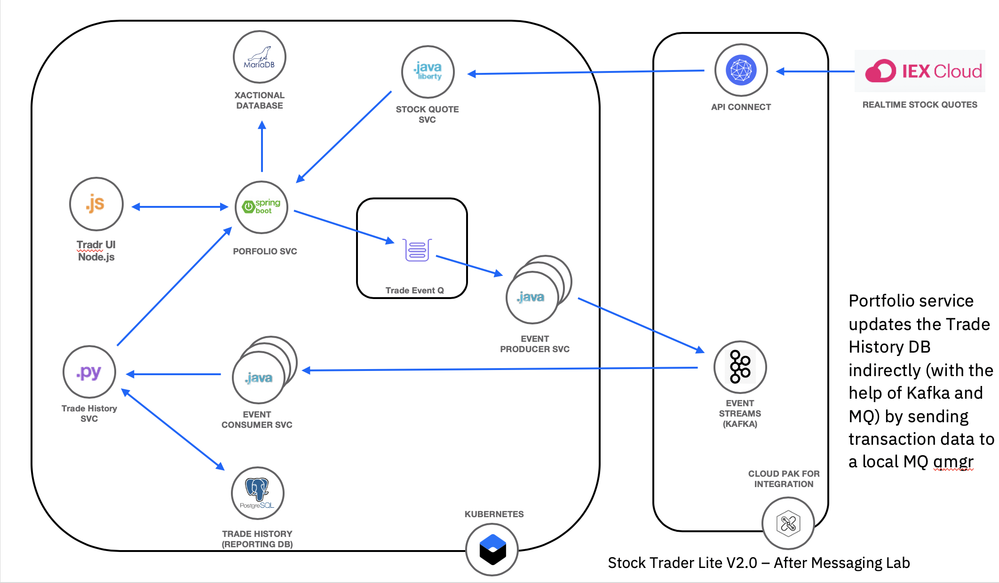

# Exercise: Introduction to the example application

In this exercise, we will introduce the sample application that we'll use for the workshop, an application called ["Stock Trader Lite"](https://github.com/IBMStockTraderLite/stocktrader-cp4I). The "Stock Trader Lite" application is a simple stock trading sample where you can create various stock portfolios and add shares of stock to each for a commission. It is written in multiple languages such as Java, Python, and Node.js.

It keeps track of each porfolio's total value and its loyalty level which affects the commission charged per transaction. It is a simpler version of the [IBM Stock Trader sample](https://github.com/IBMStockTrader/stocktrader). It differs from the original version in the following ways:

* The UI was rewritten using Bootstrap and JQuery and a Node.js app that implements the Backend for Frontend (BFF) pattern.
* The Trade History service was rewritten as a Python Flask app.
* The Portfolio Service was rewritten as a Spring Boot app.
* The HTTPS and JWT security of the original app have been removed to make the deployment configuration simple.
* Integration with the App Connect component of IBM Cloud Pak for Integration was added.
* Added a separate Event Streams Producer pod so it can be scaled independently of the Portfolio service.
* Uses a PostgreSQL database instead of a Mongo database for storing trading history.
* Local MQ is now used to trigger input to Event Streams when replicating transaction data

This version is designed to be used for educational purposes only on a Red Hat OpenShift cluster with network access to an installation of IBM Cloud Pak for Integration V 2020.1. Instructions for deploying the app etc will be included with the educational materials of courses that include this sample.



* The **portfolio** microservice sits at the center of the application. This microservice;

  * persists trade data using JDBC to a MariaDB database
  * invokes the **stock-quote** service that invokes an API defined in the API Connect component of CP4I to get stock quotes
  * sends trades indirectly via a local MQ qmgr to Event Streams in CP4I so that they can be recorded in PostgreSQL by the **event-consumer** microservice
  * calls the **trade-history** service to get aggregated historical trade data.
  * pushes new client data to Salesforce via the AppConnect component of CP4I
  * links an external bank account via AppConnect component of CP4I

* **Tradr** is a Node.js UI for the porfolio service

* The **event-consumer** service serves as a Kafka consumer and stores trade data published by the portfolio service in the PostgreSQL database.

* The **trade-history** service exposes an API to query the historical data in PostgreSQL and is called by the **portfortio** to get aggregated historical data.

* The **stock-quote** service queries an external service to get real time stock quotes via an API Connect proxy.

## Installing the Stock Trader App

### 1. Create a new OpenShift project for the Stock Trader application

In the IBM Cloud Shell set an environment variable for the *studentid* assigned to you by the instructors (e.g. **user001**):

```bash
export STUDENTID=user???
```

Create a new OpenShift project

```bash
oc new-project trader-$STUDENTID
```

### 2. Prepare for installation

Like a typical Kubernetes app, Stock Trader use secrets to store sensitive data needed by one or more microservices to access external services and other microservices. You'll run a script to store your API Connect endpoint and apikey as secrets that the Stock Trader application references to get this information.

From the IBM Cloud Shell terminal

```bash
git clone https://github.com/IBMStockTraderLite/stocktrader-cp4i.git
```

Go to the directory required to run the setup scripts

```bash
cd stocktrader-cp4i/scripts
```

Run the following command, substituting your API Connect endpoint URL and API Key that saved previously.

```bash
./setupAPIConnectAccess.sh [YOUR API CONNECT EXTERNAL URL] [YOUR API KEY]
```

The output should look like the following


### 3. Install the Stock Trader app

You'll install Stock Trader using an OpenShift template.

Run the following script

```bash
./initialInstall.sh
```

Verify that the output looks like the following:


Wait for all the pods to start. Run the following command repeatedly until all the pods are in the *Ready* state as shown below

```bash
oc get pods | grep -v deploy
```


Initialize the database pods by running the following command

```bash
./createDbTables.sh
```


### 4. Verify that the Stock Trader app is calling your API successfully

You will verify the configuration that you created that points at the API you created in API Connect.

From the command line run the following script:

```bash
./showTradrURL.sh
```

Copy the URL that is output and access it with your browser

Log in using the username `stock` and the password `trader`


If the DJIA summary has data then you know that the API you created in API Connect is working!


