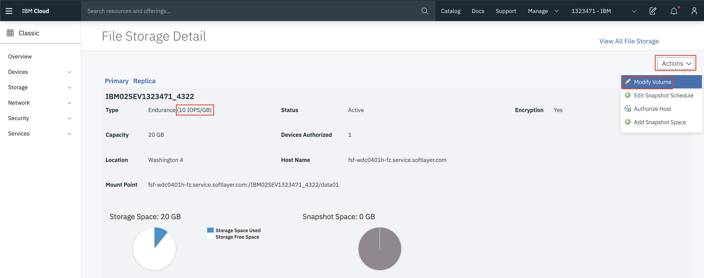

# Instructor guide

The content in this section is specifically made for instructors hosting this workshop.

## Logging into Tekton UI

To log into the Tekton UI, you need to authenticate with the OpenShift cluster is was deployed on. This means that if we spin up 1 or N clusters for every workshop participant, then they all need to be added to the a single IBM Cloud account beforehand, and consequently must have an IBM ID, too.

## Pushing to the OpenShift registry times out

It's possible that when deploying a large image to OpenShift's internal registry, the deployment times out, with an error message like this:

```bash
$ appsody deploy --tag $DOCKER_REGISTRY/insurance-quote/quote-backend:v1 --push --namespace insurance-quote
...
[Docker] Successfully built 89b220cafd4a
[Docker] Successfully tagged docker-registry-default.cp4apps-workshop-prop-5290c8c8e5797924dc1ad5d1b85b37c0-0001.us-east.containers.appdomain.cloud/insurance-quote/quote-backend:1
Built docker image docker-registry-default.cp4apps-workshop-prop-5290c8c8e5797924dc1ad5d1b85b37c0-0001.us-east.containers.appdomain.cloud/insurance-quote/quote-backend:1
Using applicationImage of: docker-registry-default.cp4apps-workshop-prop-5290c8c8e5797924dc1ad5d1b85b37c0-0001.us-east.containers.appdomain.cloud/insurance-quote/quote-backend:1
Pushing docker image docker-registry-default.cp4apps-workshop-prop-5290c8c8e5797924dc1ad5d1b85b37c0-0001.us-east.containers.appdomain.cloud/insurance-quote/quote-backend:1
[Error] Could not push the image: exit status 1 The push refers to repository [docker-registry-default.cp4apps-workshop-prop-5290c8c8e5797924dc1ad5d1b85b37c0-0001.us-east.containers.appdomain.cloud/insurance-quote/quote-backend]
9176e849956e: Preparing
25311323356d: Preparing
c7a362505ffd: Layer already exists
4487d7944a84: Layer already exists
9176e849956e: Pushed
34c263b82e37: Retrying in 5 seconds
```

To get around this issue, the IOPS (input/output operations per second) should be upgraded past the default (0.25). To do this, follow this guide (or see the [Official Documentation](https://cloud.ibm.com/docs/openshift?topic=openshift-file_storage#file_change_storage_configuration)).

First, find the OpenShift volume claim ID for `registry-backing`. To do this run:

```bash
oc get pvc --all-namespaces
```

You should see output similar to the snippet below, in this case the volume claim ID is `pvc-82769bfa-f694-11e9-bf77-faf40b1b6da7`.

```bash
$ oc get pvc --all-namespaces
NAMESPACE   NAME                                         STATUS    VOLUME                                     CAPACITY   ACCESS MODES   STORAGECLASS        AGE
default     registry-backing                             Bound     pvc-82769bfa-f694-11e9-bf77-faf40b1b6da7   20Gi       RWX            ibmc-file-bronze    4d
```

Use `oc describe pv` to find the volume ID (this is different than the volume claim ID), and can be found in the `Labels` section of the output. In this case it is `102411628`.

```bash
$ oc describe pv pvc-82769bfa-f694-11e9-bf77-faf40b1b6da7 --namespace default
Name:            pvc-82769bfa-f694-11e9-bf77-faf40b1b6da7
Labels:          CapacityGb=20
                 Datacenter=wdc04
                 Iops=2
                 StorageType=ENDURANCE
                 Username=IBM02SEV1323471_4322
                 billingType=hourly
                 failure-domain.beta.kubernetes.io/region=us-east
                 failure-domain.beta.kubernetes.io/zone=wdc04
                 path=IBM02SEV1323471_4322data01
                 server=fsf-wdc0401h-fz.service.softlayer.com
                 volumeId=102411628
Annotations:     ibmFileProvisionerIdentity=8d6ff3ed-f695-11e9-9ecf-66243bd50687
                 pv.kubernetes.io/provisioned-by=ibm.io/ibmc-file
Finalizers:      [kubernetes.io/pv-protection]
StorageClass:    ibmc-file-bronze
Status:          Bound
Claim:           default/registry-backing
Reclaim Policy:  Delete
Access Modes:    RWX
Capacity:        20Gi
Node Affinity:   <none>
Message:
Source:
    Type:      NFS (an NFS mount that lasts the lifetime of a pod)
    Server:    fsf-wdc0401h-fz.service.softlayer.com
    Path:      /IBM02SEV1323471_4322/data01
    ReadOnly:  false
Events:        <none>
```

Lastly, use the `ibmcloud sl file` command to modify the volume to have 10 IOPS. This may take several minutes to complete.

```bash
$ ibmcloud sl file volume-modify 102411628 --new-tier 10
This action will incur charges on your account. Continue?> y
```

Alternatively, should the CLI fail, modifying the volume can be done be accomplished from the IBM Cloud Dashboard. Navigate to <https://cloud.ibm.com/classic/storage/file/{id}>, where {id} is the volume ID. Choose to modify the volume, and choose an IOPS of 10.


