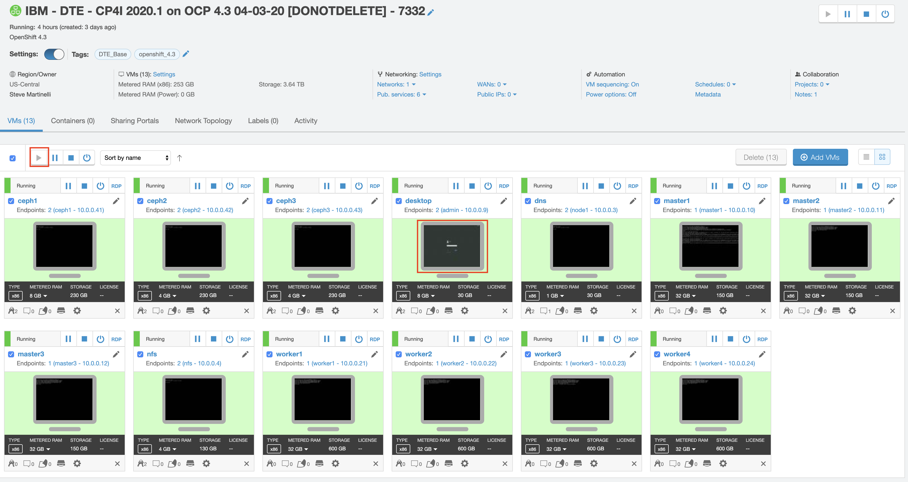
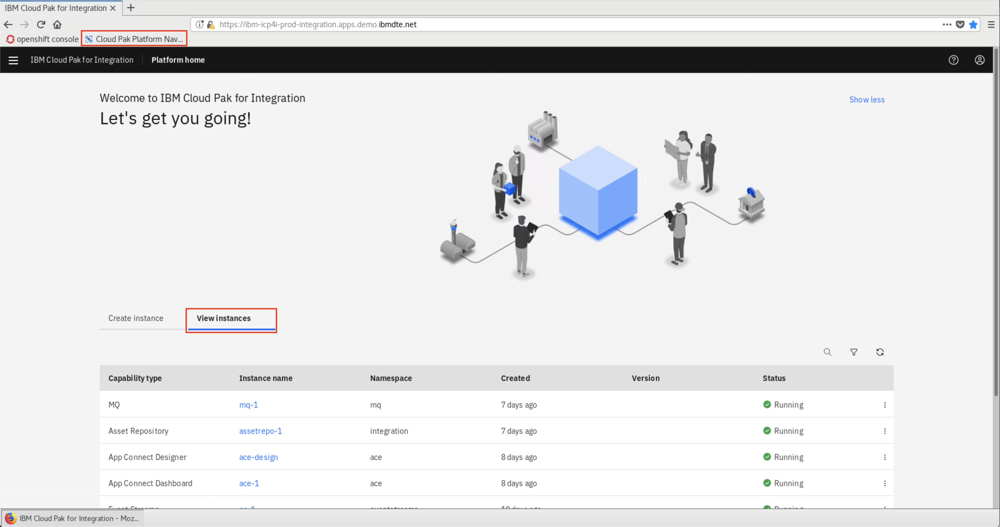

# Pre-work

## On Skytap

> These requirements are for THINK2020 and runs on the [Skytap](https://cloud.skytap.com/) platform.

Click the *Run VM(s)* button to start all of the virtual machines that are used for this lab. Once the virtual machine starts, click the *Developer Machine* tile to start your lab exercise. To log into the Linux desktop use the credentials **ibmuser** and **engageibm**

Open the browser on the *Developer Machine* VM and click the *IBM Cloud Pak for Integration* bookmark in the bookmarks bar at the top. You might receive a login screen, to log into the console use the credentials **admin** and **passw0rd**.

From the console overview page, click *View Instances* to see the list of instances available. The list of installed instances includes: **API Connect**, **App Connect**, **MQ**, and **Event Streams**.

## On IBM Cloud

> These requirements are for workshops running on IBM Cloud

### 1. Accounts

The following accounts are needed for this workshop:

* [IBM Cloud](https://cloud.ibm.com)

### 2. IBM Cloud Shell

For this workshop we'll be using the IBM Cloud Shell. The IBM Cloud Shell is a cloud-based shell workspace that you can access through your browser. It's preconfigured with the full IBM Cloud CLI and tons of plug-ins, and other 3rd party CLIs like OpenShift's `oc`, Helm's `helm` and Kubernetes' `kubectl`.

## Accessing the IBM Cloud Shell

From the IBM Cloud console, click the IBM Cloud Shell icon. A session will start and automatically log you in through the IBM Cloud CLI.

> **NOTE** Make sure you've selected the right account in the account list

From here, you can access pre-installed CLIs like `git`, `kubectl`, and many others.

