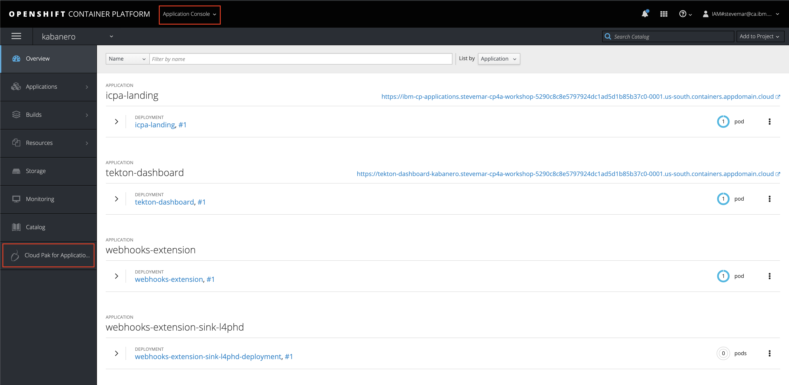
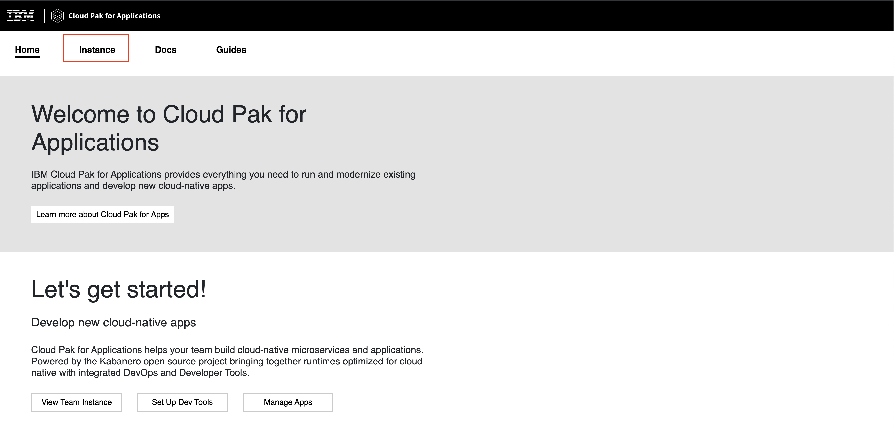
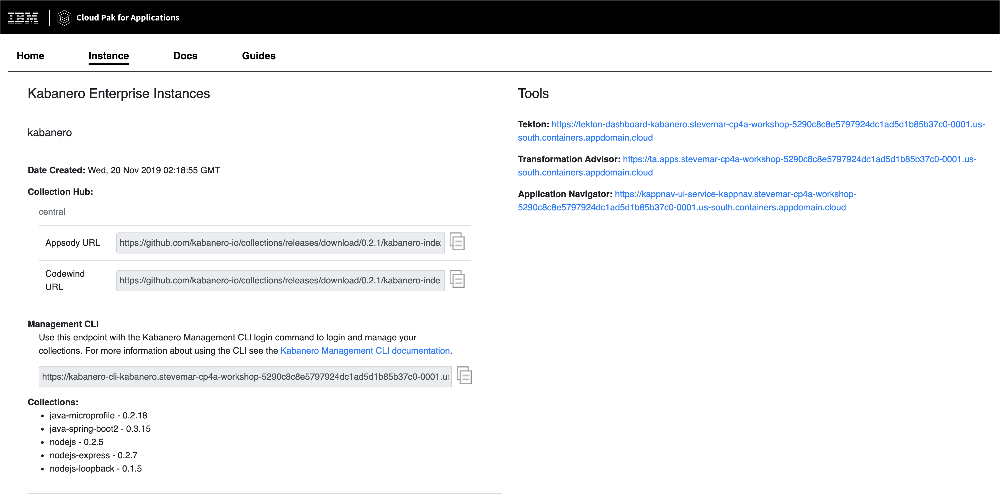

# Pre-work

This section is broken up into the following steps:

1. [Accounts](#1-accounts)
1. [Install Docker](#2-install-docker)
1. [Install Appsody CLI](#3-install-appsody-cli)
1. [Install OpenShift CLI](#4-install-appsody-cli)
1. [Check access to OpenShift cluster](#5-check-access-to-openshift-cluster)
1. [Ensure Cloud Pak for Applications is installed](#6-ensure-cloud-pak-for-applications-is-installed)
1. [Install VS Code](#7-install-vs-code) (Optional)

## 1. Accounts

The following accounts are needed for this workshop:

* [Github](https://github.com)
* [IBM Cloud](https://cloud.ibm.com)

## 2. Install Docker

A key part of the Appsody development experience is Rapid Local Development Mode, where the code you develop is continuously being run in a local docker container. If you don't already have Docker installed on your machine, you should do so now:

* [Install Docker for macOS](https://docs.docker.com/docker-for-mac/install/)
* [Install Docker for Windows](https://docs.docker.com/docker-for-windows/install/)

If you are not familiar with Docker Desktop, you can learn more about the orientation and setup [here](https://docs.docker.com/get-started/#Install-Docker-Desktop).

```bash
docker version
```

You should see output similar to the following:

```bash
$ docker version
Client: Docker Engine - Community
 Version:           19.03.4
...
```

## 3. Install Appsody CLI

Appsody includes a CLI which allows you to manage you stack based development (this workshop requries version 0.5.0 or later). This should be installed on your development machine:

[Install the Appsody CLI](https://appsody.dev/docs/getting-started/installation)

You can check that you have the correct version installed by executing the command:

```bash
appsody version
```

You should see output similar to the following:

```bash
$ appsody version
appsody 0.5.3
```

## 4. Install OpenShift CLI

The OpenShift CLI allows you to manage OpenShift resources from a terminal (this workshop requries version 3.11 (**not 4.x**)). This should be installed on your development machine:

[Install the OpenShift CLI](https://www.okd.io/download.html)

You can check that you have the correct version installed by executing the command:

```bash
oc version
```

You should see output similar to the following:

```bash
$ oc version
oc v3.11.0+0cbc58b
...
```

## 5. Check access to OpenShift cluster

You should already have been provided with details of a managed OpenShift cluster that has been provisioned for you. Check you have access to this by using the `oc login` with the credentials the workshop administrator provides to you.

```bash
oc login <url> --token=<token>
```

## 6. Ensure Cloud Pak for Applications is installed

Cloud Pak for Applications should already have been installed in your managed OpenShift cluster. Check you have access to this by ensuring that *Cloud Pak for Applications* exists in the *Application Console* of your OpenShift cluster.



When clicked, the *Cloud Pak for Applications* landing page should appear:



Clicking on the *Instance* menu link will show you information about Kabanero.



## 7. Install VS Code

VS Code and its Codewind extension are used in a number of steps in [Exercise 1](../exercise-1/README.md). Although it is possible to comlete the workshop without these steps, we recommend you install VSCode on your machine if you don't have it already, using the following link:

[Install VSCode](https://code.visualstudio.com/download)
